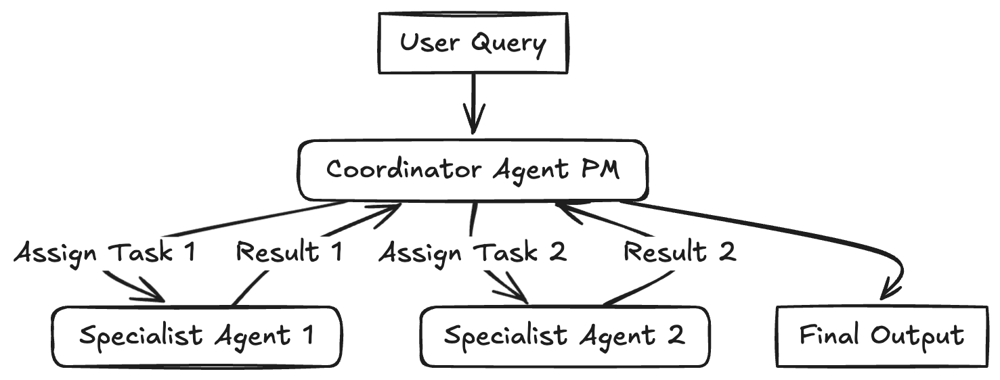

# 引言

人工智能代理。代理式 AI。代理架构。代理工作流程。代理模式。代理无处不在。但它们究竟是什么，我们如何构建稳健有效的代理系统呢？虽然“代理”一词被广泛使用，但其关键特征是能够动态规划并执行任务，通常利用外部工具和记忆来实现复杂目标。

本文旨在探讨常见的设计模式。将这些模式视为构建 AI 应用的蓝图或可重用模板。理解它们为我们解决复杂问题、设计可扩展、模块化和适应性强的系统提供了一个思维模型。

我们将深入探讨几种常见模式，区分更结构化的工作流程和更动态的代理模式。工作流程通常遵循预定义的路径，而代理在决定行动路线方面拥有更大的自主权。

**为什么（代理）模式很重要？**

- 模式提供了一种结构化的思考和设计系统的方法。
- 模式使我们能够构建和扩展 AI 应用，适应复杂性和不断变化的需求。基于模式的模块化设计更容易修改和扩展。
- 模式通过提供经过验证的可重用模板，帮助管理协调多个代理、工具和工作流程的复杂性。它们促进了最佳实践和开发者之间的共同理解。

**何时（以及何时不）使用代理？**

在深入研究模式之前，考虑何时采用代理方法真正必要至关重要。

- 首先寻求最简单的解决方案。如果你知道解决问题的确切步骤，固定的工作流程甚至简单的脚本可能比代理更高效、更可靠。
- 代理系统通常在复杂、模糊或动态任务上以增加延迟和计算成本为代价，换取潜在的性能提升。确保这些好处超过成本。
- 在处理步骤已知、定义明确的任务时，使用工作流程以实现可预测性和一致性。
- 需要灵活性、适应性和模型驱动决策时，请使用代理。
- 简化至上：即使在构建代理系统时，也要追求最简单有效的设计。过于复杂的代理可能难以调试和管理。
- 代理引入了固有的不可预测性和潜在错误。代理系统必须包含强大的错误记录、异常处理和重试机制，让系统（或底层 LLM）有机会自我纠正。

下面，我们将探讨 3 种常见的流程模式和 4 种代理模式。我们将使用纯 API 调用来说明每个模式，而不依赖 LangChain、LangGraph、LlamaIndex 或 CrewAI 等特定框架，以关注核心概念。

# 模式概述

我们将介绍以下模式：

- Workflow: Prompt Chaining (提示连)
- Workflow: Routing or Handoff (路由或转换)
- Workflow: Parallelization (并行)
- Reflection Pattern (反思模式)
- Tool Use Pattern (工具使用模式)
- Planning Pattern (Orchestrator-Workers) (规划模式(协调者-工作者))
- Multi-Agent Pattern (多智能体模式)

## Workflow: Prompt Chaining

一个 LLM 调用的输出依次作为下一个 LLM 调用的输入。
此模式将任务分解为一系列固定的步骤，每个步骤由处理前一个步骤输出的 LLM 调用处理。
适用于可以干净利落地分解为可预测、顺序子任务的作业。

**用例：**
- 生成结构化文档：LLM 1 创建大纲，LLM 2 根据标准验证大纲，LLM 3 根据验证过的大纲撰写内容。
- 多步骤数据处理：信息提取 -> 转换 -> 总结。
- 根据精选输入生成总结简报。

```python
import os
import openai

client = openai.OpenAI(base_url="https://api.deepseek.com/v1", api_key=os.getenv("DEEPSEEK_API_KEY"))

diff = """\
• pkg/config/defaults/defaults.go:9: const (
  9 ⋮  9 │        DefaultModel            = "gpt-4o"
 10 ⋮ 10 │        DefaultRetries          = 3
 11 ⋮ 11 │        DefaultMaxTokens        = 1024
 12 ⋮    │        DefaultTemperature      = 0.7
    ⋮ 12 │        DefaultTemperature      = 0.3
 13 ⋮ 13 │        DefaultTopP             = 1.0
 14 ⋮ 14 │        DefaultFrequencyPenalty = 0.0
 15 ⋮ 15 │)
"""

# ------ Step 1: Generate a commit message ------
prompt1 = f"""Generate a brief commit message in Conventional Commits format for the following diff.
Your response should only include the commit message without any explain:\n{diff}"""

response = client.chat.completions.create(model="deepseek-chat", messages=[{"role": "user", "content": prompt1}])

commit_message = response.choices[0].message.content
print(commit_message)
# Output: fix(config): adjust DefaultTemperature from 0.7 to 0.3

# ------ Step 2: Translate message into French ------
prompt2 = f"""Translate the following commit message into French (you should only translate the content after commit message header like `feat:`).
Your response should only include the translated commit message without any explain:\n{commit_message}"""
response = client.chat.completions.create(model="deepseek-chat", messages=[{"role": "user", "content": prompt2}])
commit_message_fr = response.choices[0].message.content
print(commit_message_fr)
# Output: fix(config): ajuster DefaultTemperature de 0.7 à 0.3
```

另一个例子：Qwen3支持启用或禁用思考功能。我们可以允许Qwen3决定是否采用思考过程。

```python
import os
import openai

client = openai.OpenAI(base_url="https://api.siliconflow.cn/v1", api_key=os.getenv("SILICONFLOW_API_KEY"))

# ------ Step 1: Evaluate task difficulty ------
original_prompt = """Write a fib generator in python, your response should only include the generator function code with any markdown format like ```python."""
prompt1 = f"""Your only task is to evaluate the difficulty of the following task.
You will receive a user request as input.
Your objective is to determine if this request requires careful, deliberate thought from the downstream AI, or if it's straightforward.

Criteria for your decision:
1. If the user's request is complex, nuanced, requires multi-step reasoning, creative generation, in-depth analysis, or careful consideration by the AI to produce a high-quality response, you MUST respond with: `yes`
2. If the user's request is simple, factual, straightforward, or can likely be answered quickly and directly by the AI with minimal processing or deliberation, you MUST respond with: `no`
Your response should only include "yes" or "no" without any explain.
<USER_REQUEST>: {original_prompt}</USER_REQUEST>"""

response = client.chat.completions.create(
    model="Qwen/Qwen3-8B", messages=[{"role": "user", "content": prompt1}], extra_body={"enable_thinking": False}
)

commit_message = response.choices[0].message.content
print(commit_message)
# Output: no
if commit_message.lower() == "yes":
    enable_thinking = True
else:
    enable_thinking = False

# ------ Step 2: Process original prompt ------
response = client.chat.completions.create(
    model="Qwen/Qwen3-8B",
    messages=[{"role": "user", "content": original_prompt}],
    extra_body={"enable_thinking": enable_thinking},
)
reasoning = response.choices[0].message.model_extra.get("reasoning_content", None)
content = response.choices[0].message.content
print(reasoning)
# Output: None
print(content)
# Output:
# ```python
# def fib_generator():
#     a, b = 0, 1
#     while True:
#         yield a
#         a, b = b, a + b
# ```
```

## Workflow: Routing


一个初始的 LLM 充当路由器，对用户的输入进行分类，并将其引导至最合适的专用任务或 LLM。
这种模式实现了关注点的分离，并允许独立优化单个下游任务（使用专用提示、不同模型或特定工具）。
通过使用更小的模型处理简单任务，它提高了效率并可能降低成本。当任务被路由时，所选的代理“接管”完成任务的职责。

**用例：**
- 客户支持系统：将查询路由到擅长账单、技术支持或产品信息的客服代表。
- 分级大型语言模型使用：将简单查询路由到更快、更便宜的模型（如 Llama 3.1 8B），将复杂或非同寻常的问题路由到更强大的模型（如 Gemini 1.5 Pro）。
- 内容生成：将博客文章、社交媒体更新或广告文案的请求路由到不同的专业提示/模型。

```python
import enum
import os
import openai
from pydantic import BaseModel

client = openai.OpenAI(base_url="https://openrouter.ai/api/v1", api_key=os.getenv("OPENROUTE_API_KEY"))


# Define Routing Schema
class Category(enum.Enum):
    WEATHER = "weather"
    SCIENCE = "science"
    UNKNOWN = "unknown"


class RoutingDecision(BaseModel):
    category: Category
    reasoning: str


# ------ Step 1: Routing Decision ------
user_query = "What's the weather like in Beijing?"

prompt_router = f"""
Analyze the user query below and determine its category.
Categories:
- weather: For questions about weather conditions.
- science: For questions about science.
- unknown: If the category is unclear.

Your answer should be a json object with the following structure:
{{
    "category": "<Category>",
    "reasoning": "<Your reasoning here>"
}}

Query: {user_query}
"""

router_response = client.beta.chat.completions.parse(
    model="qwen/qwen3-32b:free",
    messages=[{"role": "user", "content": prompt_router}],
    response_format=RoutingDecision,
    extra_body={"enable_thinking": False},
)
message = router_response.choices[0].message

print(f"Routing Decision: Category={message.parsed.category}, Reasoning={message.parsed.reasoning}")
# Output: Routing Decision: Category=Category.WEATHER, Reasoning=The user is asking about the current or typical weather conditions in Beijing, which directly falls under the 'weather' category as it focuses on meteorological information for a specific location.

# ------ Step 2: Handoff based on Routing ------
final_response = ""
if message.parsed.category == Category.WEATHER:
    weather_response = client.chat.completions.create(
        model="qwen/qwen3-32b:free",
        messages=[
            {
                "role": "user",
                "content": f"Provide a brief weather forecast for the location mentioned in: '{user_query}'",
            }
        ],
    )
    final_response = weather_response.choices[0].message.content
elif message.parsed.category == Category.SCIENCE:
    science_response = client.chat.completions.create(
        model="qwen/qwen3-30b-a3b:free",
        messages=[
            {
                "role": "user",
                "content": f"Answer the following science-related question: '{user_query}'",
            }
        ],
    )
    final_response = science_response.choices[0].message.content
else:
    unknown_response = client.chat.completions.create(
        model="qwen/qwen3-8b:free",
        messages=[
            {
                "role": "user",
                "contents": f"The user query is: {prompt_router}, but could not be answered. Here is the reasoning: {message.parsed.reasoning}. Write a helpful response to the user for him to try again.",
            }
        ],
    )
print(f"\nFinal Response: {final_response}")
# Output: Final Response: **Beijing Weather Forecast (Sample for Mid-April):**  
# **Today:** Clear skies, 21°C. Gentle northwest winds (15 km/h). UV index: 7.  
# **Tomorrow:** Mostly sunny, temperatures between 20-24°C. Slight increase in afternoon humidity.  
# **Next 2 Days:** Stable weather, 19-23°C. No rain expected.  

# **Advisor:** Light clothing, but carry a light jacket for breezy mornings/evenings. High UV—sunscreen recommended.
```

## Workflow: Parallelization


任务被分解为独立的子任务，这些子任务由多个大型语言模型（LLM）同时处理，并将它们的输出结果汇总。
这种模式利用并发处理任务。初始查询（或其部分）与单独的提示/目标并行发送给多个 LLM。
一旦所有分支任务完成，它们的单独结果将被收集，并传递给一个最终的聚合 LLM，该 LLM 将它们综合成最终响应。
如果子任务之间相互独立，这可以降低延迟，或者通过如多数投票或生成多种选项等技术提高质量。

**用例：**
- RAG与查询分解：将复杂查询分解为子查询，并行运行检索，然后综合结果。
- 分析大型文档：将文档分为部分，并行总结每一部分，然后合并摘要。
- 生成多个观点：向多个 LLM 提出相同问题，使用不同的角色提示，并汇总它们的回答。
- 数据的 Map-reduce 风格处理。

```python
import asyncio
import os
import time
import openai

client = openai.AsyncOpenAI(base_url="https://openrouter.ai/api/v1", api_key=os.getenv("OPENROUTE_API_KEY"))


async def generate_content(prompt: str) -> str:
    response = await client.chat.completions.create(
        model="qwen/qwen3-32b:free",
        messages=[
            {"role": "system", "content": "You are a helpful assistant."},
            {"role": "user", "content": prompt},
        ],
    )
    return response.choices[0].message.content


async def parallel_tasks():
    # Define Parallel Tasks
    topic = "a friendly robot exploring a jungle"
    prompts = [
        f"Write a short, adventurous story idea about {topic}.",
        f"Write a short, funny story idea about {topic}.",
        f"Write a short, mysterious story idea about {topic}.",
    ]
    # Run tasks concurrently and gather results
    start_time = time.time()
    tasks = [generate_content(prompt) for prompt in prompts]
    results = await asyncio.gather(*tasks)
    end_time = time.time()
    print(f"Time taken: {end_time - start_time} seconds")

    print("\n--- Individual Results ---")
    for i, result in enumerate(results):
        print(f"Result {i + 1}: {result}\n")

    # Aggregate results and generate final story
    story_ideas = '\n'.join([f"Idea {i+1}: {result}" for i, result in enumerate(results)])
    aggregation_prompt = f"Combine the following three story ideas into a single, cohesive summary paragraph:{story_ideas}"
    aggregation_response = await client.chat.completions.create(
        model="deepseek/deepseek-r1:free",
        messages=[
            {"role": "system", "content": "You are a helpful assistant."},
            {"role": "user", "content": aggregation_prompt},
        ],
    )
    return aggregation_response.choices[0].message.content

if __name__ == "__main__":
    # Run the parallel tasks
    print("--- Running Parallel Tasks ---")
    final_story = asyncio.run(parallel_tasks())
    print("\n--- Final Story ---")
    print(final_story)
```

## Reflection Pattern


代理评估自己的输出，并利用该反馈迭代地优化其响应。
这种模式也被称为评估-优化器，并使用自我校正循环。
一个初始的 LLM 生成响应或完成任务。
第二个 LLM（或甚至是使用不同提示的同一个 LLM）随后充当反思者或评估者，对初始输出与需求或期望质量进行批判。
然后，这种批判（反馈）被反馈回来，促使 LLM 产生更精细的输出。这个循环可以重复进行，直到评估者确认需求得到满足或达到令人满意的输出。

**用例：**
- 代码生成：编写代码，执行它，使用错误信息或测试结果作为反馈来修复错误。
- 写作与润色：生成草稿，反思其清晰度和语气，然后进行修改。
- 复杂问题解决：制定计划、评估可行性并根据评估进行改进。
- 信息检索：搜索信息并使用评估型大型语言模型检查是否找到了所有必要细节，然后再呈现答案。

```python
import os
from google import genai
from pydantic import BaseModel
import enum

# Configure the client (ensure GEMINI_API_KEY is set in your environment)
client = genai.Client(api_key=os.environ["GEMINI_API_KEY"])


class EvaluationStatus(enum.Enum):
    PASS = "PASS"
    FAIL = "FAIL"


class Evaluation(BaseModel):
    evaluation: EvaluationStatus
    feedback: str
    reasoning: str


# --- Initial Generation Function ---
def generate_poem(topic: str, feedback: str = None) -> str:
    prompt = f"Write a short, four-line poem about {topic}."
    if feedback:
        prompt += f"\nIncorporate this feedback: {feedback}"

    response = client.models.generate_content(model="gemini-2.0-flash", contents=prompt)
    poem = response.text.strip()
    print(f"Generated Poem:\n{poem}")
    return poem


# --- Evaluation Function ---
def evaluate(poem: str) -> Evaluation:
    print("\n--- Evaluating Poem ---")
    prompt_critique = f"""Critique the following poem. Does it rhyme well? Is it exactly four lines? 
Is it creative? Respond with PASS or FAIL and provide feedback.

Poem:
{poem}
"""
    response_critique = client.models.generate_content(
        model="gemini-2.0-flash",
        contents=prompt_critique,
        config={
            "response_mime_type": "application/json",
            "response_schema": Evaluation,
        },
    )
    critique = response_critique.parsed
    print(f"Evaluation Status: {critique.evaluation}")
    print(f"Evaluation Feedback: {critique.feedback}")
    return critique


# Reflection Loop
max_iterations = 3
current_iteration = 0
topic = "a robot learning to paint"

# simulated poem which will not pass the evaluation
current_poem = "With circuits humming, cold and bright,\nA metal hand now holds a brush"

while current_iteration < max_iterations:
    current_iteration += 1
    print(f"\n--- Iteration {current_iteration} ---")
    evaluation_result = evaluate(current_poem)

    if evaluation_result.evaluation == EvaluationStatus.PASS:
        print("\nFinal Poem:")
        print(current_poem)
        break
    else:
        current_poem = generate_poem(topic, feedback=evaluation_result.feedback)
        if current_iteration == max_iterations:
            print("\nMax iterations reached. Last attempt:")
            print(current_poem)
```

## Tool Use Pattern


大型语言模型具备调用外部函数或 API 与外界互动、获取信息或执行操作的能力。
这种模式通常被称为函数调用，是最为广泛认可的。模型被提供了可用工具（函数、API、数据库等）的定义（名称、描述、输入模式）。
根据用户查询，模型可以决定调用一个或多个工具，生成符合所需模式的结构化输出（如 JSON）。
该输出用于执行实际的外部工具/函数，并将结果返回给模型。随后，模型利用这些结果来形成对用户的最终回应。
这极大地扩展了模型的能力，使其超越了训练数据。

**用例：**
- 使用日历 API 预约安排。
- 通过金融 API 获取实时股价。
- 在向量数据库中搜索相关文档（RAG）。
- 控制智能家居设备。
- 执行代码片段。

```python
import os
from google import genai
from google.genai import types

# Configure the client (ensure GEMINI_API_KEY is set in your environment)
client = genai.Client(api_key=os.environ["GEMINI_API_KEY"])

# Define the function declaration for the model
weather_function = {
    "name": "get_current_temperature",
    "description": "Gets the current temperature for a given location.",
    "parameters": {
        "type": "object",
        "properties": {
            "location": {
                "type": "string",
                "description": "The city name, e.g. San Francisco",
            },
        },
        "required": ["location"],
    },
}


# Placeholder function to simulate API call
def get_current_temperature(location: str) -> dict:
    return {"temperature": "15", "unit": "Celsius"}


# Create the config object as shown in the user's example
# Use client.models.generate_content with model, contents, and config
tools = types.Tool(function_declarations=[weather_function])
contents = ["What's the temperature in London right now?"]
response = client.models.generate_content(
    model="gemini-2.0-flash", contents=contents, config=types.GenerateContentConfig(tools=[tools])
)

# Process the Response (Check for Function Call)
response_part = response.candidates[0].content.parts[0]
if response_part.function_call:
    function_call = response_part.function_call
    print(f"Function to call: {function_call.name}")
    print(f"Arguments: {dict(function_call.args)}")

    # Execute the Function
    if function_call.name == "get_current_temperature":
        # Call the actual function
        api_result = get_current_temperature(*function_call.args)
        # Append function call and result of the function execution to contents
        follow_up_contents = [
            types.Part(function_call=function_call),
            types.Part.from_function_response(name="get_current_temperature", response=api_result),
        ]
        # Generate final response
        response_final = client.models.generate_content(
            model="gemini-2.0-flash",
            contents=contents + follow_up_contents,
            config=types.GenerateContentConfig(tools=[tools]),
        )
        print(response_final.text)
    else:
        print(f"Error: Unknown function call requested: {function_call.name}")
else:
    print("No function call found in the response.")
    print(response.text)
```

## Planning Pattern (Orchestrator-Workers)


中心规划型大型语言模型将复杂任务分解为动态子任务列表，随后将这些子任务委托给专门的工人代理（通常使用工具使用）执行。
这种模式通过创建初始计划来解决需要多步推理的复杂问题。该计划根据用户输入动态生成。
然后将子任务分配给“工人”代理执行，如果依赖关系允许，可以并行执行。
一个“协调器”或“合成器”型大型语言模型收集来自工人的结果，反思整体目标是否达成，并综合最终输出，或在必要时启动重新规划步骤。
这减少了单个大型语言模型调用时的认知负荷，提高了推理质量，最小化了错误，并允许动态调整工作流程。
与路由相比，关键区别在于规划器生成多步计划，而不是选择下一步单独的步骤。

**用例：**
- 复杂的软件开发任务：将“构建功能”分解为规划、编码、测试和文档编制子任务。
- 研究和报告生成：规划步骤如文献检索、数据提取、分析和报告撰写。
- 多模态任务：涉及图像生成、文本分析和数据集成的规划步骤。
- 执行复杂的用户请求，如“计划一次 3 天的巴黎之旅，预订符合预算的航班和酒店。”

```python
import os
from google import genai
from pydantic import BaseModel, Field
from typing import List

# Configure the client (ensure GEMINI_API_KEY is set in your environment)
client = genai.Client(api_key=os.environ["GEMINI_API_KEY"])


# Define the Plan Schema
class Task(BaseModel):
    task_id: int
    description: str
    assigned_to: str = Field(description="Which worker type should handle this? E.g., Researcher, Writer, Coder")


class Plan(BaseModel):
    goal: str
    steps: List[Task]


# Step 1: Generate the Plan (Planner LLM)
user_goal = "Write a short blog post about the benefits of AI agents."

prompt_planner = f"""
Create a step-by-step plan to achieve the following goal. 
Assign each step to a hypothetical worker type (Researcher, Writer).
 
Goal: {user_goal}
"""

print(f"Goal: {user_goal}")
print("Generating plan...")

# Use a model capable of planning and structured output
response_plan = client.models.generate_content(
    model="gemini-2.5-pro-preview-03-25",
    contents=prompt_planner,
    config={
        "response_mime_type": "application/json",
        "response_schema": Plan,
    },
)

# Step 2: Execute the Plan (Orchestrator/Workers - Omitted for brevity)
for step in response_plan.parsed.steps:
    print(f"Step {step.task_id}: {step.description} (Assignee: {step.assigned_to})")
```

## Multi-Agent Pattern




蜂群方法

多个不同的代理各自承担特定角色、形象或专长，共同协作以实现一个共同目标。
这种模式采用自主或半自主的代理。每个代理可能拥有独特的角色（例如：项目经理、程序员、测试员、评论员），专业知识和对特定工具的访问。
他们相互交流和协作，通常由一个中央的“协调器”或“管理者”代理（如图中的项目经理Coordiantor Agent PM）或通过交接逻辑进行协调，其中一个代理将控制权传递给另一个代理。

**用例：**
- 模拟与不同 AI 角色进行的辩论或头脑风暴会议。
- 涉及到规划、编码、测试和部署的复杂软件创作。
- 运行虚拟实验或模拟，其中包含代表不同角色的智能体。
- 协作写作或内容创作过程。

以下是一个如何使用多智能体模式结合交接逻辑和结构化输出的简化示例。
建议您查看 [LangGraph Multi-Agent Swarm](https://github.com/langchain-ai/langgraph-swarm-py)或者[Crew AI](https://www.crewai.com/open-source)。

```python
import os
from google import genai
from pydantic import BaseModel, Field

# Configure the client (ensure GEMINI_API_KEY is set in your environment)
client = genai.Client(api_key=os.environ["GEMINI_API_KEY"])


# Define Structured Output Schemas
class Response(BaseModel):
    handoff: str = Field(
        default="",
        description="The name/role of the agent to hand off to. Available agents: 'Restaurant Agent', 'Hotel Agent'",
    )
    message: str = Field(description="The response message to the user or context for the next agent")


# Agent Function
def run_agent(agent_name: str, system_prompt: str, prompt: str) -> Response:
    response = client.models.generate_content(
        model="gemini-2.0-flash",
        contents=prompt,
        config={
            "system_instruction": f"You are {agent_name}. {system_prompt}",
            "response_mime_type": "application/json",
            "response_schema": Response,
        },
    )
    return response.parsed


# Define System Prompts for the agents
hotel_system_prompt = "You are a Hotel Booking Agent. You ONLY handle hotel bookings. If the user asks about restaurants, flights, or anything else, respond with a short handoff message containing the original request and set the 'handoff' field to 'Restaurant Agent'. Otherwise, handle the hotel request and leave 'handoff' empty."
restaurant_system_prompt = "You are a Restaurant Booking Agent. You handle restaurant recommendations and bookings based on the user's request provided in the prompt."

# Prompt to be about a restaurant
initial_prompt = "Can you book me a table at an Italian restaurant for 2 people tonight?"
print(f"Initial User Request: {initial_prompt}")

# Run the first agent (Hotel Agent) to force handoff logic
output = run_agent("Hotel Agent", hotel_system_prompt, initial_prompt)

# simulate a user interaction to change the prompt and handoff
if output.handoff == "Restaurant Agent":
    print("Handoff Triggered: Hotel to Restaurant")
    output = run_agent("Restaurant Agent", restaurant_system_prompt, initial_prompt)
elif output.handoff == "Hotel Agent":
    print("Handoff Triggered: Restaurant to Hotel")
    output = run_agent("Hotel Agent", hotel_system_prompt, initial_prompt)

print(output.message)
```

# 组合与定制

这些模式并非固定规则，而是灵活的构建模块。现实中的代理系统通常结合多个模式中的元素。
一个规划代理可能会使用工具使用，而其工人可能会采用反思。多代理系统可能会在任务分配内部使用路由。

任何 LLM 应用的成功关键，尤其是复杂的代理系统，是经验评估。定义指标，衡量性能，识别瓶颈或失败点，并在设计上进行迭代。抵制过度设计。


> 原文：https://www.philschmid.de/agentic-pattern