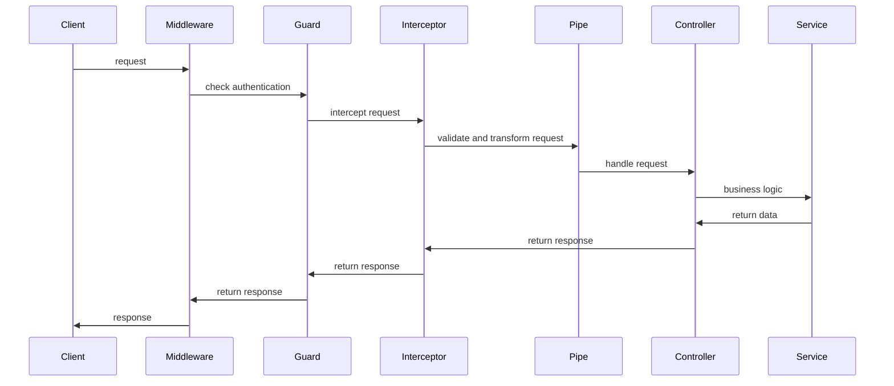

# NestJS 入门指南：基础配置与核心概念解析

## 一：NestJS

### 1. 是什么

NestJS是一个node运行时的，构建于typescript上，同时支持javascript后端框架，是对express的上层抽象，同时支持fastify。

特点：

1. 面向对象的设计（大量使用依赖注入，单例，封装继承）

2. 函数式编程（支持使用函数实现切面编程，中间件、管道、拦截、异常处理等）

3. 函数响应式编程（支持使用RxJS实现流的响应式控制）

对于我来说NestJS最大的特点就是可以使用面向对象的设计来进行服务的开发，相比于Hono和Express，更类似于Python中的Django，一应俱全，而前者则更像Flask用于简单的快速开发。

但是NestJS依然是需要进行一些配置才能满足基本的开发需求，例如Config、Database、Validate，本文主要记录在使用NestJS时，尤其是项目开启时需要进行的一些基础的配置。

### 2. 工具

NestJS贴心的准备了cli用来初始化项目和生成模块和工具，`nest cli`，使用npm全局安装

```shell
npm install -g @nestjs/cli
```

使用`nest --help`可以看到一下输出(10.3.2版本)：

```shell
> nest --help
Usage: nest <command> [options]

Options:
  -v, --version                                   Output the current version.
  -h, --help                                      Output usage information.

Commands:
  new|n [options] [name]                          Generate Nest application.
  build [options] [app]                           Build Nest application.
  start [options] [app]                           Run Nest application.
  info|i                                          Display Nest project details.
  add [options] <library>                         Adds support for an external library to your project.
  generate|g [options] <schematic> [name] [path]  Generate a Nest element.
    Schematics available on @nestjs/schematics collection:
      ┌───────────────┬─────────────┬──────────────────────────────────────────────┐
      │ name          │ alias       │ description                                  │
      │ application   │ application │ Generate a new application workspace         │
      │ class         │ cl          │ Generate a new class                         │
      │ configuration │ config      │ Generate a CLI configuration file            │
      │ controller    │ co          │ Generate a controller declaration            │
      │ decorator     │ d           │ Generate a custom decorator                  │
      │ filter        │ f           │ Generate a filter declaration                │
      │ gateway       │ ga          │ Generate a gateway declaration               │
      │ guard         │ gu          │ Generate a guard declaration                 │
      │ interceptor   │ itc         │ Generate an interceptor declaration          │
      │ interface     │ itf         │ Generate an interface                        │
      │ library       │ lib         │ Generate a new library within a monorepo     │
      │ middleware    │ mi          │ Generate a middleware declaration            │
      │ module        │ mo          │ Generate a module declaration                │
      │ pipe          │ pi          │ Generate a pipe declaration                  │
      │ provider      │ pr          │ Generate a provider declaration              │
      │ resolver      │ r           │ Generate a GraphQL resolver declaration      │
      │ resource      │ res         │ Generate a new CRUD resource                 │
      │ service       │ s           │ Generate a service declaration               │
      │ sub-app       │ app         │ Generate a new application within a monorepo │
      └───────────────┴─────────────┴──────────────────────────────────────────────┘
```

`nest new`用于生成一个新的项目，会提示你使用的包管理器，以及安装必要的依赖。默认使用ts，自动生成tsconfig.json。

`nest build`和`nest start`，顾名思义，构建和启动nest服务，`nest start`用于本地开发调试，自动生成的package.json中，生产环境启动是使用的node`"start:prod": "node dist/main"`。

`nest add`官方文档说导入已经打包成nest库的库，ChatGPT说可以用来安装swagger`

```bash
nest add @nestjs/swagger`
```

但是会出现`Error: Collection "@nestjs/grqphql" cannot be resolved.`错误。看源码是用包管理器安装依赖，没有深究为什么会出现错误，官方文档使用的是npm安装`@nest/graphql`。

`nest info`会显示当前环境和nest官方包的版本。

`nest generate`是nest官方提供的用来生成依赖、模块、组件、子应用的工具。其中需要注意`nest g application`和`nest g sub-app`的区别，`g application <app>`会在项目根目录生成一个`<app>`名字的和`nest new <app>`几乎一样的应用，同时会有一个`package.json`，不共享依赖，并且是全部是js文件，而`nest g sub-app <app>`则是使用`monorepo`的项目管理方式，创建一个`apps`目录，并将原来`src`目录下的app挪到`apps`目录下，并在`apps`中创建`<app>`应用，两个app共享依赖。如下所示：

```shell
> nest new demo
> tree -L 2
.
├── README.md
├── nest-cli.json
├── package.json
├── src
│   ├── app.controller.spec.ts
│   ├── app.controller.ts
│   ├── app.module.ts
│   ├── app.service.ts
│   └── main.ts
├── test
│   ├── app.e2e-spec.ts
│   └── jest-e2e.json
├── tsconfig.build.json
├── tsconfig.json
└── yarn.lock
```

`nest g sub-app sub`：

```shell
> nest g sub-app sub
> tree -L 3
.
├── README.md
├── apps
│   ├── demo
│   │   ├── src
│   │   ├── test
│   │   └── tsconfig.app.json
│   └── sub
│       ├── src
│       ├── test
│       └── tsconfig.app.json
├── nest-cli.json
├── package.json
├── tsconfig.build.json
├── tsconfig.json
└── yarn.lock
```

具体`monorepo`共享依赖带来的利弊，可以参考`Turborepo`,`Rush`,`Lerna`或者`yarn workspace`等解决方案。

## 二：概念

要理解NestJS，首先要理解的就是NestJS中的八个概念，`Controler`,`Provider`,`Modules`,`Middleware`,`Exception Filter`,`Pipe`,`Guards`，其中最重要的是前三个。

### 1. Controller

和所有的后端框架、概念一样，这里的controller也是接口的入口，接收请求参数，返回响应。需要注意的是NestJS为controller提供两种响应方式，一种是NestJS标准响应，一种是Adaptor(Express/Fastify)特定响应。

NestJS标准响应指的是直接返回具体的相应内容，例如:

```typescript
@Controller()
export class AppController {

  @Get()
  getHello(): string {
    return "Hello World!";
  }
}
```

这个响应会被Nest自动处理，默认返回200状态码，type为`text/html`：

```shell
> http :3000/
HTTP/1.1 200 OK
Connection: keep-alive
Content-Length: 12
Content-Type: text/html; charset=utf-8
Date: Fri, 17 May 2024 07:32:49 GMT
ETag: W/"c-Lve95gjOVATpfV8EL5X4nxwjKHE"
Keep-Alive: timeout=5
X-Powered-By: Express

Hello World!
```

可以看到`X-Powered-By: Express`，默认的Adaptor是Express。

或者也可以返回js object，会自动转为json。

```typescript
@Get("json")
getJson(): { msg: string } {
  return { msg: "Hello World!" };
}
```

响应：

```shell
> http :3000/json
HTTP/1.1 200 OK
Connection: keep-alive
Content-Length: 22
Content-Type: application/json; charset=utf-8
Date: Fri, 17 May 2024 07:37:05 GMT
ETag: W/"16-20luvwVmABRcNMehXRFal/WNXbM"
Keep-Alive: timeout=5
X-Powered-By: Express

{
    "msg": "Hello World!"
}
```

Adaptor(Express/Fastify)特定响应指的是使用更底层的Express/Fastify接口来处理响应。

一旦你在接口中导入了@Res和@Next，NestJS会将这个接口作为Express原生接口处理，必须要在接口中使用Express的方式处理响应，例如`res.status(200).send()`。如果你只导入了@Res，但是你想让NestJS来处理，而不是自己手动处理，可以给Res传参passthrough，这样Nest就会知道响应需要框架来进行处理。

```typescript
@Get('lib')
expressWay(@Req() Req, @Res({ passthrough: true }) Res): string {
  return 'Hello World!';
}
```

但是如果你使用了@Next，则没有这个参数，只能通过手动处理响应。

### 2. Provider

Nest中Provider的概念应该对应两个，一个是传统意义上服务端的service层，一个是依赖注入中的依赖对象，因为他们都是声明在Module的providers中，以依赖注入的方式提示给Controller和其他service来调用，所以Nest都放到了Provider这个概念中。当然，你完全可以不遵守Nest对service层的定义，将其封装成类，不通过注入的方式调用，而是手动调用。区别在于，使用依赖注入的方式可以更方便的使用其他模块提供的providers，并且携带context。

在使用service层时，无论是代码的组织还是项目的管理，你都应该将你复杂的业务逻辑放到service中，controller只负责对参数的校验和响应的处理。

注册并使用service，使用`nest new <app>`生成项目时，会有一个默认的`app.service.ts`可以作为一个参考。

我们使用nest cli来生成一个新的模块。有两种方式，可以直接生成一个包含CRUD例子的模块，也可以只生成需要的controller和service，本文只使用单个app的单独生成controller和service的服务作为例子。

```shell
nest g module duck
nest g controller duck
nest g service duck
```

nest会自动创建duck这个目录，目录结构如下

```shell
> tree -L 2 src
src
├── app.controller.spec.ts
├── app.controller.ts
├── app.module.ts
├── app.service.ts
├── duck
│   ├── duck.controller.spec.ts
│   ├── duck.controller.ts
│   ├── duck.module.ts
│   ├── duck.service.spec.ts
│   └── duck.service.ts
└── main.ts
```

并且会自动注册到AppModule中。

```typescript
@Module({
  imports: [DuckModule],
  controllers: [AppController],
  providers: [AppService],
})
export class AppModule {}
```

`AppModule`就是这个项目的根模块。下面是`DuckModule`的声明。

nest会自动将controller和service注册到Module中。

```typescript
import { Module } from '@nestjs/common';
import { DuckService } from './duck.service';
import { DuckController } from './duck.controller';

@Module({
  providers: [DuckService],
  controllers: [DuckController]
})
export class DuckModule {}
```

Providers就是模块会管理和注入的依赖项，每个模块管理自己提供的依赖项，即上面的providers中注册的，`AppModule`，管理这些子模块，模块不单单可以是一个处理请求的模块，也可以是一个功能的封装，例如nest中自带的HttpService，HttpModule，是用法发起请求的模块。

使用这些依赖的方法也有三种：

第一种，在Controller中可以在构造方法中接收注入。

```typescript
constructor(private readonly duckService: DuckService)
```

第二种，使用属性注入。

```typescript
@Inject(DuckService)
private readonly duckService: DuckService;
```

**Providers的作用域**

Providers的作用域分为三种：

1. DEFAULT：和程序的生命周期相同，启动时创建单例。

2. REQUEST：和请求的生命周期相同，每个请求创建对象。

3. TRANSIENT：每次注入的依赖都是一个新的对象。

### Module

Module是对一整个模块内容的管理，导入依赖，注入依赖，导出依赖，同时管理接收的请求分发。

Module有四个属性：

1. providers：注册可以在模块中使用的依赖。

2. controller：必须实例化的接口控制器。

3. imports：导入这个模块需要的依赖项。

4. exports：模块导出的依赖项，可以供其他模块使用。

例如我们的DuckModule中：

```typescript
@Module({
  imports: [HttpModule],
  providers: [DuckService],
  controllers: [DuckController]
})
export class DuckModule {}
```

注册了DuckServic作为依赖项，注册了接口的控制器DuckController作为请求的接收项，导入了HttpModule作为依赖注入到模块中需要注入的地方，可以使用service，可以是controller也可以是其他装饰了@Injectable的类，例如：

```typescript
// 在DuckService中注入HttpService，用来发起请求
@Injectable()
export class DuckService {
    constructor(private readonly httpService: HttpService) {}
}
```

exports是为了将封装导出给其他模块使用，例如`@nest/axios`中的HttpModule，将HttpService导出,让我们可以在DuckModule中导入这个依赖并在Service中注入并使用。

```typescript
// HttpModule源码，只摘取了部分
@Module({
  providers: [
    HttpService,
    {
      provide: AXIOS_INSTANCE_TOKEN,
      useValue: Axios,
    },
  ],
  exports: [HttpService],
})
export class HttpModule
```

需要注意的是，Module类可以进行进行依赖注入，但是Module类本身是不可以作为依赖注入其他类。

> 同时nestjs中也支持全局化一个Module，在任何地方都可以使用这个模块，那就是@nestjs/common中的@Global装饰器。但是不建议使用这种方法。

同时你也可以定义一个动态模块，提供一个静态方法，在导入模块时，根据options来生成providers，module，exports，以及布尔值global。下面是官方的例子：

```typescript
import { Module, DynamicModule } from '@nestjs/common';
import { createDatabaseProviders } from './database.providers';
import { Connection } from './connection.provider';

@Module({
  providers: [Connection],
  exports: [Connection],
})
export class DatabaseModule {
  static forRoot(entities = [], options?): DynamicModule {
    const providers = createDatabaseProviders(options, entities);
    return {
      module: DatabaseModule,
      providers: providers,
      exports: providers,
    };
  }
}
```

### Middleware

nest的中间件就是express的中间件，nest什么都没有做，只是定义了一个interface。

官方在文档中举了一个记录日志的例子，但是只记录了请求，对于express的中间件，如果记录相应状态码或者响应数据，需要重写一些方法，个人认为并不是一个很优雅的方法，不如使用nest中的interceptor。

我们和Interceptor对比来看。

### Interceptor

NestJS的拦截器和中间件的定义是一些重合的，他们都是针对请求的切面编程，都可以正对全部请求，单个请求，和单个controller进行处理，不同的是Middleware可以对一组路由以及特定方法进行处理，例如，针对路径是cats的接口，请求方式为GET的请求应用中间件：

```typescript
@Module({
  imports: [CatsModule],
})
export class AppModule implements NestModule {
  configure(consumer: MiddlewareConsumer) {
    consumer
      .apply(LoggerMiddleware)
      .forRoutes({ path: 'cats', method: RequestMethod.GET });
  }
}
```

而interceptor不能进行这么精细的配置，使用方式如下：

1.在controller上使用装饰器，作用于整个controller的接口。

```typescript
@UseInterceptors(LoggingInterceptor)
export class CatsController {}
```

2.在module的providers中引入，作用于整个模块的接口。

```typescript
@Module({
  providers: [
    {
      provide: APP_INTERCEPTOR,
      useClass: LoggingInterceptor,
    },
  ],
})
export class CatsModule {}
```

3.全局注册，作用于AppModule的所有接口。

```typescript
const app = await NestFactory.create(AppModule);
app.useGlobalInterceptors(new LoggingInterceptor());
```

当你需要精细的控制时，例如针对部分接口，但是排除其中的什么请求，或者给多个path`/cats`,`/dog`,`/duck`，多个版本，配置权限管理，排除其中的`/*/login`接口。

```typescript
@Module({
  imports: [DuckModule, DogModule],
  controllers: [AppController],
  providers: [AppService],
})
export class AppModule {
  configure(consumer: MiddlewareConsumer) {
    consumer
      .apply(LoginRequiredMiddleware)
      .exclude({ path: '/*/login', method: RequestMethod.POST })
      .forRoutes(
        { path: '/duck', method: RequestMethod.ALL, version: ['1', '2'] },
        { path: '/dog', method: RequestMethod.GET, version: '1' },
      );
  }
}
```

### Exception Filter

首先需要了解基础的类`HttpException`，继承自`Error`，`export declare class HttpException extends Error`，其他的内置异常类都是继承自`HttpException`，这个类接收两个必选参数返回响应和状态码，和一个可选参数options。

例如`throw new HttpException('Forbidden', HttpStatus.FORBIDDEN);`的异常，会返回下面的数据：

```json
{
  "statusCode": 403,
  "message": "Forbidden"
}
```

默认的字段为`statusCode`和`message`，当然你也可以自定义字段：

```typescript
throw new HttpException({
      status: HttpStatus.FORBIDDEN,
      error: 'This is a custom message',
    }, HttpStatus.FORBIDDEN, {
      cause: error
    });
```

响应为：

```json
{
  "status": 403,
  "error": "This is a custom message"
}
```

cause字段不会返回，但是可以作为记录，description会返回。

```typescript
throw new BadRequestException('Something bad happened', { cause: new Error(), description: 'Some error description' })
```

返回响应为：

```json
{
  "message": "Something bad happened",
  "error": "Some error description",
  "statusCode": 400,
}
```

内置的异常可以在@nestjs/common/exceptions中看到。

使用异常过滤器需要实现catch方法，继承自`ExceptionFilter`，装饰器`Catch`表示你需要捕获的异常类，可以接收一个列表，捕获多种异常，**也可以不传这个参数，捕获所有的异常**。

```typescript
@Catch(HttpException)
export class HttpExceptionFilter implements ExceptionFilter {
  catch(exception: HttpException, host: ArgumentsHost)
```

**使用**

异常过滤也可以实现精细的控制，可以使用在全局，模块，控制器和路由。在UseFilters中推荐传入类而不是实例，节省内存空间。

```typescript
// 全局
app.useGlobalFilters(new HttpExceptionFilter());
// 模块
@Module({
  providers: [
    {
      provide: APP_FILTER,
      useClass: HttpExceptionFilter,
    },
  ],
})
export class AppModule {}
// 控制器
@UseFilters(HttpExceptionFilter)
export class CatsController {}
// 路由
@Post('login')
@UseFilters(HttpExceptionFilter)
login() {
    throw new HttpException('Forbidden', 403);
    return this.duckService.login();
}
```

需要注意的是，更推荐使用nestjs的适配器来返回响应，和使用的平台`express`或者`fastify`解耦。

下面是一个完整示例：

```typescript
import {
  ExceptionFilter,
  Catch,
  ArgumentsHost,
  HttpException,
  HttpStatus,
} from '@nestjs/common';
import { HttpAdapterHost } from '@nestjs/core';

@Catch()
export class AllExceptionsFilter implements ExceptionFilter {
  constructor(private readonly httpAdapterHost: HttpAdapterHost) {}

  catch(exception: unknown, host: ArgumentsHost): void {
    // In certain situations `httpAdapter` might not be available in the
    // constructor method, thus we should resolve it here.
    const { httpAdapter } = this.httpAdapterHost;

    const ctx = host.switchToHttp();

    const httpStatus =
      exception instanceof HttpException
        ? exception.getStatus()
        : HttpStatus.INTERNAL_SERVER_ERROR;

    const responseBody = {
      statusCode: httpStatus,
      timestamp: new Date().toISOString(),
      path: httpAdapter.getRequestUrl(ctx.getRequest()),
    };

    httpAdapter.reply(ctx.getResponse(), responseBody, httpStatus);
  }
}
```

### Pipe

管道一般有两个作用

1. 转换：转换成指定的类型

2. 验证：验证输入，抛出异常

转换比较简单，就是告诉框架这个参数的类型，框架在转换过程中实际上进行了验证，如果不能转换则会抛出异常。

```typescript
@Get(':id')
async findOne(
  @Param('id', new ParseIntPipe({ errorHttpStatusCode: HttpStatus.NOT_ACCEPTABLE }))
  id: number,
) {
  return this.catsService.findOne(id);
}
```

上面的例子接收一个路径参数`id`，类型为Int，如果传参不是Int类型，则返回`NOT_ACCEPTABLE`响应。

```json
{
    "error": "Not Acceptable",
    "message": "Validation failed (numeric string is expected)",
    "statusCode": 406
}
```

`class-validator`和`class-transformer`来进行验证，建议两个都安装，使用class-validator的装饰器来指定验证规则。

```typescript
import { IsString, IsInt, IsEmail, MaxLength, IsNotEmpty } from 'class-validator'
export class BodyDTO {
    @MaxLength(10)
    @MinLength(5)
    @IsString()
    name: string

    @IsNotEmpty()
    @IsInt()
    age: number

    @IsEmail()
    @IsString()
    email: string
}
```

装饰器的规则看变量定义可以看出来，大驼峰的变量比如`IsString`，是用作装饰器来验证DTO中字段，小驼峰`isString`是用来手动验证数据的，返回一个布尔值。

```typescript
const idIsString: boolean = isString(id)
```

启动验证器，也可以是不是得作用范围，参数上，方法上，控制器类上，模块上或者全局弃用。这里给出全局和module启用的例子：

```typescript
// 全局启用验证器
app.useGlobalPipes(
    new ValidationPipe({
      stopAtFirstError: true, // 第一个错误就停止验证，指的是每个字段的第一个装饰器
      errorHttpStatusCode: HttpStatus.UNPROCESSABLE_ENTITY, // 自定义异常状态码
    }),
  );
// module范围启用验证器

import { Module } from '@nestjs/common';
import { APP_PIPE } from '@nestjs/core';

@Module({
  providers: [
    {
      provide: APP_PIPE,
      useClass: ValidationPipe,
    },
  ],
})
export class AppModule {}
```

`stopAtFirstError`会影响返回数据，默认是false，当我们向接口只发送name数据时：

```shell
http post :3000/v1/duck/body name=1
```

响应：

```json
{
    "error": "Unprocessable Entity",
    "message": [
        "name must be longer than or equal to 5 characters",
        "age must be an integer number",
        "age should not be empty",
        "email must be a string",
        "email must be an email",
        "email should not be empty"
    ],
    "statusCode": 422
}
```

`stopAtFirstError`为true时的响应，每个字段只返回了一个错误：

```json
{
    "error": "Unprocessable Entity",
    "message": [
        "name must be longer than or equal to 5 characters",
        "age must be an integer number",
        "email must be a string"
    ],
    "statusCode": 422
}
```

**自定义异常**

有些时候我们不想要暴露类型或者我们需要返回的数据结构保持一致，可以对全局的验证异常进行自定义(当然也可以应用在更小的范围内，比如接口方法中使用自定义)

```typescript
// import { ValidationError } from 'class-validator';
app.useGlobalPipes(
    new ValidationPipe({
      stopAtFirstError: true,
      errorHttpStatusCode: HttpStatus.UNPROCESSABLE_ENTITY,
      exceptionFactory: (errors: Array<ValidationError>) => {
        let msg: Array<string> = errors.map(obj => obj.property);
        return new UnprocessableEntityException(msg.join() + ' is not valid');
      }
    }),
  );
```

这个例子中我们将errors（`ValidationError`的数组）中的`property`提取出来，即我们DTO的属性名，join之后返回，响应为：

```shell
> http post :3000/v1/duck/body name=1
HTTP/1.1 422 Unprocessable Entity
Connection: keep-alive
Content-Length: 89
Content-Type: application/json; charset=utf-8
Date: Thu, 23 May 2024 07:44:48 GMT
ETag: W/"59-lmQyEaQlJ3s97Y8ss2wPCHXqA5E"
Keep-Alive: timeout=5
X-Powered-By: Express

{
    "error": "Unprocessable Entity",
    "message": "name,age,email is not valid",
    "statusCode": 422
}
```

当然，响应体整个数据结构也可以自定义，返回不同的异常实例即可，也可以通过异常过滤器来实现。

### Guard

顾名思义是服务的守卫，可以对来访请求进行验证，是否有权限访问这个接口、模块、服务。使用Guard需要实现`CanActivate`接口的`canActivate`方法，返回一个布尔值，true则允许访问，false则返回Forbiden。

参数和返回示例：

```typescript
mport { CanActivate, ExecutionContext } from '@nestjs/common';
import { Observable } from 'rxjs';

export class DuckGoGuard implements CanActivate {
    canActivate(
        context: ExecutionContext,
    ): boolean | Promise<boolean> | Observable<boolean> {
        return false;
    }
}
```

在使用上也和其他组件类似，可以控制影响范围，在全局、模块、控制器或路由中生效。

使用上可以自定义一个装饰器，指定某些角色可以访问这个接口，例如

```typescript
import { SetMetadata } from '@nestjs/common';

export const Roles = (...roles: string[]) => SetMetadata('roles', roles);
```

这个装饰器接口一个角色名列表，在指定允许的角色，在Guard中判断角色。

结合authentication，我们可能需要完善我们的认证管理，可以定义一个AuthGuard来管理认证。

```typescript
@Injectable()
export class AuthGuard implements CanActivate {
    async canActivate(context: ExecutionContext): Promise<boolean> {
        const request = context.switchToHttp().getRequest();
        // 将user添加到请求上下文中
        request['user'] = {
            id: 1,
            name: 'test',
            roles: [Role.User],
        };
        return true;
    }
}
```

和一个权限管理模块，RolesGuard

```typescript
import { SetMetadata } from '@nestjs/common';

export const Roles = (...roles: string[]) => SetMetadata(ROLES_KEY, roles);

export enum Role {
    User = 'user',
    Admin = 'admin',
}
const ROLES_KEY = 'roles';
@Injectable()
export class RolesGuard implements CanActivate {
    constructor(private reflector: Reflector) {}

    canActivate(context: ExecutionContext): boolean {
        const requiredRoles = this.reflector.getAllAndOverride<Role[]>(
            ROLES_KEY,
            [context.getHandler(), context.getClass()],
        );
        if (!requiredRoles) {
            return true;
        }
        const { user } = context.switchToHttp().getRequest();
        console.log('user is: ', user);
        return requiredRoles.some((role) => user.roles?.includes(role));
    }
}
```

注册在需要的module中：

```typescript
@Module({
    imports: [HttpModule],
    providers: [
        DuckService,
        {
            provide: APP_GUARD,
            useClass: AuthGuard, // AuthGuard在前
        },
        {
            provide: APP_GUARD,
            useClass: RolesGuard,
        },
    ],
    controllers: [DuckController],
})
export class DuckModule {}
```

**AuthGuard应该注册在RolesGuard前面，请求生命周期将在文末给出。**

现在，我们可以在controller中进行基于角色的权限控制(RBAC)。

```typescript
@Roles(Role.Admin)
@Post('/')
passBody(@Body() body: CreateDuckDTO) {
    console.log(body);
    return body
}
```

这个例子中，只有`Role.Admin`可以创建Duck，其他用户会返回：

```json
{
    "error": "Forbidden",
    "message": "Forbidden resource",
    "statusCode": 403
}
```

### 自定义装饰器

其实我们在上文中已经自定了一个`export const Roles = (...roles: string[]) => SetMetadata(ROLES_KEY, roles);`的装饰器，设置元数据`SetMetadata`和反射`Reflector`是一组概念，`SetMetadata(K, V)`将K作为键将V赋值给Reflector，在其他的组件中注入Reflector来获取元数据。

```typescript
export class RolesGuard implements CanActivate {
    constructor(private reflector: Reflector) {}
    canActivate(context: ExecutionContext): boolean {
        // 从reflector中读取元数据
        const requiredRoles = this.reflector.getAllAndOverride<Role[]>(
            ROLES_KEY,
            [context.getHandler(), context.getClass()],
        );
        return true;
    }
}
```

roles是一个动态的数据，在使用`@Role(Roles.Admin)`的时候传入到装饰器中。

也可以使用`createParamDecorator`来创建一个类似于nest中的@Req的参数装饰器。

例如：

```typescript
import { createParamDecorator, ExecutionContext } from '@nestjs/common';

export const User = createParamDecorator(
  (data: string, ctx: ExecutionContext) => {
    const request = ctx.switchToHttp().getRequest();
    const user = request.user;

    return data ? user?.[data] : user;
  },
);


// 使用
@Get()
async findOne(@User('firstName') firstName: string) {
  console.log(`Hello ${firstName}`);
}

@Get()
async findOne(@User() user: UserEntity) {
  console.log(user);
}
```

这些就是NestJS中的一些基本概念，有了这些就可以组合实现一些复杂的功能，上面我们用硬编码实现了一个角色控制，给系统添加jwt功能，AuthGuard中实现用户角色查询的逻辑，就基本实现了一个完整的RBAC功能。

### 生命周期

NestJS的请求生命周期如下：

1. 传入请求

2. 中间件
   
   - 2.1.全局绑定的中间件
   
   - 2.2.模块绑定中间件

3. 守卫
   
   - 3.1 全局守卫
   
   - 3.2 控制器防护装置
   
   - 3.3 路由守卫

4. 拦截器
   
   - 4.1 全局拦截器
   
   - 4.2 控制器拦截器
   
   - 4.3 路由拦截器

5. 管道
   
   - 5.1 全局管道
   
   - 5.2 控制器管道
   
   - 5.3 布管
   
   - 5.4 路由参数管道

6. 控制器（方法处理程序）

7. 服务（如果存在）

8. 拦截器（请求后）
   
   - 8.1 路由拦截器
   
   - 8.2 控制器拦截器
   
   - 8.3 全局拦截器

9. 异常过滤器
   
   - 9.1 路由
   
   - 9.2 控制器
   
   - 9.3 全局

10 服务器响应

在相同的作用域中，例如在module中注册的模块，会根据注册先后来执行。

外面是一个生命周期图。


