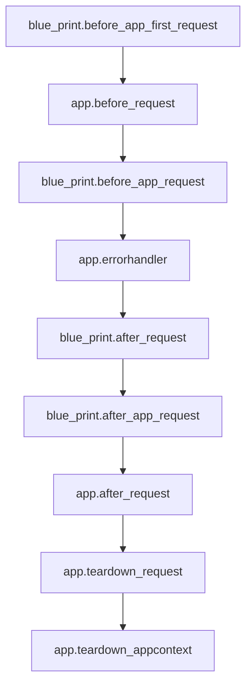

flask钩子函数执行顺序：

flask中有三种异常处理的钩子，`app.errorhandler`、`blueprint.errorhandler`和`blueprint.app_errorhandler`，在处理时，只会调用其中一个，优先级为

`blueprint.errorhandler` > `blueprint.app_errorhandler` > `app.errorhandler`

