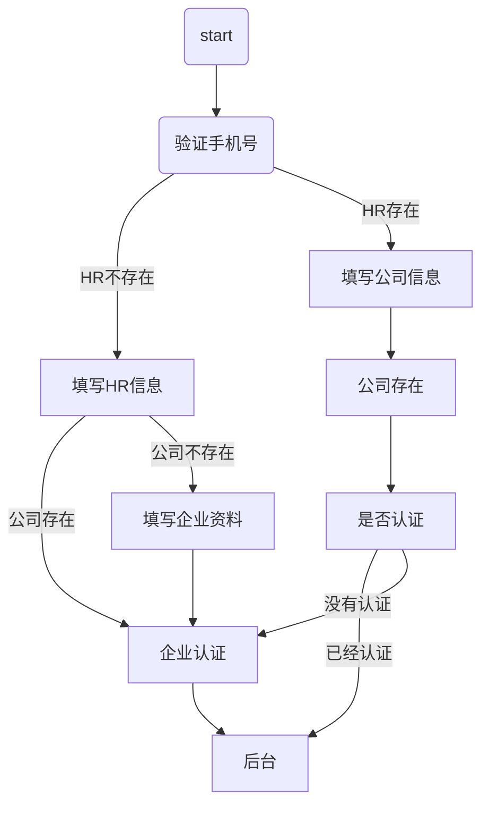

```mermaid
graph TB
  开始(start)
  B(验证手机号)
  开始-->B
  
  填写HR信息
  B--HR不存在-->填写HR信息
  填写公司信息
  B--HR存在-->填写公司信息
  
  填写HR信息--公司存在-->企业认证
  填写HR信息--公司不存在-->填写企业资料
  填写企业资料-->企业认证
  
  填写公司信息-->公司存在
  公司存在 -->是否认证
  是否认证--已经认证-->后台
  是否认证--没有认证-->企业认证
  
  企业认证-->后台
  
```

