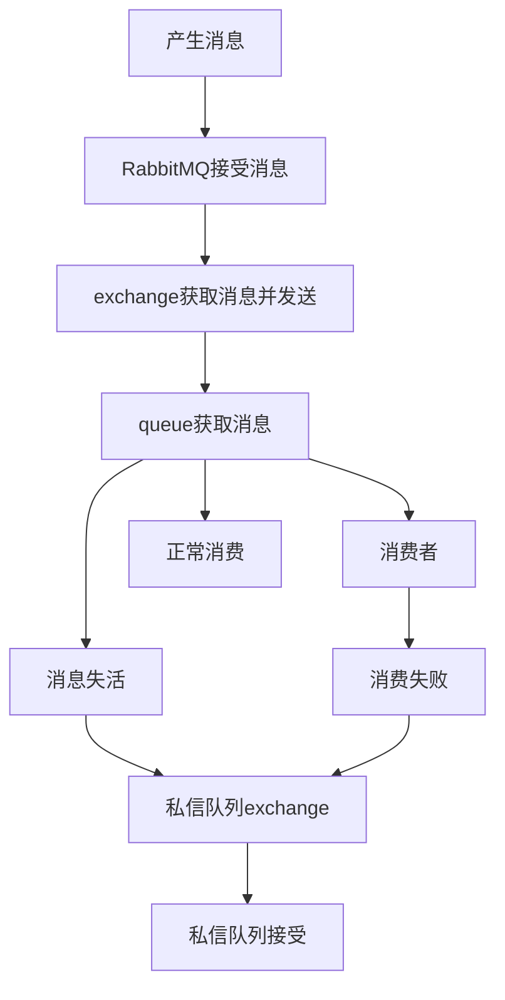

# 概念

首先应该弄清一个概念，什么是死信队列。

关于私信队列官方的说法是：

> Messages from a queue can be "dead-lettered"; that is, republished to an exchange when any of the following events occur
> 
> - The message is [negatively acknowledged](https://www.rabbitmq.com/confirms.html) by a consumer using basic.reject or basic.nack with requeue parameter set to false.
> - The message expires due to [per-message TTL](https://www.rabbitmq.com/ttl.html); or
> - The message is dropped because its queue exceeded a [length limit](https://www.rabbitmq.com/maxlength.html)
> 
> Note that expiration of a queue will not dead letter the messages in it.
> 
> Dead letter exchanges (DLXs) are normal exchanges. They can be any of the usual types and are declared as usual.
> 
> For any given queue, a DLX can be defined by clients using the [queue's arguments](https://www.rabbitmq.com/queues.html#optional-arguments), or in the server using [policies](https://www.rabbitmq.com/parameters.html#policies). In the case where both policy and arguments specify a DLX, the one specified in arguments overrules the one specified in policy.

一个消息是有死亡状态的，它会被发送到一个指定的队列中，这个队列是一个普通的队列，根据他的功能，我们叫他死信队列。

当发生下面的情况时，消息会被发送到死信队列：

1. 消息被消费者接收，并且标记了reject或者nack，拒绝或者未消费成功。
2. 队列设定了消息存活时间，超过存活时间未被消费，会自动发送到死信队列。
3. 队列满了，再被分发到队列的消息，会被发送到死信队列。

死信队列官方的介绍和使用页面是：

私信队列介绍页面：https://www.rabbitmq.com/dlx.html

消息拒绝机制：https://www.rabbitmq.com/confirms.html

存活时间介绍页面：https://www.rabbitmq.com/ttl.html

队列长度介绍页面：https://www.rabbitmq.com/maxlength.html

# 死信队列绑定

包括官方，首先需要注意的问题是，死信队列是一个普通的队列，你可以按照普通队列的创建方式来创建，连接，消费队列里面的消息。

首先创建一个队列，创建这个这个队列的exchange，然后一个可以正常运行的死信队列，就创建好了。你可以用一些名字来标记他是一个死信队列，比如`_tlx`，`.tlx`等。

然后创建你作为架构中的消息队列，或者broker使用的队列，在创建过程中，需要设置参数，将这个队列绑定到死信队列上，产生死信的时候，会自动发送到这个死信队列。

在创建队列时候，设置图中两个参数，一个是绑定死信队列的exchange，一个是绑定死信队列的routing key

# 死信队列使用

在python中连接rabbitmq使用的pika库，创建queue和connection之后，可以进行消费，对于当前消费中的消息，有`channel.basic_rejact(delivery_tag, requeue=False)`或者和`channel.basic_nack(delivery_tag=None, multiple=False,requeue=False)`方法将消息发送到死信队列。

对于在死信队列中的消息，可以使用一个单独的连接来进行处理。消费失败的消息，可能是一些数据存在问题的消息，问题多种多样，可能不能够用同意的逻辑进行处理，这时候就需要查看确认导致消息消费失败的原因，具体问题具体分析，挨个排查。

pika的文档中发送到私信队列的部分：

rejact：https://pika.readthedocs.io/en/stable/modules/channel.html#pika.channel.Channel.basic_reject

nack：https://pika.readthedocs.io/en/stable/modules/channel.html#pika.channel.Channel.basic_nack

