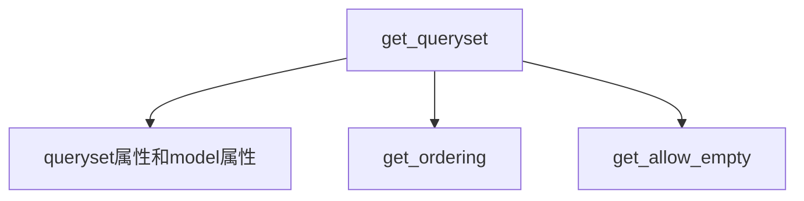
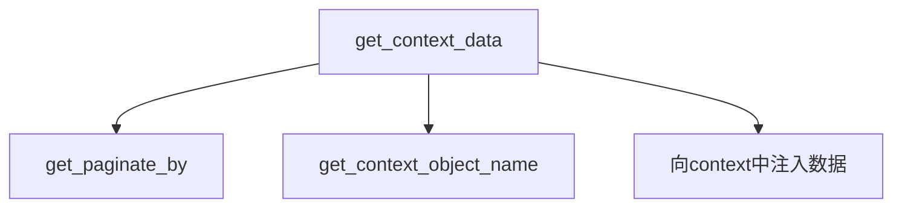

# CBV模式的接口

CBV模式即为API式的写法，一个资源类接受一系列的请求。本文讨论的是View的直接子类中的概念和方法，Django REST framework中重写和添加了大量的方法，可以直接继承自XXXAPIView，不再本文的讨论范围。

- 首先在试图函数中创建View的子类
- 在类中定义请求方式的类方法
- 在urlpatterns中添加方式不同，需要加as_view()
  - 需要加()，调用这个方法

```python
class HelloView(View):
	def get(self, request):
		return HttpResponse("GET view ok")
```

View中的方法

1. \_\_init__
2. [as_view](#p1)
3. [dispaych](#p2)
4. [http_method_not_allowed](#p3)
5. [options](#p4)
6. [\__allowed_methods](#p5)
7. http_method_name

## 调用顺序为

<p id='p1'>

### as_view

- as_view

1. as_view传入的参数不能和请求方法同名

```python
	def get(self, request):
        return HttpResponse("GET %s" % self.msg)
```

2. as_view传递进来的参数必须是类中既有的属性

- 定义view函数

1. 创建自己的对象
```python
def as_view(resquest):
	def view(cls)
		self = cls(**initkwargs)
```

2. 记录传入的参数HelloView
2. 只要支持get请求就支持head请求

3. 在view函数中调用了dispatch

<p id='p2'></p>

### dispatch


1. 根据请求方法名字小写取既有请求方法列表中判定
```python
def dispatch(self, request, *args, **kwargs):
	if request.method.lower() in self.http_method_names:
	handler = getattr(self, request.method.lower(), self.http_method_not_allowed)
	else:
        handler = self.http_method_not_allowed
    return handler(request, *args, **kwargs)
```

  - 如果请求不存在直接返回http_method_not_allowed
  - 如果存在，会根据请求方法获取对应的属性

    - 属性不存在也返回http_method_not_allowed
    - 属性存在返回正常属性
- 调用属性

<p id='p3'>

### http_method_not_allowed

- 直接返回HttpResponse

<p id='p5'>

### _allowed_methods

- 用列表迭代器，返回请求方法的名字

```python
return [m.upper() for m in self.http_method_names if hasattr(self, m)]
```

<p id='p4'>

### options

- 是一个请求方法
- 默认所有的CBV都支持options方法

# 类试图CBV流程

as_view

通过内置方法dispatch来分发请求方法


重写View父类，实现继承自重写类的类，可以支持请求方法

```python
class HelloCustomView(object):
    @classmethod
    def as_view(cls):
        def view(request):
            self = cls()
            return self.dispatch(request)
        return view

    def dispatch(self, request):
        handler = getattr(self, request.method.lower(), None)
        if not handler:
            return HttpResponse("request method not allowed")
        return handler(request)

    def get(self, request):
        return HttpResponse("GET")

    def post(self, request):
        return HttpResponse("POST")

    def put(self, resquest):
        return HttpResponse("PUT")
```

---

# TemplateView

继承关系如图


有三个父类


- TemplateResponseMixin
- ContextMixin
- View
	- 用来分发请求的父类

<p id='TemplateResponseMixin'>

## TemplateResponseMixin

- 属性
  - template_name
  - template_engine
  - response_class
  - content_type

- 方法
  - render_to_respose
	  - 将传入的上下文渲染形成响应
  - get_template_names

- 作用
  - 用来渲染模板的多继承类

## ContextMixin
  - 属性
  - 方法
    - get_context_data
  - 作用
	  - 一个将传入的键值对转化为`'view'`键字典的默认多继承父类

<p id='View'>

## View
- 属性
	- http_method_names
- 方法
	- as_view
		- view
	- dispatch
	- http_method_not_allowed
	- options
- 作用
	- 用来分发请求

TemplateView实现的功能：

1. 分发请求：dispatch方法
2. 实现了get请求：在TemplateView类中的get方法
3. 获取上下文：ContextMixin多继承父类
4. 渲染成响应：TemplateResponseMixin中的render_to_respose方法

---

# ListView

继承关系如图


ListView只是继承父类，没有在其中增改方法

**有两个父类**：
- MultipleObjectTemplateResponseMixin
- BaseListView

MultipleObjectTemplateResponseMixin的属性和方法

**属性：**
1. template_name_suffix = '_list'

**方法：**
1. def get_template_names(self):返回模板名字的列表

BaseListView的属性和方法

无属性

方法：

- get():将传入的上下文渲染成响应，默认支持get请求

```python
return self.render_to_response(context)
```


## MultipleObjectTemplateResponseMixin
有一个父类

### TemplateResponseMixin

也是[View](#TemplateResponseMixin)的父类，属性和方法同上文的TemplateResponseMixin

### BaseListView

有两个父类
#### 1. MultipleObjectMixin

他有一个父类ContextMixin，父类的类方法 `get_context_data` 将传入的键值对转化为’view’键字典的默认多继承父类

**属性：**

- allow_empty
- context_object_name
- model

- ordering
	- 以某个字段排序，可以制定多个
- page_kwargs
- paginate_by
- paginate_class
- paginate_orphans
- queryset

传入一个model或者query_set，返回modelname_list，否则默认为object_list

```python
model = Book  # 或下面的query_set
queryset = Book.objects.all()
```

**方法：**

- get_queryset
- get_ordering
- paginate_queryset
- get_paginate_by
- get_paginator
- get_paginate_orphans
	- 返回最后一个页码
- get_allow_empty
- get_context_object_name
- get_context_data
	- 用来重写

#### 2. [View](#View)

即上文中的View

### 流程概览






# CBV模型的请求流程

基本的请求流程如图所示，详细的处理方法可以在源码中找到。

![](data:image/svg+xml;base64,PD94bWwgdmVyc2lvbj0iMS4wIiBlbmNvZGluZz0iVVRGLTgiIHN0YW5kYWxvbmU9Im5vIj8+PHN2%0D%0AZyB4bWxucz0iaHR0cDovL3d3dy53My5vcmcvMjAwMC9zdmciIHhtbG5zOnhsaW5rPSJodHRwOi8v%0D%0Ad3d3LnczLm9yZy8xOTk5L3hsaW5rIiBjb250ZW50U2NyaXB0VHlwZT0iYXBwbGljYXRpb24vZWNt%0D%0AYXNjcmlwdCIgY29udGVudFN0eWxlVHlwZT0idGV4dC9jc3MiIGhlaWdodD0iMTY0OXB4IiBwcmVz%0D%0AZXJ2ZUFzcGVjdFJhdGlvPSJub25lIiBzdHlsZT0id2lkdGg6ODQ1cHg7aGVpZ2h0OjE2NDlweDsi%0D%0AIHZlcnNpb249IjEuMSIgdmlld0JveD0iMCAwIDg0NSAxNjQ5IiB3aWR0aD0iODQ1cHgiIHpvb21B%0D%0AbmRQYW49Im1hZ25pZnkiPgogICAgPGRlZnM+CiAgICAgICAgPGZpbHRlciBoZWlnaHQ9IjMwMCUi%0D%0AIGlkPSJmMTl6Mjc3ZmExcHh5cyIgd2lkdGg9IjMwMCUiIHg9Ii0xIiB5PSItMSI+CiAgICAgICAg%0D%0AICAgIDxmZUdhdXNzaWFuQmx1ciByZXN1bHQ9ImJsdXJPdXQiIHN0ZERldmlhdGlvbj0iMi4wIiAv%0D%0APgogICAgICAgICAgICA8ZmVDb2xvck1hdHJpeCBpbj0iYmx1ck91dCIgcmVzdWx0PSJibHVyT3V0%0D%0AMiIgdHlwZT0ibWF0cml4IiB2YWx1ZXM9IjAgMCAwIDAgMCAwIDAgMCAwIDAgMCAwIDAgMCAwIDAg%0D%0AMCAwIC40IDAiIC8+CiAgICAgICAgICAgIDxmZU9mZnNldCBkeD0iNC4wIiBkeT0iNC4wIiBpbj0i%0D%0AYmx1ck91dDIiIHJlc3VsdD0iYmx1ck91dDMiIC8+CiAgICAgICAgICAgIDxmZUJsZW5kIGluPSJT%0D%0Ab3VyY2VHcmFwaGljIiBpbjI9ImJsdXJPdXQzIiBtb2RlPSJub3JtYWwiIC8+CiAgICAgICAgPC9m%0D%0AaWx0ZXI+CiAgICA8L2RlZnM+CiAgICA8Zz48dGV4dCBmaWxsPSIjMDAwMDAwIiBmb250LWZhbWls%0D%0AeT0ic2Fucy1zZXJpZiIgZm9udC1zaXplPSIxOCIgbGVuZ3RoQWRqdXN0PSJzcGFjaW5nQW5kR2x5%0D%0AcGhzIiB0ZXh0TGVuZ3RoPSI2MyIgeD0iMzkwIiB5PSIyNi4yNzczIj5BUElWaWV3PC90ZXh0Pgog%0D%0AICAgICAgIDxyZWN0IGZpbGw9IiNGRUZFQ0UiIGZpbHRlcj0idXJsKCNmMTl6Mjc3ZmExcHh5cyki%0D%0AIGhlaWdodD0iMzIuNjMyOCIgcng9IjEyLjUiIHJ5PSIxMi41IiBzdHlsZT0ic3Ryb2tlOiAjQTgw%0D%0AMDM2OyBzdHJva2Utd2lkdGg6IDEuNTsiIHdpZHRoPSI2MiIgeD0iMzg0IiB5PSIyOC45NDkyIiAv%0D%0APjx0ZXh0IGZpbGw9IiMwMDAwMDAiIGZvbnQtZmFtaWx5PSJzYW5zLXNlcmlmIiBmb250LXNpemU9%0D%0AIjEyIiBsZW5ndGhBZGp1c3Q9InNwYWNpbmdBbmRHbHlwaHMiIHRleHRMZW5ndGg9IjQyIiB4PSIz%0D%0AOTQiIHk9IjQ5LjgwMDgiPlJlcXVlc3Q8L3RleHQ+CiAgICAgICAgPGxpbmUgc3R5bGU9InN0cm9r%0D%0AZTogI0E4MDAzNjsgc3Ryb2tlLXdpZHRoOiAxLjU7IiB4MT0iMjg2IiB4Mj0iNTM1IiB5MT0iODEu%0D%0ANTgyIiB5Mj0iODEuNTgyIiAvPgogICAgICAgIDxyZWN0IGZpbGw9IiNGRUZFQ0UiIGZpbHRlcj0i%0D%0AdXJsKCNmMTl6Mjc3ZmExcHh5cykiIGhlaWdodD0iMzIuNjMyOCIgcng9IjEyLjUiIHJ5PSIxMi41%0D%0AIiBzdHlsZT0ic3Ryb2tlOiAjQTgwMDM2OyBzdHJva2Utd2lkdGg6IDEuNTsiIHdpZHRoPSI0NCIg%0D%0AeD0iMjY0IiB5PSIxMDEuNTgyIiAvPjx0ZXh0IGZpbGw9IiMwMDAwMDAiIGZvbnQtZmFtaWx5PSJz%0D%0AYW5zLXNlcmlmIiBmb250LXNpemU9IjEyIiBsZW5ndGhBZGp1c3Q9InNwYWNpbmdBbmRHbHlwaHMi%0D%0AIHRleHRMZW5ndGg9IjE4IiB4PSIyODAiIHk9IjEyMi40MzM2Ij5nZXQ8L3RleHQ+CiAgICAgICAg%0D%0APHJlY3QgZmlsbD0iI0ZFRkVDRSIgZmlsdGVyPSJ1cmwoI2YxOXoyNzdmYTFweHlzKSIgaGVpZ2h0%0D%0APSIzMi42MzI4IiByeD0iMTIuNSIgcnk9IjEyLjUiIHN0eWxlPSJzdHJva2U6ICNBODAwMzY7IHN0%0D%0Acm9rZS13aWR0aDogMS41OyIgd2lkdGg9IjUwIiB4PSIzMzYiIHk9IjEwMS41ODIiIC8+PHRleHQg%0D%0AZmlsbD0iIzAwMDAwMCIgZm9udC1mYW1pbHk9InNhbnMtc2VyaWYiIGZvbnQtc2l6ZT0iMTIiIGxl%0D%0Abmd0aEFkanVzdD0ic3BhY2luZ0FuZEdseXBocyIgdGV4dExlbmd0aD0iMjQiIHg9IjM1MiIgeT0i%0D%0AMTIyLjQzMzYiPnBvc3Q8L3RleHQ+CiAgICAgICAgPHJlY3QgZmlsbD0iI0ZFRkVDRSIgZmlsdGVy%0D%0APSJ1cmwoI2YxOXoyNzdmYTFweHlzKSIgaGVpZ2h0PSIzMi42MzI4IiByeD0iMTIuNSIgcnk9IjEy%0D%0ALjUiIHN0eWxlPSJzdHJva2U6ICNBODAwMzY7IHN0cm9rZS13aWR0aDogMS41OyIgd2lkdGg9IjYy%0D%0AIiB4PSI0MTQiIHk9IjEwMS41ODIiIC8+PHRleHQgZmlsbD0iIzAwMDAwMCIgZm9udC1mYW1pbHk9%0D%0AInNhbnMtc2VyaWYiIGZvbnQtc2l6ZT0iMTIiIGxlbmd0aEFkanVzdD0ic3BhY2luZ0FuZEdseXBo%0D%0AcyIgdGV4dExlbmd0aD0iMzYiIHg9IjQzMCIgeT0iMTIyLjQzMzYiPnVwZGF0ZTwvdGV4dD4KICAg%0D%0AICAgICA8cmVjdCBmaWxsPSIjRkVGRUNFIiBmaWx0ZXI9InVybCgjZjE5ejI3N2ZhMXB4eXMpIiBo%0D%0AZWlnaHQ9IjMyLjYzMjgiIHJ4PSIxMi41IiByeT0iMTIuNSIgc3R5bGU9InN0cm9rZTogI0E4MDAz%0D%0ANjsgc3Ryb2tlLXdpZHRoOiAxLjU7IiB3aWR0aD0iNjIiIHg9IjUwNCIgeT0iMTAxLjU4MiIgLz48%0D%0AdGV4dCBmaWxsPSIjMDAwMDAwIiBmb250LWZhbWlseT0ic2Fucy1zZXJpZiIgZm9udC1zaXplPSIx%0D%0AMiIgbGVuZ3RoQWRqdXN0PSJzcGFjaW5nQW5kR2x5cGhzIiB0ZXh0TGVuZ3RoPSIzNiIgeD0iNTIw%0D%0AIiB5PSIxMjIuNDMzNiI+ZGVsZXRlPC90ZXh0PgogICAgICAgIDxsaW5lIHN0eWxlPSJzdHJva2U6%0D%0AICNBODAwMzY7IHN0cm9rZS13aWR0aDogMS41OyIgeDE9IjI4NiIgeDI9IjUzNSIgeTE9IjE1NC4y%0D%0AMTQ4IiB5Mj0iMTU0LjIxNDgiIC8+CiAgICAgICAgPHJlY3QgZmlsbD0iI0ZFRkVDRSIgZmlsdGVy%0D%0APSJ1cmwoI2YxOXoyNzdmYTFweHlzKSIgaGVpZ2h0PSIzMi42MzI4IiByeD0iMTIuNSIgcnk9IjEy%0D%0ALjUiIHN0eWxlPSJzdHJva2U6ICNBODAwMzY7IHN0cm9rZS13aWR0aDogMS41OyIgd2lkdGg9IjUw%0D%0AIiB4PSIzOTAiIHk9IjE3NC4yMTQ4IiAvPjx0ZXh0IGZpbGw9IiMwMDAwMDAiIGZvbnQtZmFtaWx5%0D%0APSJzYW5zLXNlcmlmIiBmb250LXNpemU9IjEyIiBsZW5ndGhBZGp1c3Q9InNwYWNpbmdBbmRHbHlw%0D%0AaHMiIHRleHRMZW5ndGg9IjI0IiB4PSI0MDYiIHk9IjE5NS4wNjY0Ij53c2dpPC90ZXh0PgogICAg%0D%0AICAgIDxyZWN0IGZpbGw9IiNGRUZFQ0UiIGZpbHRlcj0idXJsKCNmMTl6Mjc3ZmExcHh5cykiIGhl%0D%0AaWdodD0iMzIuNjMyOCIgcng9IjEyLjUiIHJ5PSIxMi41IiBzdHlsZT0ic3Ryb2tlOiAjQTgwMDM2%0D%0AOyBzdHJva2Utd2lkdGg6IDEuNTsiIHdpZHRoPSI2MiIgeD0iMzg0IiB5PSIyMjYuODQ3NyIgLz48%0D%0AdGV4dCBmaWxsPSIjMDAwMDAwIiBmb250LWZhbWlseT0ic2Fucy1zZXJpZiIgZm9udC1zaXplPSIx%0D%0AMiIgbGVuZ3RoQWRqdXN0PSJzcGFjaW5nQW5kR2x5cGhzIiB0ZXh0TGVuZ3RoPSI0MiIgeD0iMzk0%0D%0AIiB5PSIyNDcuNjk5MiI+dXJs6Lev55SxPC90ZXh0PgogICAgICAgIDxyZWN0IGZpbGw9IiNGRUZF%0D%0AQ0UiIGZpbHRlcj0idXJsKCNmMTl6Mjc3ZmExcHh5cykiIGhlaWdodD0iMzIuNjMyOCIgcng9IjEy%0D%0ALjUiIHJ5PSIxMi41IiBzdHlsZT0ic3Ryb2tlOiAjQTgwMDM2OyBzdHJva2Utd2lkdGg6IDEuNTsi%0D%0AIHdpZHRoPSIxNTIiIHg9IjMzOSIgeT0iMjc5LjQ4MDUiIC8+PHRleHQgZmlsbD0iIzAwMDAwMCIg%0D%0AZm9udC1mYW1pbHk9InNhbnMtc2VyaWYiIGZvbnQtc2l6ZT0iMTIiIGxlbmd0aEFkanVzdD0ic3Bh%0D%0AY2luZ0FuZEdseXBocyIgdGV4dExlbmd0aD0iMTI2IiB4PSIzNTUiIHk9IjMwMC4zMzIiPue7p+aJ%0D%0Av+iHqkFQSVZpZXfnmoTnsbvop4blm748L3RleHQ+CiAgICAgICAgPHBhdGggZD0iTTQ2OSwzMzYu%0D%0ANTg2OSBMNDY5LDM0NC40Mjk3IEw0NDksMzQ4LjQyOTcgTDQ2OSwzNTIuNDI5NyBMNDY5LDM2MC4y%0D%0ANzI1IEEwLDAgMCAwIDAgNDY5LDM2MC4yNzI1IEw1NTMsMzYwLjI3MjUgQTAsMCAwIDAgMCA1NTMs%0D%0AMzYwLjI3MjUgTDU1MywzNDYuNTg2OSBMNTQzLDMzNi41ODY5IEw0NjksMzM2LjU4NjkgQTAsMCAw%0D%0AIDAgMCA0NjksMzM2LjU4NjkgIiBmaWxsPSIjRkJGQjc3IiBmaWx0ZXI9InVybCgjZjE5ejI3N2Zh%0D%0AMXB4eXMpIiBzdHlsZT0ic3Ryb2tlOiAjQTgwMDM2OyBzdHJva2Utd2lkdGg6IDEuMDsiIC8+CiAg%0D%0AICAgICAgPHBhdGggZD0iTTU0MywzMzYuNTg2OSBMNTQzLDM0Ni41ODY5IEw1NTMsMzQ2LjU4Njkg%0D%0ATDU0MywzMzYuNTg2OSAiIGZpbGw9IiNGQkZCNzciIHN0eWxlPSJzdHJva2U6ICNBODAwMzY7IHN0%0D%0Acm9rZS13aWR0aDogMS4wOyIgLz48dGV4dCBmaWxsPSIjMDAwMDAwIiBmb250LWZhbWlseT0ic2Fu%0D%0Acy1zZXJpZiIgZm9udC1zaXplPSIxMyIgbGVuZ3RoQWRqdXN0PSJzcGFjaW5nQW5kR2x5cGhzIiB0%0D%0AZXh0TGVuZ3RoPSI2MyIgeD0iNDc1IiB5PSIzNTMuMzQyOCI+57un5om/6IeqdmlldzwvdGV4dD4K%0D%0AICAgICAgICA8cmVjdCBmaWxsPSIjRkVGRUNFIiBmaWx0ZXI9InVybCgjZjE5ejI3N2ZhMXB4eXMp%0D%0AIiBoZWlnaHQ9IjMyLjYzMjgiIHJ4PSIxMi41IiByeT0iMTIuNSIgc3R5bGU9InN0cm9rZTogI0E4%0D%0AMDAzNjsgc3Ryb2tlLXdpZHRoOiAxLjU7IiB3aWR0aD0iNjgiIHg9IjM4MSIgeT0iMzMyLjExMzMi%0D%0AIC8+PHRleHQgZmlsbD0iIzAwMDAwMCIgZm9udC1mYW1pbHk9InNhbnMtc2VyaWYiIGZvbnQtc2l6%0D%0AZT0iMTIiIGxlbmd0aEFkanVzdD0ic3BhY2luZ0FuZEdseXBocyIgdGV4dExlbmd0aD0iNDIiIHg9%0D%0AIjM5NyIgeT0iMzUyLjk2NDgiPmFzX3ZpZXc8L3RleHQ+CiAgICAgICAgPHJlY3QgZmlsbD0iI0ZF%0D%0ARkVDRSIgZmlsdGVyPSJ1cmwoI2YxOXoyNzdmYTFweHlzKSIgaGVpZ2h0PSIzMi42MzI4IiByeD0i%0D%0AMTIuNSIgcnk9IjEyLjUiIHN0eWxlPSJzdHJva2U6ICNBODAwMzY7IHN0cm9rZS13aWR0aDogMS41%0D%0AOyIgd2lkdGg9IjExMCIgeD0iMzYwIiB5PSIzODQuNzQ2MSIgLz48dGV4dCBmaWxsPSIjMDAwMDAw%0D%0AIiBmb250LWZhbWlseT0ic2Fucy1zZXJpZiIgZm9udC1zaXplPSIxMiIgbGVuZ3RoQWRqdXN0PSJz%0D%0AcGFjaW5nQW5kR2x5cGhzIiB0ZXh0TGVuZ3RoPSI5MCIgeD0iMzcwIiB5PSI0MDUuNTk3NyI+Y2hl%0D%0AY2tfYXJndWVtZW50PC90ZXh0PgogICAgICAgIDxwYXRoIGQ9Ik0yMzMsNDQxLjg1MjUgTDIzMyw0%0D%0ANjUuNTM4MSBBMCwwIDAgMCAwIDIzMyw0NjUuNTM4MSBMMzYxLDQ2NS41MzgxIEEwLDAgMCAwIDAg%0D%0AMzYxLDQ2NS41MzgxIEwzNjEsNDU5Ljg1MjUgTDM4MSw0NTMuNjk1MyBMMzYxLDQ1MS44NTI1IEwz%0D%0ANjEsNDUxLjg1MjUgTDM1MSw0NDEuODUyNSBMMjMzLDQ0MS44NTI1IEEwLDAgMCAwIDAgMjMzLDQ0%0D%0AMS44NTI1ICIgZmlsbD0iI0ZCRkI3NyIgZmlsdGVyPSJ1cmwoI2YxOXoyNzdmYTFweHlzKSIgc3R5%0D%0AbGU9InN0cm9rZTogI0E4MDAzNjsgc3Ryb2tlLXdpZHRoOiAxLjA7IiAvPgogICAgICAgIDxwYXRo%0D%0AIGQ9Ik0zNTEsNDQxLjg1MjUgTDM1MSw0NTEuODUyNSBMMzYxLDQ1MS44NTI1IEwzNTEsNDQxLjg1%0D%0AMjUgIiBmaWxsPSIjRkJGQjc3IiBzdHlsZT0ic3Ryb2tlOiAjQTgwMDM2OyBzdHJva2Utd2lkdGg6%0D%0AIDEuMDsiIC8+PHRleHQgZmlsbD0iIzAwMDAwMCIgZm9udC1mYW1pbHk9InNhbnMtc2VyaWYiIGZv%0D%0AbnQtc2l6ZT0iMTMiIGxlbmd0aEFkanVzdD0ic3BhY2luZ0FuZEdseXBocyIgdGV4dExlbmd0aD0i%0D%0AMTA3IiB4PSIyMzkiIHk9IjQ1OC42MDg0Ij7osIPnlKhBUElWaWV36Ieq5bex55qEPC90ZXh0Pgog%0D%0AICAgICAgIDxyZWN0IGZpbGw9IiNGRUZFQ0UiIGZpbHRlcj0idXJsKCNmMTl6Mjc3ZmExcHh5cyki%0D%0AIGhlaWdodD0iMzIuNjMyOCIgcng9IjEyLjUiIHJ5PSIxMi41IiBzdHlsZT0ic3Ryb2tlOiAjQTgw%0D%0AMDM2OyBzdHJva2Utd2lkdGg6IDEuNTsiIHdpZHRoPSI2OCIgeD0iMzgxIiB5PSI0MzcuMzc4OSIg%0D%0ALz48dGV4dCBmaWxsPSIjMDAwMDAwIiBmb250LWZhbWlseT0ic2Fucy1zZXJpZiIgZm9udC1zaXpl%0D%0APSIxMiIgbGVuZ3RoQWRqdXN0PSJzcGFjaW5nQW5kR2x5cGhzIiB0ZXh0TGVuZ3RoPSI0OCIgeD0i%0D%0AMzkxIiB5PSI0NTguMjMwNSI+ZGlzcGF0Y2g8L3RleHQ+CiAgICAgICAgPHBhdGggZD0iTTQ5OSw0%0D%0AOTQuNDg1NCBMNDk5LDUxOC4xNzA5IEw2MTQsNTE4LjE3MDkgTDYxNCw1MDQuNDg1NCBMNjA0LDQ5%0D%0ANC40ODU0IEw0OTksNDk0LjQ4NTQgIiBmaWxsPSIjRkJGQjc3IiBmaWx0ZXI9InVybCgjZjE5ejI3%0D%0AN2ZhMXB4eXMpIiBzdHlsZT0ic3Ryb2tlOiAjQTgwMDM2OyBzdHJva2Utd2lkdGg6IDEuMDsiIC8+%0D%0ACiAgICAgICAgPHBhdGggZD0iTTYwNCw0OTQuNDg1NCBMNjA0LDUwNC40ODU0IEw2MTQsNTA0LjQ4%0D%0ANTQgTDYwNCw0OTQuNDg1NCAiIGZpbGw9IiNGQkZCNzciIHN0eWxlPSJzdHJva2U6ICNBODAwMzY7%0D%0AIHN0cm9rZS13aWR0aDogMS4wOyIgLz48dGV4dCBmaWxsPSIjMDAwMDAwIiBmb250LWZhbWlseT0i%0D%0Ac2Fucy1zZXJpZiIgZm9udC1zaXplPSIxMyIgbGVuZ3RoQWRqdXN0PSJzcGFjaW5nQW5kR2x5cGhz%0D%0AIiB0ZXh0TGVuZ3RoPSI5NCIgeD0iNTA1IiB5PSI1MTEuMjQxMiI+6YeN5paw5bCB6KOFcmVxdWVz%0D%0AdDwvdGV4dD4KICAgICAgICA8cmVjdCBmaWxsPSIjRkVGRUNFIiBmaWx0ZXI9InVybCgjZjE5ejI3%0D%0AN2ZhMXB4eXMpIiBoZWlnaHQ9IjMyLjYzMjgiIHJ4PSIxMi41IiByeT0iMTIuNSIgc3R5bGU9InN0%0D%0Acm9rZTogI0E4MDAzNjsgc3Ryb2tlLXdpZHRoOiAxLjU7IiB3aWR0aD0iMTI4IiB4PSIzNTEiIHk9%0D%0AIjQ5MC4wMTE3IiAvPjx0ZXh0IGZpbGw9IiMwMDAwMDAiIGZvbnQtZmFtaWx5PSJzYW5zLXNlcmlm%0D%0AIiBmb250LXNpemU9IjEyIiBsZW5ndGhBZGp1c3Q9InNwYWNpbmdBbmRHbHlwaHMiIHRleHRMZW5n%0D%0AdGg9IjEwOCIgeD0iMzYxIiB5PSI1MTAuODYzMyI+aW5pdGlhbGl6ZV9yZXF1ZXN0PC90ZXh0Pgog%0D%0AICAgICAgIDxyZWN0IGZpbGw9IiNGRUZFQ0UiIGZpbHRlcj0idXJsKCNmMTl6Mjc3ZmExcHh5cyki%0D%0AIGhlaWdodD0iMzIuNjMyOCIgcng9IjEyLjUiIHJ5PSIxMi41IiBzdHlsZT0ic3Ryb2tlOiAjQTgw%0D%0AMDM2OyBzdHJva2Utd2lkdGg6IDEuNTsiIHdpZHRoPSI2MiIgeD0iMzg0IiB5PSI1NDIuNjQ0NSIg%0D%0ALz48dGV4dCBmaWxsPSIjMDAwMDAwIiBmb250LWZhbWlseT0ic2Fucy1zZXJpZiIgZm9udC1zaXpl%0D%0APSIxMiIgbGVuZ3RoQWRqdXN0PSJzcGFjaW5nQW5kR2x5cGhzIiB0ZXh0TGVuZ3RoPSI0MiIgeD0i%0D%0AMzk0IiB5PSI1NjMuNDk2MSI+aW5pdGlhbDwvdGV4dD4KICAgICAgICA8bGluZSBzdHlsZT0ic3Ry%0D%0Ab2tlOiAjQTgwMDM2OyBzdHJva2Utd2lkdGg6IDEuNTsiIHgxPSIxMjciIHgyPSI2OTEiIHkxPSI1%0D%0AOTUuMjc3MyIgeTI9IjU5NS4yNzczIiAvPgogICAgICAgIDxyZWN0IGZpbGw9IiNGRUZFQ0UiIGZp%0D%0AbHRlcj0idXJsKCNmMTl6Mjc3ZmExcHh5cykiIGhlaWdodD0iMzIuNjMyOCIgcng9IjEyLjUiIHJ5%0D%0APSIxMi41IiBzdHlsZT0ic3Ryb2tlOiAjQTgwMDM2OyBzdHJva2Utd2lkdGg6IDEuNTsiIHdpZHRo%0D%0APSI2OCIgeD0iOTMiIHk9IjYxNS4yNzczIiAvPjx0ZXh0IGZpbGw9IiMwMDAwMDAiIGZvbnQtZmFt%0D%0AaWx5PSJzYW5zLXNlcmlmIiBmb250LXNpemU9IjEyIiBsZW5ndGhBZGp1c3Q9InNwYWNpbmdBbmRH%0D%0AbHlwaHMiIHRleHRMZW5ndGg9IjQ4IiB4PSIxMDMiIHk9IjYzNi4xMjg5Ij7mo4Dmn6XlkI7nvIA8%0D%0AL3RleHQ+CiAgICAgICAgPHJlY3QgZmlsbD0iI0ZFRkVDRSIgZmlsdGVyPSJ1cmwoI2YxOXoyNzdm%0D%0AYTFweHlzKSIgaGVpZ2h0PSIzMi42MzI4IiByeD0iMTIuNSIgcnk9IjEyLjUiIHN0eWxlPSJzdHJv%0D%0Aa2U6ICNBODAwMzY7IHN0cm9rZS13aWR0aDogMS41OyIgd2lkdGg9IjQ0IiB4PSIxMDUiIHk9IjY4%0D%0AMi45MTAyIiAvPjx0ZXh0IGZpbGw9IiMwMDAwMDAiIGZvbnQtZmFtaWx5PSJzYW5zLXNlcmlmIiBm%0D%0Ab250LXNpemU9IjEyIiBsZW5ndGhBZGp1c3Q9InNwYWNpbmdBbmRHbHlwaHMiIHRleHRMZW5ndGg9%0D%0AIjI0IiB4PSIxMTUiIHk9IjcwMy43NjE3Ij7pooTorr48L3RleHQ+CiAgICAgICAgPHJlY3QgZmls%0D%0AbD0iI0ZFRkVDRSIgZmlsdGVyPSJ1cmwoI2YxOXoyNzdmYTFweHlzKSIgaGVpZ2h0PSIzMi42MzI4%0D%0AIiByeD0iMTIuNSIgcnk9IjEyLjUiIHN0eWxlPSJzdHJva2U6ICNBODAwMzY7IHN0cm9rZS13aWR0%0D%0AaDogMS41OyIgd2lkdGg9IjY4IiB4PSIxODkiIHk9IjY0OS4wOTM4IiAvPjx0ZXh0IGZpbGw9IiMw%0D%0AMDAwMDAiIGZvbnQtZmFtaWx5PSJzYW5zLXNlcmlmIiBmb250LXNpemU9IjEyIiBsZW5ndGhBZGp1%0D%0Ac3Q9InNwYWNpbmdBbmRHbHlwaHMiIHRleHRMZW5ndGg9IjQ4IiB4PSIxOTkiIHk9IjY2OS45NDUz%0D%0AIj7lhoXlrrnlhrPnrZY8L3RleHQ+CiAgICAgICAgPHJlY3QgZmlsbD0iI0ZFRkVDRSIgZmlsdGVy%0D%0APSJ1cmwoI2YxOXoyNzdmYTFweHlzKSIgaGVpZ2h0PSIzMi42MzI4IiByeD0iMTIuNSIgcnk9IjEy%0D%0ALjUiIHN0eWxlPSJzdHJva2U6ICNBODAwMzY7IHN0cm9rZS13aWR0aDogMS41OyIgd2lkdGg9IjY4%0D%0AIiB4PSIyOTciIHk9IjYxNS4yNzczIiAvPjx0ZXh0IGZpbGw9IiMwMDAwMDAiIGZvbnQtZmFtaWx5%0D%0APSJzYW5zLXNlcmlmIiBmb250LXNpemU9IjEyIiBsZW5ndGhBZGp1c3Q9InNwYWNpbmdBbmRHbHlw%0D%0AaHMiIHRleHRMZW5ndGg9IjQ4IiB4PSIzMDciIHk9IjYzNi4xMjg5Ij7niYjmnKzlhrPnrZY8L3Rl%0D%0AeHQ+CiAgICAgICAgPHJlY3QgZmlsbD0iI0ZFRkVDRSIgZmlsdGVyPSJ1cmwoI2YxOXoyNzdmYTFw%0D%0AeHlzKSIgaGVpZ2h0PSIzMi42MzI4IiByeD0iMTIuNSIgcnk9IjEyLjUiIHN0eWxlPSJzdHJva2U6%0D%0AICNBODAwMzY7IHN0cm9rZS13aWR0aDogMS41OyIgd2lkdGg9IjkyIiB4PSIyODUiIHk9IjY4Mi45%0D%0AMTAyIiAvPjx0ZXh0IGZpbGw9IiMwMDAwMDAiIGZvbnQtZmFtaWx5PSJzYW5zLXNlcmlmIiBmb250%0D%0ALXNpemU9IjEyIiBsZW5ndGhBZGp1c3Q9InNwYWNpbmdBbmRHbHlwaHMiIHRleHRMZW5ndGg9Ijcy%0D%0AIiB4PSIyOTUiIHk9IjcwMy43NjE3Ij7mo4Dmn6XniYjmnKzmm7TmlrA8L3RleHQ+CiAgICAgICAg%0D%0APHJlY3QgZmlsbD0iI0ZFRkVDRSIgZmlsdGVyPSJ1cmwoI2YxOXoyNzdmYTFweHlzKSIgaGVpZ2h0%0D%0APSIzMi42MzI4IiByeD0iMTIuNSIgcnk9IjEyLjUiIHN0eWxlPSJzdHJva2U6ICNBODAwMzY7IHN0%0D%0Acm9rZS13aWR0aDogMS41OyIgd2lkdGg9IjY4IiB4PSI0MTciIHk9IjYxNS4yNzczIiAvPjx0ZXh0%0D%0AIGZpbGw9IiMwMDAwMDAiIGZvbnQtZmFtaWx5PSJzYW5zLXNlcmlmIiBmb250LXNpemU9IjEyIiBs%0D%0AZW5ndGhBZGp1c3Q9InNwYWNpbmdBbmRHbHlwaHMiIHRleHRMZW5ndGg9IjQ4IiB4PSI0MjciIHk9%0D%0AIjYzNi4xMjg5Ij7miafooYzorqTor4E8L3RleHQ+CiAgICAgICAgPHJlY3QgZmlsbD0iI0ZFRkVD%0D%0ARSIgZmlsdGVyPSJ1cmwoI2YxOXoyNzdmYTFweHlzKSIgaGVpZ2h0PSIzMi42MzI4IiByeD0iMTIu%0D%0ANSIgcnk9IjEyLjUiIHN0eWxlPSJzdHJva2U6ICNBODAwMzY7IHN0cm9rZS13aWR0aDogMS41OyIg%0D%0Ad2lkdGg9IjkyIiB4PSI0MDUiIHk9IjY4Mi45MTAyIiAvPjx0ZXh0IGZpbGw9IiMwMDAwMDAiIGZv%0D%0AbnQtZmFtaWx5PSJzYW5zLXNlcmlmIiBmb250LXNpemU9IjEyIiBsZW5ndGhBZGp1c3Q9InNwYWNp%0D%0AbmdBbmRHbHlwaHMiIHRleHRMZW5ndGg9IjcyIiB4PSI0MTUiIHk9IjcwMy43NjE3Ij7ph43lhpno%0D%0ArqTor4Hop4TliJk8L3RleHQ+CiAgICAgICAgPHJlY3QgZmlsbD0iI0ZFRkVDRSIgZmlsdGVyPSJ1%0D%0AcmwoI2YxOXoyNzdmYTFweHlzKSIgaGVpZ2h0PSIzMi42MzI4IiByeD0iMTIuNSIgcnk9IjEyLjUi%0D%0AIHN0eWxlPSJzdHJva2U6ICNBODAwMzY7IHN0cm9rZS13aWR0aDogMS41OyIgd2lkdGg9IjY4IiB4%0D%0APSI1MzciIHk9IjYxNS4yNzczIiAvPjx0ZXh0IGZpbGw9IiMwMDAwMDAiIGZvbnQtZmFtaWx5PSJz%0D%0AYW5zLXNlcmlmIiBmb250LXNpemU9IjEyIiBsZW5ndGhBZGp1c3Q9InNwYWNpbmdBbmRHbHlwaHMi%0D%0AIHRleHRMZW5ndGg9IjQ4IiB4PSI1NDciIHk9IjYzNi4xMjg5Ij7mo4Dmn6XmnYPpmZA8L3RleHQ+%0D%0ACiAgICAgICAgPHJlY3QgZmlsbD0iI0ZFRkVDRSIgZmlsdGVyPSJ1cmwoI2YxOXoyNzdmYTFweHlz%0D%0AKSIgaGVpZ2h0PSIzMi42MzI4IiByeD0iMTIuNSIgcnk9IjEyLjUiIHN0eWxlPSJzdHJva2U6ICNB%0D%0AODAwMzY7IHN0cm9rZS13aWR0aDogMS41OyIgd2lkdGg9IjkyIiB4PSI1MjUiIHk9IjY4Mi45MTAy%0D%0AIiAvPjx0ZXh0IGZpbGw9IiMwMDAwMDAiIGZvbnQtZmFtaWx5PSJzYW5zLXNlcmlmIiBmb250LXNp%0D%0AemU9IjEyIiBsZW5ndGhBZGp1c3Q9InNwYWNpbmdBbmRHbHlwaHMiIHRleHRMZW5ndGg9IjcyIiB4%0D%0APSI1MzUiIHk9IjcwMy43NjE3Ij7ph43lhpnmnYPpmZDop4TliJk8L3RleHQ+CiAgICAgICAgPHJl%0D%0AY3QgZmlsbD0iI0ZFRkVDRSIgZmlsdGVyPSJ1cmwoI2YxOXoyNzdmYTFweHlzKSIgaGVpZ2h0PSIz%0D%0AMi42MzI4IiByeD0iMTIuNSIgcnk9IjEyLjUiIHN0eWxlPSJzdHJva2U6ICNBODAwMzY7IHN0cm9r%0D%0AZS13aWR0aDogMS41OyIgd2lkdGg9IjQ0IiB4PSI2NjkiIHk9IjYxNS4yNzczIiAvPjx0ZXh0IGZp%0D%0AbGw9IiMwMDAwMDAiIGZvbnQtZmFtaWx5PSJzYW5zLXNlcmlmIiBmb250LXNpemU9IjEyIiBsZW5n%0D%0AdGhBZGp1c3Q9InNwYWNpbmdBbmRHbHlwaHMiIHRleHRMZW5ndGg9IjI0IiB4PSI2NzkiIHk9IjYz%0D%0ANi4xMjg5Ij7oioLmtYE8L3RleHQ+CiAgICAgICAgPHJlY3QgZmlsbD0iI0ZFRkVDRSIgZmlsdGVy%0D%0APSJ1cmwoI2YxOXoyNzdmYTFweHlzKSIgaGVpZ2h0PSIzMi42MzI4IiByeD0iMTIuNSIgcnk9IjEy%0D%0ALjUiIHN0eWxlPSJzdHJva2U6ICNBODAwMzY7IHN0cm9rZS13aWR0aDogMS41OyIgd2lkdGg9Ijky%0D%0AIiB4PSI2NDUiIHk9IjY4Mi45MTAyIiAvPjx0ZXh0IGZpbGw9IiMwMDAwMDAiIGZvbnQtZmFtaWx5%0D%0APSJzYW5zLXNlcmlmIiBmb250LXNpemU9IjEyIiBsZW5ndGhBZGp1c3Q9InNwYWNpbmdBbmRHbHlw%0D%0AaHMiIHRleHRMZW5ndGg9IjcyIiB4PSI2NTUiIHk9IjcwMy43NjE3Ij7lrprkuYnoioLmtYHop4Tl%0D%0AiJk8L3RleHQ+CiAgICAgICAgPGxpbmUgc3R5bGU9InN0cm9rZTogI0E4MDAzNjsgc3Ryb2tlLXdp%0D%0AZHRoOiAxLjU7IiB4MT0iMTI3IiB4Mj0iNjkxIiB5MT0iNzM1LjU0MyIgeTI9IjczNS41NDMiIC8+%0D%0ACiAgICAgICAgPHJlY3QgZmlsbD0iI0ZFRkVDRSIgZmlsdGVyPSJ1cmwoI2YxOXoyNzdmYTFweHlz%0D%0AKSIgaGVpZ2h0PSIzMi42MzI4IiByeD0iMTIuNSIgcnk9IjEyLjUiIHN0eWxlPSJzdHJva2U6ICNB%0D%0AODAwMzY7IHN0cm9rZS13aWR0aDogMS41OyIgd2lkdGg9IjQ0IiB4PSIzOTMiIHk9Ijc1NS41NDMi%0D%0AIC8+PHRleHQgZmlsbD0iIzAwMDAwMCIgZm9udC1mYW1pbHk9InNhbnMtc2VyaWYiIGZvbnQtc2l6%0D%0AZT0iMTIiIGxlbmd0aEFkanVzdD0ic3BhY2luZ0FuZEdseXBocyIgdGV4dExlbmd0aD0iMjQiIHg9%0D%0AIjQwMyIgeT0iNzc2LjM5NDUiPuWIhuWPkTwvdGV4dD4KICAgICAgICA8bGluZSBzdHlsZT0ic3Ry%0D%0Ab2tlOiAjQTgwMDM2OyBzdHJva2Utd2lkdGg6IDEuNTsiIHgxPSIxNzkiIHgyPSI3NzkiIHkxPSI4%0D%0AMDguMTc1OCIgeTI9IjgwOC4xNzU4IiAvPgogICAgICAgIDxsaW5lIHN0eWxlPSJzdHJva2U6ICNB%0D%0AODAwMzY7IHN0cm9rZS13aWR0aDogMS41OyIgeDE9IjEyMiIgeDI9IjI0OCIgeTE9IjgyOC4xNzU4%0D%0AIiB5Mj0iODI4LjE3NTgiIC8+CiAgICAgICAgPHJlY3QgZmlsbD0iI0ZGRkYwMCIgZmlsdGVyPSJ1%0D%0AcmwoI2YxOXoyNzdmYTFweHlzKSIgaGVpZ2h0PSIzMi42MzI4IiByeD0iMTIuNSIgcnk9IjEyLjUi%0D%0AIHN0eWxlPSJzdHJva2U6ICNBODAwMzY7IHN0cm9rZS13aWR0aDogMS41OyIgd2lkdGg9IjExMCIg%0D%0AeD0iNjciIHk9Ijg0OC4xNzU4IiAvPjx0ZXh0IGZpbGw9IiMwMDAwMDAiIGZvbnQtZmFtaWx5PSJz%0D%0AYW5zLXNlcmlmIiBmb250LXNpemU9IjEyIiBsZW5ndGhBZGp1c3Q9InNwYWNpbmdBbmRHbHlwaHMi%0D%0AIHRleHRMZW5ndGg9IjkwIiB4PSI3NyIgeT0iODY5LjAyNzMiPlJldHJpZXZlQVBJVmlldzwvdGV4%0D%0AdD4KICAgICAgICA8cmVjdCBmaWxsPSIjRkZGRjAwIiBmaWx0ZXI9InVybCgjZjE5ejI3N2ZhMXB4%0D%0AeXMpIiBoZWlnaHQ9IjMyLjYzMjgiIHJ4PSIxMi41IiByeT0iMTIuNSIgc3R5bGU9InN0cm9rZTog%0D%0AI0E4MDAzNjsgc3Ryb2tlLXdpZHRoOiAxLjU7IiB3aWR0aD0iODYiIHg9IjIwNSIgeT0iODQ4LjE3%0D%0ANTgiIC8+PHRleHQgZmlsbD0iIzAwMDAwMCIgZm9udC1mYW1pbHk9InNhbnMtc2VyaWYiIGZvbnQt%0D%0Ac2l6ZT0iMTIiIGxlbmd0aEFkanVzdD0ic3BhY2luZ0FuZEdseXBocyIgdGV4dExlbmd0aD0iNjYi%0D%0AIHg9IjIxNSIgeT0iODY5LjAyNzMiPkxpc3RBUElWaWV3PC90ZXh0PgogICAgICAgIDxsaW5lIHN0%0D%0AeWxlPSJzdHJva2U6ICNBODAwMzY7IHN0cm9rZS13aWR0aDogMS41OyIgeDE9IjEyMiIgeDI9IjI0%0D%0AOCIgeTE9IjkwMC44MDg2IiB5Mj0iOTAwLjgwODYiIC8+CiAgICAgICAgPHJlY3QgZmlsbD0iI0ZF%0D%0ARkVDRSIgZmlsdGVyPSJ1cmwoI2YxOXoyNzdmYTFweHlzKSIgaGVpZ2h0PSIzMi42MzI4IiByeD0i%0D%0AMTIuNSIgcnk9IjEyLjUiIHN0eWxlPSJzdHJva2U6ICNBODAwMzY7IHN0cm9rZS13aWR0aDogMS41%0D%0AOyIgd2lkdGg9IjM4IiB4PSIxNjAiIHk9IjkyMi4zMDg2IiAvPjx0ZXh0IGZpbGw9IiMwMDAwMDAi%0D%0AIGZvbnQtZmFtaWx5PSJzYW5zLXNlcmlmIiBmb250LXNpemU9IjEyIiBsZW5ndGhBZGp1c3Q9InNw%0D%0AYWNpbmdBbmRHbHlwaHMiIHRleHRMZW5ndGg9IjE4IiB4PSIxNzAiIHk9Ijk0My4xNjAyIj5nZXQ8%0D%0AL3RleHQ+CiAgICAgICAgPGxpbmUgc3R5bGU9InN0cm9rZTogI0E4MDAzNjsgc3Ryb2tlLXdpZHRo%0D%0AOiAxLjU7IiB4MT0iMTA0IiB4Mj0iMjI3IiB5MT0iOTg5Ljk0MTQiIHkyPSI5ODkuOTQxNCIgLz4K%0D%0AICAgICAgICA8cmVjdCBmaWxsPSIjRkVGRUNFIiBmaWx0ZXI9InVybCgjZjE5ejI3N2ZhMXB4eXMp%0D%0AIiBoZWlnaHQ9IjMyLjYzMjgiIHJ4PSIxMi41IiByeT0iMTIuNSIgc3R5bGU9InN0cm9rZTogI0E4%0D%0AMDAzNjsgc3Ryb2tlLXdpZHRoOiAxLjU7IiB3aWR0aD0iNjgiIHg9IjcwIiB5PSIxMDQ1LjI1Nzgi%0D%0AIC8+PHRleHQgZmlsbD0iIzAwMDAwMCIgZm9udC1mYW1pbHk9InNhbnMtc2VyaWYiIGZvbnQtc2l6%0D%0AZT0iMTIiIGxlbmd0aEFkanVzdD0ic3BhY2luZ0FuZEdseXBocyIgdGV4dExlbmd0aD0iNDgiIHg9%0D%0AIjgwIiB5PSIxMDY2LjEwOTQiPnJldHJpZXZlPC90ZXh0PgogICAgICAgIDxyZWN0IGZpbGw9IiNG%0D%0ARUZFQ0UiIGZpbHRlcj0idXJsKCNmMTl6Mjc3ZmExcHh5cykiIGhlaWdodD0iMzIuNjMyOCIgcng9%0D%0AIjEyLjUiIHJ5PSIxMi41IiBzdHlsZT0ic3Ryb2tlOiAjQTgwMDM2OyBzdHJva2Utd2lkdGg6IDEu%0D%0ANTsiIHdpZHRoPSI0NCIgeD0iMjA1IiB5PSIxMDExLjQ0MTQiIC8+PHRleHQgZmlsbD0iIzAwMDAw%0D%0AMCIgZm9udC1mYW1pbHk9InNhbnMtc2VyaWYiIGZvbnQtc2l6ZT0iMTIiIGxlbmd0aEFkanVzdD0i%0D%0Ac3BhY2luZ0FuZEdseXBocyIgdGV4dExlbmd0aD0iMjQiIHg9IjIxNSIgeT0iMTAzMi4yOTMiPmxp%0D%0Ac3Q8L3RleHQ+CiAgICAgICAgPHJlY3QgZmlsbD0iI0ZFRkVDRSIgZmlsdGVyPSJ1cmwoI2YxOXoy%0D%0ANzdmYTFweHlzKSIgaGVpZ2h0PSIzMi42MzI4IiByeD0iMTIuNSIgcnk9IjEyLjUiIHN0eWxlPSJz%0D%0AdHJva2U6ICNBODAwMzY7IHN0cm9rZS13aWR0aDogMS41OyIgd2lkdGg9IjEyMiIgeD0iMTY2IiB5%0D%0APSIxMDc5LjA3NDIiIC8+PHRleHQgZmlsbD0iIzAwMDAwMCIgZm9udC1mYW1pbHk9InNhbnMtc2Vy%0D%0AaWYiIGZvbnQtc2l6ZT0iMTIiIGxlbmd0aEFkanVzdD0ic3BhY2luZ0FuZEdseXBocyIgdGV4dExl%0D%0Abmd0aD0iMTAyIiB4PSIxNzYiIHk9IjEwOTkuOTI1OCI+cGFnaW5hdGVfcXVlcnlzZXQ8L3RleHQ+%0D%0ACiAgICAgICAgPGxpbmUgc3R5bGU9InN0cm9rZTogI0E4MDAzNjsgc3Ryb2tlLXdpZHRoOiAxLjU7%0D%0AIiB4MT0iMTA0IiB4Mj0iMjI3IiB5MT0iMTEzMS43MDciIHkyPSIxMTMxLjcwNyIgLz4KICAgICAg%0D%0AICA8cmVjdCBmaWxsPSIjRkVGRUNFIiBmaWx0ZXI9InVybCgjZjE5ejI3N2ZhMXB4eXMpIiBoZWln%0D%0AaHQ9IjMyLjYzMjgiIHJ4PSIxMi41IiByeT0iMTIuNSIgc3R5bGU9InN0cm9rZTogI0E4MDAzNjsg%0D%0Ac3Ryb2tlLXdpZHRoOiAxLjU7IiB3aWR0aD0iODAiIHg9IjEzOSIgeT0iMTE2OC4yMDciIC8+PHRl%0D%0AeHQgZmlsbD0iIzAwMDAwMCIgZm9udC1mYW1pbHk9InNhbnMtc2VyaWYiIGZvbnQtc2l6ZT0iMTIi%0D%0AIGxlbmd0aEFkanVzdD0ic3BhY2luZ0FuZEdseXBocyIgdGV4dExlbmd0aD0iNjAiIHg9IjE0OSIg%0D%0AeT0iMTE4OS4wNTg2Ij5nZXQgb2JqZWN0PC90ZXh0PgogICAgICAgIDxyZWN0IGZpbGw9IiNGRUZF%0D%0AQ0UiIGZpbHRlcj0idXJsKCNmMTl6Mjc3ZmExcHh5cykiIGhlaWdodD0iMzIuNjMyOCIgcng9IjEy%0D%0ALjUiIHJ5PSIxMi41IiBzdHlsZT0ic3Ryb2tlOiAjQTgwMDM2OyBzdHJva2Utd2lkdGg6IDEuNTsi%0D%0AIHdpZHRoPSI5MiIgeD0iMTMzIiB5PSIxMjM1LjgzOTgiIC8+PHRleHQgZmlsbD0iIzAwMDAwMCIg%0D%0AZm9udC1mYW1pbHk9InNhbnMtc2VyaWYiIGZvbnQtc2l6ZT0iMTIiIGxlbmd0aEFkanVzdD0ic3Bh%0D%0AY2luZ0FuZEdseXBocyIgdGV4dExlbmd0aD0iNzIiIHg9IjE0MyIgeT0iMTI1Ni42OTE0Ij5nZXRf%0D%0AcXVlcnlzZXQ8L3RleHQ+CiAgICAgICAgPGxpbmUgc3R5bGU9InN0cm9rZTogI0E4MDAzNjsgc3Ry%0D%0Ab2tlLXdpZHRoOiAxLjU7IiB4MT0iODkiIHgyPSIyNzIiIHkxPSIxMzAzLjQ3MjciIHkyPSIxMzAz%0D%0ALjQ3MjciIC8+CiAgICAgICAgPHJlY3QgZmlsbD0iI0ZFRkVDRSIgZmlsdGVyPSJ1cmwoI2YxOXoy%0D%0ANzdmYTFweHlzKSIgaGVpZ2h0PSIzMi42MzI4IiByeD0iMTIuNSIgcnk9IjEyLjUiIHN0eWxlPSJz%0D%0AdHJva2U6ICNBODAwMzY7IHN0cm9rZS13aWR0aDogMS41OyIgd2lkdGg9IjExMCIgeD0iMzQiIHk9%0D%0AIjEzNTguNzg5MSIgLz48dGV4dCBmaWxsPSIjMDAwMDAwIiBmb250LWZhbWlseT0ic2Fucy1zZXJp%0D%0AZiIgZm9udC1zaXplPSIxMiIgbGVuZ3RoQWRqdXN0PSJzcGFjaW5nQW5kR2x5cGhzIiB0ZXh0TGVu%0D%0AZ3RoPSI5MCIgeD0iNDQiIHk9IjEzNzkuNjQwNiI+ZmlsdGVyX3F1ZXJ5c2V0PC90ZXh0PgogICAg%0D%0AICAgIDxyZWN0IGZpbGw9IiNGRUZFQ0UiIGZpbHRlcj0idXJsKCNmMTl6Mjc3ZmExcHh5cykiIGhl%0D%0AaWdodD0iMzIuNjMyOCIgcng9IjEyLjUiIHJ5PSIxMi41IiBzdHlsZT0ic3Ryb2tlOiAjQTgwMDM2%0D%0AOyBzdHJva2Utd2lkdGg6IDEuNTsiIHdpZHRoPSIxNTgiIHg9IjEwIiB5PSIxNDI2LjQyMTkiIC8+%0D%0APHRleHQgZmlsbD0iIzAwMDAwMCIgZm9udC1mYW1pbHk9InNhbnMtc2VyaWYiIGZvbnQtc2l6ZT0i%0D%0AMTIiIGxlbmd0aEFkanVzdD0ic3BhY2luZ0FuZEdseXBocyIgdGV4dExlbmd0aD0iMTM4IiB4PSIy%0D%0AMCIgeT0iMTQ0Ny4yNzM0Ij5jaGVja19vYmplY3RfcGVybWlzc2lvbjwvdGV4dD4KICAgICAgICA8%0D%0AcmVjdCBmaWxsPSIjRkVGRUNFIiBmaWx0ZXI9InVybCgjZjE5ejI3N2ZhMXB4eXMpIiBoZWlnaHQ9%0D%0AIjMyLjYzMjgiIHJ4PSIxMi41IiByeT0iMTIuNSIgc3R5bGU9InN0cm9rZTogI0E4MDAzNjsgc3Ry%0D%0Ab2tlLXdpZHRoOiAxLjU7IiB3aWR0aD0iMTA0IiB4PSIyMjAiIHk9IjEzMjQuOTcyNyIgLz48dGV4%0D%0AdCBmaWxsPSIjMDAwMDAwIiBmb250LWZhbWlseT0ic2Fucy1zZXJpZiIgZm9udC1zaXplPSIxMiIg%0D%0AbGVuZ3RoQWRqdXN0PSJzcGFjaW5nQW5kR2x5cGhzIiB0ZXh0TGVuZ3RoPSI4NCIgeD0iMjMwIiB5%0D%0APSIxMzQ1LjgyNDIiPmdldF9zZXJpYWxpemVyPC90ZXh0PgogICAgICAgIDxyZWN0IGZpbGw9IiNG%0D%0ARUZFQ0UiIGZpbHRlcj0idXJsKCNmMTl6Mjc3ZmExcHh5cykiIGhlaWdodD0iMzIuNjMyOCIgcng9%0D%0AIjEyLjUiIHJ5PSIxMi41IiBzdHlsZT0ic3Ryb2tlOiAjQTgwMDM2OyBzdHJva2Utd2lkdGg6IDEu%0D%0ANTsiIHdpZHRoPSIxNDAiIHg9IjIwMiIgeT0iMTM5Mi42MDU1IiAvPjx0ZXh0IGZpbGw9IiMwMDAw%0D%0AMDAiIGZvbnQtZmFtaWx5PSJzYW5zLXNlcmlmIiBmb250LXNpemU9IjEyIiBsZW5ndGhBZGp1c3Q9%0D%0AInNwYWNpbmdBbmRHbHlwaHMiIHRleHRMZW5ndGg9IjEyMCIgeD0iMjEyIiB5PSIxNDEzLjQ1NyI+%0D%0AZ2V0X3NlcmlhbGl6ZXJfY2xhc3M8L3RleHQ+CiAgICAgICAgPHJlY3QgZmlsbD0iI0ZFRkVDRSIg%0D%0AZmlsdGVyPSJ1cmwoI2YxOXoyNzdmYTFweHlzKSIgaGVpZ2h0PSIzMi42MzI4IiByeD0iMTIuNSIg%0D%0Acnk9IjEyLjUiIHN0eWxlPSJzdHJva2U6ICNBODAwMzY7IHN0cm9rZS13aWR0aDogMS41OyIgd2lk%0D%0AdGg9IjE1MiIgeD0iMTk2IiB5PSIxNDYwLjIzODMiIC8+PHRleHQgZmlsbD0iIzAwMDAwMCIgZm9u%0D%0AdC1mYW1pbHk9InNhbnMtc2VyaWYiIGZvbnQtc2l6ZT0iMTIiIGxlbmd0aEFkanVzdD0ic3BhY2lu%0D%0AZ0FuZEdseXBocyIgdGV4dExlbmd0aD0iMTMyIiB4PSIyMDYiIHk9IjE0ODEuMDg5OCI+Z2V0X3Nl%0D%0AcmlhbGl6ZXJfY29udGV4dDwvdGV4dD4KICAgICAgICA8bGluZSBzdHlsZT0ic3Ryb2tlOiAjQTgw%0D%0AMDM2OyBzdHJva2Utd2lkdGg6IDEuNTsiIHgxPSI4OSIgeDI9IjI3MiIgeTE9IjE1MTIuODcxMSIg%0D%0AeTI9IjE1MTIuODcxMSIgLz4KICAgICAgICA8cmVjdCBmaWxsPSIjRkZGRjAwIiBmaWx0ZXI9InVy%0D%0AbCgjZjE5ejI3N2ZhMXB4eXMpIiBoZWlnaHQ9IjMyLjYzMjgiIHJ4PSIxMi41IiByeT0iMTIuNSIg%0D%0Ac3R5bGU9InN0cm9rZTogI0E4MDAzNjsgc3Ryb2tlLXdpZHRoOiAxLjU7IiB3aWR0aD0iOTgiIHg9%0D%0AIjQwOCIgeT0iOTQzLjgwODYiIC8+PHRleHQgZmlsbD0iIzAwMDAwMCIgZm9udC1mYW1pbHk9InNh%0D%0AbnMtc2VyaWYiIGZvbnQtc2l6ZT0iMTIiIGxlbmd0aEFkanVzdD0ic3BhY2luZ0FuZEdseXBocyIg%0D%0AdGV4dExlbmd0aD0iNzgiIHg9IjQxOCIgeT0iOTY0LjY2MDIiPkNyZWF0ZUFQSVZpZXc8L3RleHQ+%0D%0ACiAgICAgICAgPHJlY3QgZmlsbD0iI0ZFRkVDRSIgZmlsdGVyPSJ1cmwoI2YxOXoyNzdmYTFweHlz%0D%0AKSIgaGVpZ2h0PSIzMi42MzI4IiByeD0iMTIuNSIgcnk9IjEyLjUiIHN0eWxlPSJzdHJva2U6ICNB%0D%0AODAwMzY7IHN0cm9rZS13aWR0aDogMS41OyIgd2lkdGg9IjQ0IiB4PSI0MzUiIHk9IjEwMTEuNDQx%0D%0ANCIgLz48dGV4dCBmaWxsPSIjMDAwMDAwIiBmb250LWZhbWlseT0ic2Fucy1zZXJpZiIgZm9udC1z%0D%0AaXplPSIxMiIgbGVuZ3RoQWRqdXN0PSJzcGFjaW5nQW5kR2x5cGhzIiB0ZXh0TGVuZ3RoPSIyNCIg%0D%0AeD0iNDQ1IiB5PSIxMDMyLjI5MyI+cG9zdDwvdGV4dD4KICAgICAgICA8cmVjdCBmaWxsPSIjRkVG%0D%0ARUNFIiBmaWx0ZXI9InVybCgjZjE5ejI3N2ZhMXB4eXMpIiBoZWlnaHQ9IjMyLjYzMjgiIHJ4PSIx%0D%0AMi41IiByeT0iMTIuNSIgc3R5bGU9InN0cm9rZTogI0E4MDAzNjsgc3Ryb2tlLXdpZHRoOiAxLjU7%0D%0AIiB3aWR0aD0iNTYiIHg9IjQyOSIgeT0iMTA3OS4wNzQyIiAvPjx0ZXh0IGZpbGw9IiMwMDAwMDAi%0D%0AIGZvbnQtZmFtaWx5PSJzYW5zLXNlcmlmIiBmb250LXNpemU9IjEyIiBsZW5ndGhBZGp1c3Q9InNw%0D%0AYWNpbmdBbmRHbHlwaHMiIHRleHRMZW5ndGg9IjM2IiB4PSI0MzkiIHk9IjEwOTkuOTI1OCI+Y3Jl%0D%0AYXRlPC90ZXh0PgogICAgICAgIDxyZWN0IGZpbGw9IiNGRUZFQ0UiIGZpbHRlcj0idXJsKCNmMTl6%0D%0AMjc3ZmExcHh5cykiIGhlaWdodD0iMzIuNjMyOCIgcng9IjEyLjUiIHJ5PSIxMi41IiBzdHlsZT0i%0D%0Ac3Ryb2tlOiAjQTgwMDM2OyBzdHJva2Utd2lkdGg6IDEuNTsiIHdpZHRoPSIxMDQiIHg9IjQwNSIg%0D%0AeT0iMTE0Ni43MDciIC8+PHRleHQgZmlsbD0iIzAwMDAwMCIgZm9udC1mYW1pbHk9InNhbnMtc2Vy%0D%0AaWYiIGZvbnQtc2l6ZT0iMTIiIGxlbmd0aEFkanVzdD0ic3BhY2luZ0FuZEdseXBocyIgdGV4dExl%0D%0Abmd0aD0iODQiIHg9IjQxNSIgeT0iMTE2Ny41NTg2Ij5nZXRfc2VyaWFsaXplcjwvdGV4dD4KICAg%0D%0AICAgICA8cmVjdCBmaWxsPSIjRkVGRUNFIiBmaWx0ZXI9InVybCgjZjE5ejI3N2ZhMXB4eXMpIiBo%0D%0AZWlnaHQ9IjMyLjYzMjgiIHJ4PSIxMi41IiByeT0iMTIuNSIgc3R5bGU9InN0cm9rZTogI0E4MDAz%0D%0ANjsgc3Ryb2tlLXdpZHRoOiAxLjU7IiB3aWR0aD0iMTA0IiB4PSI0MDUiIHk9IjEyMTQuMzM5OCIg%0D%0ALz48dGV4dCBmaWxsPSIjMDAwMDAwIiBmb250LWZhbWlseT0ic2Fucy1zZXJpZiIgZm9udC1zaXpl%0D%0APSIxMiIgbGVuZ3RoQWRqdXN0PSJzcGFjaW5nQW5kR2x5cGhzIiB0ZXh0TGVuZ3RoPSI4NCIgeD0i%0D%0ANDE1IiB5PSIxMjM1LjE5MTQiPnBlcmZvcm1fY3JlYXRlPC90ZXh0PgogICAgICAgIDxyZWN0IGZp%0D%0AbGw9IiNGRUZFQ0UiIGZpbHRlcj0idXJsKCNmMTl6Mjc3ZmExcHh5cykiIGhlaWdodD0iMzIuNjMy%0D%0AOCIgcng9IjEyLjUiIHJ5PSIxMi41IiBzdHlsZT0ic3Ryb2tlOiAjQTgwMDM2OyBzdHJva2Utd2lk%0D%0AdGg6IDEuNTsiIHdpZHRoPSI0NCIgeD0iNDM1IiB5PSIxMjgxLjk3MjciIC8+PHRleHQgZmlsbD0i%0D%0AIzAwMDAwMCIgZm9udC1mYW1pbHk9InNhbnMtc2VyaWYiIGZvbnQtc2l6ZT0iMTIiIGxlbmd0aEFk%0D%0AanVzdD0ic3BhY2luZ0FuZEdseXBocyIgdGV4dExlbmd0aD0iMjQiIHg9IjQ0NSIgeT0iMTMwMi44%0D%0AMjQyIj5zYXZlPC90ZXh0PgogICAgICAgIDxyZWN0IGZpbGw9IiNGRUZFQ0UiIGZpbHRlcj0idXJs%0D%0AKCNmMTl6Mjc3ZmExcHh5cykiIGhlaWdodD0iMzIuNjMyOCIgcng9IjEyLjUiIHJ5PSIxMi41IiBz%0D%0AdHlsZT0ic3Ryb2tlOiAjQTgwMDM2OyBzdHJva2Utd2lkdGg6IDEuNTsiIHdpZHRoPSIxMzQiIHg9%0D%0AIjM5MCIgeT0iMTM0OS42MDU1IiAvPjx0ZXh0IGZpbGw9IiMwMDAwMDAiIGZvbnQtZmFtaWx5PSJz%0D%0AYW5zLXNlcmlmIiBmb250LXNpemU9IjEyIiBsZW5ndGhBZGp1c3Q9InNwYWNpbmdBbmRHbHlwaHMi%0D%0AIHRleHRMZW5ndGg9IjExNCIgeD0iNDAwIiB5PSIxMzcwLjQ1NyI+Z2V0X3N1Y2Nlc3NfaGVhZGVy%0D%0AczwvdGV4dD4KICAgICAgICA8cmVjdCBmaWxsPSIjRkZGRjAwIiBmaWx0ZXI9InVybCgjZjE5ejI3%0D%0AN2ZhMXB4eXMpIiBoZWlnaHQ9IjMyLjYzMjgiIHJ4PSIxMi41IiByeT0iMTIuNSIgc3R5bGU9InN0%0D%0Acm9rZTogI0E4MDAzNjsgc3Ryb2tlLXdpZHRoOiAxLjU7IiB3aWR0aD0iOTgiIHg9IjU3NSIgeT0i%0D%0AODY5LjY3NTgiIC8+PHRleHQgZmlsbD0iIzAwMDAwMCIgZm9udC1mYW1pbHk9InNhbnMtc2VyaWYi%0D%0AIGZvbnQtc2l6ZT0iMTIiIGxlbmd0aEFkanVzdD0ic3BhY2luZ0FuZEdseXBocyIgdGV4dExlbmd0%0D%0AaD0iNzgiIHg9IjU4NSIgeT0iODkwLjUyNzMiPlVwZGF0ZUFQSVZpZXc8L3RleHQ+CiAgICAgICAg%0D%0APHJlY3QgZmlsbD0iI0ZFRkVDRSIgZmlsdGVyPSJ1cmwoI2YxOXoyNzdmYTFweHlzKSIgaGVpZ2h0%0D%0APSIzMi42MzI4IiByeD0iMTIuNSIgcnk9IjEyLjUiIHN0eWxlPSJzdHJva2U6ICNBODAwMzY7IHN0%0D%0Acm9rZS13aWR0aDogMS41OyIgd2lkdGg9IjU2IiB4PSI1OTYiIHk9IjkyMi4zMDg2IiAvPjx0ZXh0%0D%0AIGZpbGw9IiMwMDAwMDAiIGZvbnQtZmFtaWx5PSJzYW5zLXNlcmlmIiBmb250LXNpemU9IjEyIiBs%0D%0AZW5ndGhBZGp1c3Q9InNwYWNpbmdBbmRHbHlwaHMiIHRleHRMZW5ndGg9IjM2IiB4PSI2MDYiIHk9%0D%0AIjk0My4xNjAyIj51cGRhdGU8L3RleHQ+CiAgICAgICAgPGxpbmUgc3R5bGU9InN0cm9rZTogI0E4%0D%0AMDAzNjsgc3Ryb2tlLXdpZHRoOiAxLjU7IiB4MT0iNTg1IiB4Mj0iNjU3IiB5MT0iOTg5Ljk0MTQi%0D%0AIHkyPSI5ODkuOTQxNCIgLz4KICAgICAgICA8cmVjdCBmaWxsPSIjRkVGRUNFIiBmaWx0ZXI9InVy%0D%0AbCgjZjE5ejI3N2ZhMXB4eXMpIiBoZWlnaHQ9IjMyLjYzMjgiIHJ4PSIxMi41IiByeT0iMTIuNSIg%0D%0Ac3R5bGU9InN0cm9rZTogI0E4MDAzNjsgc3Ryb2tlLXdpZHRoOiAxLjU7IiB3aWR0aD0iMzgiIHg9%0D%0AIjU2NiIgeT0iMTAxMS40NDE0IiAvPjx0ZXh0IGZpbGw9IiMwMDAwMDAiIGZvbnQtZmFtaWx5PSJz%0D%0AYW5zLXNlcmlmIiBmb250LXNpemU9IjEyIiBsZW5ndGhBZGp1c3Q9InNwYWNpbmdBbmRHbHlwaHMi%0D%0AIHRleHRMZW5ndGg9IjE4IiB4PSI1NzYiIHk9IjEwMzIuMjkzIj5wdXQ8L3RleHQ+CiAgICAgICAg%0D%0APHJlY3QgZmlsbD0iI0ZFRkVDRSIgZmlsdGVyPSJ1cmwoI2YxOXoyNzdmYTFweHlzKSIgaGVpZ2h0%0D%0APSIzMi42MzI4IiByeD0iMTIuNSIgcnk9IjEyLjUiIHN0eWxlPSJzdHJva2U6ICNBODAwMzY7IHN0%0D%0Acm9rZS13aWR0aDogMS41OyIgd2lkdGg9IjUwIiB4PSI2MzIiIHk9IjEwMTEuNDQxNCIgLz48dGV4%0D%0AdCBmaWxsPSIjMDAwMDAwIiBmb250LWZhbWlseT0ic2Fucy1zZXJpZiIgZm9udC1zaXplPSIxMiIg%0D%0AbGVuZ3RoQWRqdXN0PSJzcGFjaW5nQW5kR2x5cGhzIiB0ZXh0TGVuZ3RoPSIzMCIgeD0iNjQyIiB5%0D%0APSIxMDMyLjI5MyI+cGF0Y2g8L3RleHQ+CiAgICAgICAgPGxpbmUgc3R5bGU9InN0cm9rZTogI0E4%0D%0AMDAzNjsgc3Ryb2tlLXdpZHRoOiAxLjU7IiB4MT0iNTg1IiB4Mj0iNjU3IiB5MT0iMTA2NC4wNzQy%0D%0AIiB5Mj0iMTA2NC4wNzQyIiAvPgogICAgICAgIDxyZWN0IGZpbGw9IiNGRUZFQ0UiIGZpbHRlcj0i%0D%0AdXJsKCNmMTl6Mjc3ZmExcHh5cykiIGhlaWdodD0iMzIuNjMyOCIgcng9IjEyLjUiIHJ5PSIxMi41%0D%0AIiBzdHlsZT0ic3Ryb2tlOiAjQTgwMDM2OyBzdHJva2Utd2lkdGg6IDEuNTsiIHdpZHRoPSI1NiIg%0D%0AeD0iNTk2IiB5PSIxMTAwLjU3NDIiIC8+PHRleHQgZmlsbD0iIzAwMDAwMCIgZm9udC1mYW1pbHk9%0D%0AInNhbnMtc2VyaWYiIGZvbnQtc2l6ZT0iMTIiIGxlbmd0aEFkanVzdD0ic3BhY2luZ0FuZEdseXBo%0D%0AcyIgdGV4dExlbmd0aD0iMzYiIHg9IjYwNiIgeT0iMTEyMS40MjU4Ij51ZHBhdGU8L3RleHQ+CiAg%0D%0AICAgICAgPHJlY3QgZmlsbD0iI0ZFRkVDRSIgZmlsdGVyPSJ1cmwoI2YxOXoyNzdmYTFweHlzKSIg%0D%0AaGVpZ2h0PSIzMi42MzI4IiByeD0iMTIuNSIgcnk9IjEyLjUiIHN0eWxlPSJzdHJva2U6ICNBODAw%0D%0AMzY7IHN0cm9rZS13aWR0aDogMS41OyIgd2lkdGg9IjgwIiB4PSI1ODQiIHk9IjExNjguMjA3IiAv%0D%0APjx0ZXh0IGZpbGw9IiMwMDAwMDAiIGZvbnQtZmFtaWx5PSJzYW5zLXNlcmlmIiBmb250LXNpemU9%0D%0AIjEyIiBsZW5ndGhBZGp1c3Q9InNwYWNpbmdBbmRHbHlwaHMiIHRleHRMZW5ndGg9IjYwIiB4PSI1%0D%0AOTQiIHk9IjExODkuMDU4NiI+Z2V0X29iamVjdDwvdGV4dD4KICAgICAgICA8cmVjdCBmaWxsPSIj%0D%0ARkVGRUNFIiBmaWx0ZXI9InVybCgjZjE5ejI3N2ZhMXB4eXMpIiBoZWlnaHQ9IjMyLjYzMjgiIHJ4%0D%0APSIxMi41IiByeT0iMTIuNSIgc3R5bGU9InN0cm9rZTogI0E4MDAzNjsgc3Ryb2tlLXdpZHRoOiAx%0D%0ALjU7IiB3aWR0aD0iMTA0IiB4PSI1NzIiIHk9IjEyMzUuODM5OCIgLz48dGV4dCBmaWxsPSIjMDAw%0D%0AMDAwIiBmb250LWZhbWlseT0ic2Fucy1zZXJpZiIgZm9udC1zaXplPSIxMiIgbGVuZ3RoQWRqdXN0%0D%0APSJzcGFjaW5nQW5kR2x5cGhzIiB0ZXh0TGVuZ3RoPSI4NCIgeD0iNTgyIiB5PSIxMjU2LjY5MTQi%0D%0APmdldF9zZXJpYWxpemVyPC90ZXh0PgogICAgICAgIDxyZWN0IGZpbGw9IiNGRUZFQ0UiIGZpbHRl%0D%0Acj0idXJsKCNmMTl6Mjc3ZmExcHh5cykiIGhlaWdodD0iMzIuNjMyOCIgcng9IjEyLjUiIHJ5PSIx%0D%0AMi41IiBzdHlsZT0ic3Ryb2tlOiAjQTgwMDM2OyBzdHJva2Utd2lkdGg6IDEuNTsiIHdpZHRoPSI2%0D%0AOCIgeD0iNTkwIiB5PSIxMzAzLjQ3MjciIC8+PHRleHQgZmlsbD0iIzAwMDAwMCIgZm9udC1mYW1p%0D%0AbHk9InNhbnMtc2VyaWYiIGZvbnQtc2l6ZT0iMTIiIGxlbmd0aEFkanVzdD0ic3BhY2luZ0FuZEds%0D%0AeXBocyIgdGV4dExlbmd0aD0iNDgiIHg9IjYwMCIgeT0iMTMyNC4zMjQyIj5pc192YWxpZDwvdGV4%0D%0AdD4KICAgICAgICA8cmVjdCBmaWxsPSIjRkVGRUNFIiBmaWx0ZXI9InVybCgjZjE5ejI3N2ZhMXB4%0D%0AeXMpIiBoZWlnaHQ9IjMyLjYzMjgiIHJ4PSIxMi41IiByeT0iMTIuNSIgc3R5bGU9InN0cm9rZTog%0D%0AI0E4MDAzNjsgc3Ryb2tlLXdpZHRoOiAxLjU7IiB3aWR0aD0iMTA0IiB4PSI1NzIiIHk9IjEzNzEu%0D%0AMTA1NSIgLz48dGV4dCBmaWxsPSIjMDAwMDAwIiBmb250LWZhbWlseT0ic2Fucy1zZXJpZiIgZm9u%0D%0AdC1zaXplPSIxMiIgbGVuZ3RoQWRqdXN0PSJzcGFjaW5nQW5kR2x5cGhzIiB0ZXh0TGVuZ3RoPSI4%0D%0ANCIgeD0iNTgyIiB5PSIxMzkxLjk1NyI+cGVyZm9ybV91cGRhdGU8L3RleHQ+CiAgICAgICAgPHJl%0D%0AY3QgZmlsbD0iI0ZFRkVDRSIgZmlsdGVyPSJ1cmwoI2YxOXoyNzdmYTFweHlzKSIgaGVpZ2h0PSIz%0D%0AMi42MzI4IiByeD0iMTIuNSIgcnk9IjEyLjUiIHN0eWxlPSJzdHJva2U6ICNBODAwMzY7IHN0cm9r%0D%0AZS13aWR0aDogMS41OyIgd2lkdGg9IjQ0IiB4PSI2MDIiIHk9IjE0MzguNzM4MyIgLz48dGV4dCBm%0D%0AaWxsPSIjMDAwMDAwIiBmb250LWZhbWlseT0ic2Fucy1zZXJpZiIgZm9udC1zaXplPSIxMiIgbGVu%0D%0AZ3RoQWRqdXN0PSJzcGFjaW5nQW5kR2x5cGhzIiB0ZXh0TGVuZ3RoPSIyNCIgeD0iNjEyIiB5PSIx%0D%0ANDU5LjU4OTgiPnNhdmU8L3RleHQ+CiAgICAgICAgPHJlY3QgZmlsbD0iI0ZGRkYwMCIgZmlsdGVy%0D%0APSJ1cmwoI2YxOXoyNzdmYTFweHlzKSIgaGVpZ2h0PSIzMi42MzI4IiByeD0iMTIuNSIgcnk9IjEy%0D%0ALjUiIHN0eWxlPSJzdHJva2U6ICNBODAwMzY7IHN0cm9rZS13aWR0aDogMS41OyIgd2lkdGg9IjEw%0D%0ANCIgeD0iNzI3IiB5PSI5NzcuNjI1IiAvPjx0ZXh0IGZpbGw9IiMwMDAwMDAiIGZvbnQtZmFtaWx5%0D%0APSJzYW5zLXNlcmlmIiBmb250LXNpemU9IjEyIiBsZW5ndGhBZGp1c3Q9InNwYWNpbmdBbmRHbHlw%0D%0AaHMiIHRleHRMZW5ndGg9Ijg0IiB4PSI3MzciIHk9Ijk5OC40NzY2Ij5EZXN0cm95QVBJVmlldzwv%0D%0AdGV4dD4KICAgICAgICA8cmVjdCBmaWxsPSIjRkVGRUNFIiBmaWx0ZXI9InVybCgjZjE5ejI3N2Zh%0D%0AMXB4eXMpIiBoZWlnaHQ9IjMyLjYzMjgiIHJ4PSIxMi41IiByeT0iMTIuNSIgc3R5bGU9InN0cm9r%0D%0AZTogI0E4MDAzNjsgc3Ryb2tlLXdpZHRoOiAxLjU7IiB3aWR0aD0iNTYiIHg9Ijc1MSIgeT0iMTA0%0D%0ANS4yNTc4IiAvPjx0ZXh0IGZpbGw9IiMwMDAwMDAiIGZvbnQtZmFtaWx5PSJzYW5zLXNlcmlmIiBm%0D%0Ab250LXNpemU9IjEyIiBsZW5ndGhBZGp1c3Q9InNwYWNpbmdBbmRHbHlwaHMiIHRleHRMZW5ndGg9%0D%0AIjM2IiB4PSI3NjEiIHk9IjEwNjYuMTA5NCI+ZGVsZXRlPC90ZXh0PgogICAgICAgIDxyZWN0IGZp%0D%0AbGw9IiNGRUZFQ0UiIGZpbHRlcj0idXJsKCNmMTl6Mjc3ZmExcHh5cykiIGhlaWdodD0iMzIuNjMy%0D%0AOCIgcng9IjEyLjUiIHJ5PSIxMi41IiBzdHlsZT0ic3Ryb2tlOiAjQTgwMDM2OyBzdHJva2Utd2lk%0D%0AdGg6IDEuNTsiIHdpZHRoPSI2MiIgeD0iNzQ4IiB5PSIxMTEyLjg5MDYiIC8+PHRleHQgZmlsbD0i%0D%0AIzAwMDAwMCIgZm9udC1mYW1pbHk9InNhbnMtc2VyaWYiIGZvbnQtc2l6ZT0iMTIiIGxlbmd0aEFk%0D%0AanVzdD0ic3BhY2luZ0FuZEdseXBocyIgdGV4dExlbmd0aD0iNDIiIHg9Ijc1OCIgeT0iMTEzMy43%0D%0ANDIyIj5kZXN0b3J5PC90ZXh0PgogICAgICAgIDxyZWN0IGZpbGw9IiNGRUZFQ0UiIGZpbHRlcj0i%0D%0AdXJsKCNmMTl6Mjc3ZmExcHh5cykiIGhlaWdodD0iMzIuNjMyOCIgcng9IjEyLjUiIHJ5PSIxMi41%0D%0AIiBzdHlsZT0ic3Ryb2tlOiAjQTgwMDM2OyBzdHJva2Utd2lkdGg6IDEuNTsiIHdpZHRoPSI4MCIg%0D%0AeD0iNzM5IiB5PSIxMTgwLjUyMzQiIC8+PHRleHQgZmlsbD0iIzAwMDAwMCIgZm9udC1mYW1pbHk9%0D%0AInNhbnMtc2VyaWYiIGZvbnQtc2l6ZT0iMTIiIGxlbmd0aEFkanVzdD0ic3BhY2luZ0FuZEdseXBo%0D%0AcyIgdGV4dExlbmd0aD0iNjAiIHg9Ijc0OSIgeT0iMTIwMS4zNzUiPmdldF9vYmplY3Q8L3RleHQ+%0D%0ACiAgICAgICAgPHJlY3QgZmlsbD0iI0ZFRkVDRSIgZmlsdGVyPSJ1cmwoI2YxOXoyNzdmYTFweHlz%0D%0AKSIgaGVpZ2h0PSIzMi42MzI4IiByeD0iMTIuNSIgcnk9IjEyLjUiIHN0eWxlPSJzdHJva2U6ICNB%0D%0AODAwMzY7IHN0cm9rZS13aWR0aDogMS41OyIgd2lkdGg9IjExMCIgeD0iNzI0IiB5PSIxMjQ4LjE1%0D%0ANjMiIC8+PHRleHQgZmlsbD0iIzAwMDAwMCIgZm9udC1mYW1pbHk9InNhbnMtc2VyaWYiIGZvbnQt%0D%0Ac2l6ZT0iMTIiIGxlbmd0aEFkanVzdD0ic3BhY2luZ0FuZEdseXBocyIgdGV4dExlbmd0aD0iOTAi%0D%0AIHg9IjczNCIgeT0iMTI2OS4wMDc4Ij5wZXJmb3JtX2Rlc3Rvcnk8L3RleHQ+CiAgICAgICAgPHJl%0D%0AY3QgZmlsbD0iI0ZFRkVDRSIgZmlsdGVyPSJ1cmwoI2YxOXoyNzdmYTFweHlzKSIgaGVpZ2h0PSIz%0D%0AMi42MzI4IiByeD0iMTIuNSIgcnk9IjEyLjUiIHN0eWxlPSJzdHJva2U6ICNBODAwMzY7IHN0cm9r%0D%0AZS13aWR0aDogMS41OyIgd2lkdGg9IjU2IiB4PSI3NTEiIHk9IjEzMTUuNzg5MSIgLz48dGV4dCBm%0D%0AaWxsPSIjMDAwMDAwIiBmb250LWZhbWlseT0ic2Fucy1zZXJpZiIgZm9udC1zaXplPSIxMiIgbGVu%0D%0AZ3RoQWRqdXN0PSJzcGFjaW5nQW5kR2x5cGhzIiB0ZXh0TGVuZ3RoPSIzNiIgeD0iNzYxIiB5PSIx%0D%0AMzM2LjY0MDYiPmRlbGV0ZTwvdGV4dD4KICAgICAgICA8bGluZSBzdHlsZT0ic3Ryb2tlOiAjQTgw%0D%0AMDM2OyBzdHJva2Utd2lkdGg6IDEuNTsiIHgxPSIxNzkiIHgyPSI3NzkiIHkxPSIxNTMyLjg3MTEi%0D%0AIHkyPSIxNTMyLjg3MTEiIC8+CiAgICAgICAgPHJlY3QgZmlsbD0iI0ZFRkVDRSIgZmlsdGVyPSJ1%0D%0AcmwoI2YxOXoyNzdmYTFweHlzKSIgaGVpZ2h0PSIzMi42MzI4IiByeD0iMTIuNSIgcnk9IjEyLjUi%0D%0AIHN0eWxlPSJzdHJva2U6ICNBODAwMzY7IHN0cm9rZS13aWR0aDogMS41OyIgd2lkdGg9IjY4IiB4%0D%0APSIzODEiIHk9IjE1NTIuODcxMSIgLz48dGV4dCBmaWxsPSIjMDAwMDAwIiBmb250LWZhbWlseT0i%0D%0Ac2Fucy1zZXJpZiIgZm9udC1zaXplPSIxMiIgbGVuZ3RoQWRqdXN0PSJzcGFjaW5nQW5kR2x5cGhz%0D%0AIiB0ZXh0TGVuZ3RoPSI0OCIgeD0iMzkxIiB5PSIxNTczLjcyMjciPlJlc3BvbnNlPC90ZXh0Pgog%0D%0AICAgICAgIDxyZWN0IGZpbGw9IiNGRUZFQ0UiIGZpbHRlcj0idXJsKCNmMTl6Mjc3ZmExcHh5cyki%0D%0AIGhlaWdodD0iMzIuNjMyOCIgcng9IjEyLjUiIHJ5PSIxMi41IiBzdHlsZT0ic3Ryb2tlOiAjQTgw%0D%0AMDM2OyBzdHJva2Utd2lkdGg6IDEuNTsiIHdpZHRoPSIxMjIiIHg9IjM1NCIgeT0iMTYwNS41MDM5%0D%0AIiAvPjx0ZXh0IGZpbGw9IiMwMDAwMDAiIGZvbnQtZmFtaWx5PSJzYW5zLXNlcmlmIiBmb250LXNp%0D%0AemU9IjEyIiBsZW5ndGhBZGp1c3Q9InNwYWNpbmdBbmRHbHlwaHMiIHRleHRMZW5ndGg9Ijk2IiB4%0D%0APSIzNzAiIHk9IjE2MjYuMzU1NSI+dmlld+S4reeahOS4muWKoemAu+i+kTwvdGV4dD4KICAgICAg%0D%0AICA8bGluZSBzdHlsZT0ic3Ryb2tlOiAjQTgwMDM2OyBzdHJva2Utd2lkdGg6IDEuNTsiIHgxPSIy%0D%0AODYiIHgyPSIyODYiIHkxPSI4My4wODIiIHkyPSIxMDEuNTgyIiAvPgogICAgICAgIDxwb2x5Z29u%0D%0AIGZpbGw9IiNBODAwMzYiIHBvaW50cz0iMjgyLDkxLjU4MiwyODYsMTAxLjU4MiwyOTAsOTEuNTgy%0D%0ALDI4Niw5NS41ODIiIHN0eWxlPSJzdHJva2U6ICNBODAwMzY7IHN0cm9rZS13aWR0aDogMS4wOyIg%0D%0ALz4KICAgICAgICA8bGluZSBzdHlsZT0ic3Ryb2tlOiAjQTgwMDM2OyBzdHJva2Utd2lkdGg6IDEu%0D%0ANTsiIHgxPSIzNjEiIHgyPSIzNjEiIHkxPSI4My4wODIiIHkyPSIxMDEuNTgyIiAvPgogICAgICAg%0D%0AIDxwb2x5Z29uIGZpbGw9IiNBODAwMzYiIHBvaW50cz0iMzU3LDkxLjU4MiwzNjEsMTAxLjU4Miwz%0D%0ANjUsOTEuNTgyLDM2MSw5NS41ODIiIHN0eWxlPSJzdHJva2U6ICNBODAwMzY7IHN0cm9rZS13aWR0%0D%0AaDogMS4wOyIgLz4KICAgICAgICA8bGluZSBzdHlsZT0ic3Ryb2tlOiAjQTgwMDM2OyBzdHJva2Ut%0D%0Ad2lkdGg6IDEuNTsiIHgxPSI0NDUiIHgyPSI0NDUiIHkxPSI4My4wODIiIHkyPSIxMDEuNTgyIiAv%0D%0APgogICAgICAgIDxwb2x5Z29uIGZpbGw9IiNBODAwMzYiIHBvaW50cz0iNDQxLDkxLjU4Miw0NDUs%0D%0AMTAxLjU4Miw0NDksOTEuNTgyLDQ0NSw5NS41ODIiIHN0eWxlPSJzdHJva2U6ICNBODAwMzY7IHN0%0D%0Acm9rZS13aWR0aDogMS4wOyIgLz4KICAgICAgICA8bGluZSBzdHlsZT0ic3Ryb2tlOiAjQTgwMDM2%0D%0AOyBzdHJva2Utd2lkdGg6IDEuNTsiIHgxPSI1MzUiIHgyPSI1MzUiIHkxPSI4My4wODIiIHkyPSIx%0D%0AMDEuNTgyIiAvPgogICAgICAgIDxwb2x5Z29uIGZpbGw9IiNBODAwMzYiIHBvaW50cz0iNTMxLDkx%0D%0ALjU4Miw1MzUsMTAxLjU4Miw1MzksOTEuNTgyLDUzNSw5NS41ODIiIHN0eWxlPSJzdHJva2U6ICNB%0D%0AODAwMzY7IHN0cm9rZS13aWR0aDogMS4wOyIgLz4KICAgICAgICA8bGluZSBzdHlsZT0ic3Ryb2tl%0D%0AOiAjQTgwMDM2OyBzdHJva2Utd2lkdGg6IDEuNTsiIHgxPSIyODYiIHgyPSIyODYiIHkxPSIxMzQu%0D%0AMjE0OCIgeTI9IjE1NC4yMTQ4IiAvPgogICAgICAgIDxwb2x5Z29uIGZpbGw9IiNBODAwMzYiIHBv%0D%0AaW50cz0iMjgyLDE0NC4yMTQ4LDI4NiwxNTQuMjE0OCwyOTAsMTQ0LjIxNDgsMjg2LDE0OC4yMTQ4%0D%0AIiBzdHlsZT0ic3Ryb2tlOiAjQTgwMDM2OyBzdHJva2Utd2lkdGg6IDEuMDsiIC8+CiAgICAgICAg%0D%0APGxpbmUgc3R5bGU9InN0cm9rZTogI0E4MDAzNjsgc3Ryb2tlLXdpZHRoOiAxLjU7IiB4MT0iMzYx%0D%0AIiB4Mj0iMzYxIiB5MT0iMTM0LjIxNDgiIHkyPSIxNTQuMjE0OCIgLz4KICAgICAgICA8cG9seWdv%0D%0AbiBmaWxsPSIjQTgwMDM2IiBwb2ludHM9IjM1NywxNDQuMjE0OCwzNjEsMTU0LjIxNDgsMzY1LDE0%0D%0ANC4yMTQ4LDM2MSwxNDguMjE0OCIgc3R5bGU9InN0cm9rZTogI0E4MDAzNjsgc3Ryb2tlLXdpZHRo%0D%0AOiAxLjA7IiAvPgogICAgICAgIDxsaW5lIHN0eWxlPSJzdHJva2U6ICNBODAwMzY7IHN0cm9rZS13%0D%0AaWR0aDogMS41OyIgeDE9IjQ0NSIgeDI9IjQ0NSIgeTE9IjEzNC4yMTQ4IiB5Mj0iMTU0LjIxNDgi%0D%0AIC8+CiAgICAgICAgPHBvbHlnb24gZmlsbD0iI0E4MDAzNiIgcG9pbnRzPSI0NDEsMTQ0LjIxNDgs%0D%0ANDQ1LDE1NC4yMTQ4LDQ0OSwxNDQuMjE0OCw0NDUsMTQ4LjIxNDgiIHN0eWxlPSJzdHJva2U6ICNB%0D%0AODAwMzY7IHN0cm9rZS13aWR0aDogMS4wOyIgLz4KICAgICAgICA8bGluZSBzdHlsZT0ic3Ryb2tl%0D%0AOiAjQTgwMDM2OyBzdHJva2Utd2lkdGg6IDEuNTsiIHgxPSI1MzUiIHgyPSI1MzUiIHkxPSIxMzQu%0D%0AMjE0OCIgeTI9IjE1NC4yMTQ4IiAvPgogICAgICAgIDxwb2x5Z29uIGZpbGw9IiNBODAwMzYiIHBv%0D%0AaW50cz0iNTMxLDE0NC4yMTQ4LDUzNSwxNTQuMjE0OCw1MzksMTQ0LjIxNDgsNTM1LDE0OC4yMTQ4%0D%0AIiBzdHlsZT0ic3Ryb2tlOiAjQTgwMDM2OyBzdHJva2Utd2lkdGg6IDEuMDsiIC8+CiAgICAgICAg%0D%0APGxpbmUgc3R5bGU9InN0cm9rZTogI0E4MDAzNjsgc3Ryb2tlLXdpZHRoOiAxLjU7IiB4MT0iNDE1%0D%0AIiB4Mj0iNDE1IiB5MT0iNjEuNTgyIiB5Mj0iODEuNTgyIiAvPgogICAgICAgIDxwb2x5Z29uIGZp%0D%0AbGw9IiNBODAwMzYiIHBvaW50cz0iNDExLDcxLjU4Miw0MTUsODEuNTgyLDQxOSw3MS41ODIsNDE1%0D%0ALDc1LjU4MiIgc3R5bGU9InN0cm9rZTogI0E4MDAzNjsgc3Ryb2tlLXdpZHRoOiAxLjA7IiAvPgog%0D%0AICAgICAgIDxsaW5lIHN0eWxlPSJzdHJva2U6ICNBODAwMzY7IHN0cm9rZS13aWR0aDogMS41OyIg%0D%0AeDE9IjQxNSIgeDI9IjQxNSIgeTE9IjE1NS43MTQ4IiB5Mj0iMTc0LjIxNDgiIC8+CiAgICAgICAg%0D%0APHBvbHlnb24gZmlsbD0iI0E4MDAzNiIgcG9pbnRzPSI0MTEsMTY0LjIxNDgsNDE1LDE3NC4yMTQ4%0D%0ALDQxOSwxNjQuMjE0OCw0MTUsMTY4LjIxNDgiIHN0eWxlPSJzdHJva2U6ICNBODAwMzY7IHN0cm9r%0D%0AZS13aWR0aDogMS4wOyIgLz4KICAgICAgICA8bGluZSBzdHlsZT0ic3Ryb2tlOiAjQTgwMDM2OyBz%0D%0AdHJva2Utd2lkdGg6IDEuNTsiIHgxPSI0MTUiIHgyPSI0MTUiIHkxPSIyMDYuODQ3NyIgeTI9IjIy%0D%0ANi44NDc3IiAvPgogICAgICAgIDxwb2x5Z29uIGZpbGw9IiNBODAwMzYiIHBvaW50cz0iNDExLDIx%0D%0ANi44NDc3LDQxNSwyMjYuODQ3Nyw0MTksMjE2Ljg0NzcsNDE1LDIyMC44NDc3IiBzdHlsZT0ic3Ry%0D%0Ab2tlOiAjQTgwMDM2OyBzdHJva2Utd2lkdGg6IDEuMDsiIC8+CiAgICAgICAgPGxpbmUgc3R5bGU9%0D%0AInN0cm9rZTogI0E4MDAzNjsgc3Ryb2tlLXdpZHRoOiAxLjU7IiB4MT0iNDE1IiB4Mj0iNDE1IiB5%0D%0AMT0iMjU5LjQ4MDUiIHkyPSIyNzkuNDgwNSIgLz4KICAgICAgICA8cG9seWdvbiBmaWxsPSIjQTgw%0D%0AMDM2IiBwb2ludHM9IjQxMSwyNjkuNDgwNSw0MTUsMjc5LjQ4MDUsNDE5LDI2OS40ODA1LDQxNSwy%0D%0ANzMuNDgwNSIgc3R5bGU9InN0cm9rZTogI0E4MDAzNjsgc3Ryb2tlLXdpZHRoOiAxLjA7IiAvPgog%0D%0AICAgICAgIDxsaW5lIHN0eWxlPSJzdHJva2U6ICNBODAwMzY7IHN0cm9rZS13aWR0aDogMS41OyIg%0D%0AeDE9IjQxNSIgeDI9IjQxNSIgeTE9IjMxMi4xMTMzIiB5Mj0iMzMyLjExMzMiIC8+CiAgICAgICAg%0D%0APHBvbHlnb24gZmlsbD0iI0E4MDAzNiIgcG9pbnRzPSI0MTEsMzIyLjExMzMsNDE1LDMzMi4xMTMz%0D%0ALDQxOSwzMjIuMTEzMyw0MTUsMzI2LjExMzMiIHN0eWxlPSJzdHJva2U6ICNBODAwMzY7IHN0cm9r%0D%0AZS13aWR0aDogMS4wOyIgLz4KICAgICAgICA8bGluZSBzdHlsZT0ic3Ryb2tlOiAjQTgwMDM2OyBz%0D%0AdHJva2Utd2lkdGg6IDEuNTsiIHgxPSI0MTUiIHgyPSI0MTUiIHkxPSIzNjQuNzQ2MSIgeTI9IjM4%0D%0ANC43NDYxIiAvPgogICAgICAgIDxwb2x5Z29uIGZpbGw9IiNBODAwMzYiIHBvaW50cz0iNDExLDM3%0D%0ANC43NDYxLDQxNSwzODQuNzQ2MSw0MTksMzc0Ljc0NjEsNDE1LDM3OC43NDYxIiBzdHlsZT0ic3Ry%0D%0Ab2tlOiAjQTgwMDM2OyBzdHJva2Utd2lkdGg6IDEuMDsiIC8+CiAgICAgICAgPGxpbmUgc3R5bGU9%0D%0AInN0cm9rZTogI0E4MDAzNjsgc3Ryb2tlLXdpZHRoOiAxLjU7IiB4MT0iNDE1IiB4Mj0iNDE1IiB5%0D%0AMT0iNDE3LjM3ODkiIHkyPSI0MzcuMzc4OSIgLz4KICAgICAgICA8cG9seWdvbiBmaWxsPSIjQTgw%0D%0AMDM2IiBwb2ludHM9IjQxMSw0MjcuMzc4OSw0MTUsNDM3LjM3ODksNDE5LDQyNy4zNzg5LDQxNSw0%0D%0AMzEuMzc4OSIgc3R5bGU9InN0cm9rZTogI0E4MDAzNjsgc3Ryb2tlLXdpZHRoOiAxLjA7IiAvPgog%0D%0AICAgICAgIDxsaW5lIHN0eWxlPSJzdHJva2U6ICNBODAwMzY7IHN0cm9rZS13aWR0aDogMS41OyIg%0D%0AeDE9IjQxNSIgeDI9IjQxNSIgeTE9IjQ3MC4wMTE3IiB5Mj0iNDkwLjAxMTciIC8+CiAgICAgICAg%0D%0APHBvbHlnb24gZmlsbD0iI0E4MDAzNiIgcG9pbnRzPSI0MTEsNDgwLjAxMTcsNDE1LDQ5MC4wMTE3%0D%0ALDQxOSw0ODAuMDExNyw0MTUsNDg0LjAxMTciIHN0eWxlPSJzdHJva2U6ICNBODAwMzY7IHN0cm9r%0D%0AZS13aWR0aDogMS4wOyIgLz4KICAgICAgICA8bGluZSBzdHlsZT0ic3Ryb2tlOiAjQTgwMDM2OyBz%0D%0AdHJva2Utd2lkdGg6IDEuNTsiIHgxPSI0MTUiIHgyPSI0MTUiIHkxPSI1MjIuNjQ0NSIgeTI9IjU0%0D%0AMi42NDQ1IiAvPgogICAgICAgIDxwb2x5Z29uIGZpbGw9IiNBODAwMzYiIHBvaW50cz0iNDExLDUz%0D%0AMi42NDQ1LDQxNSw1NDIuNjQ0NSw0MTksNTMyLjY0NDUsNDE1LDUzNi42NDQ1IiBzdHlsZT0ic3Ry%0D%0Ab2tlOiAjQTgwMDM2OyBzdHJva2Utd2lkdGg6IDEuMDsiIC8+CiAgICAgICAgPGxpbmUgc3R5bGU9%0D%0AInN0cm9rZTogI0E4MDAzNjsgc3Ryb2tlLXdpZHRoOiAxLjU7IiB4MT0iMTI3IiB4Mj0iMTI3IiB5%0D%0AMT0iNjQ3LjkxMDIiIHkyPSI2ODIuOTEwMiIgLz4KICAgICAgICA8cG9seWdvbiBmaWxsPSIjQTgw%0D%0AMDM2IiBwb2ludHM9IjEyMyw2NzIuOTEwMiwxMjcsNjgyLjkxMDIsMTMxLDY3Mi45MTAyLDEyNyw2%0D%0ANzYuOTEwMiIgc3R5bGU9InN0cm9rZTogI0E4MDAzNjsgc3Ryb2tlLXdpZHRoOiAxLjA7IiAvPgog%0D%0AICAgICAgIDxsaW5lIHN0eWxlPSJzdHJva2U6ICNBODAwMzY7IHN0cm9rZS13aWR0aDogMS41OyIg%0D%0AeDE9IjMzMSIgeDI9IjMzMSIgeTE9IjY0Ny45MTAyIiB5Mj0iNjgyLjkxMDIiIC8+CiAgICAgICAg%0D%0APHBvbHlnb24gZmlsbD0iI0E4MDAzNiIgcG9pbnRzPSIzMjcsNjcyLjkxMDIsMzMxLDY4Mi45MTAy%0D%0ALDMzNSw2NzIuOTEwMiwzMzEsNjc2LjkxMDIiIHN0eWxlPSJzdHJva2U6ICNBODAwMzY7IHN0cm9r%0D%0AZS13aWR0aDogMS4wOyIgLz4KICAgICAgICA8bGluZSBzdHlsZT0ic3Ryb2tlOiAjQTgwMDM2OyBz%0D%0AdHJva2Utd2lkdGg6IDEuNTsiIHgxPSI0NTEiIHgyPSI0NTEiIHkxPSI2NDcuOTEwMiIgeTI9IjY4%0D%0AMi45MTAyIiAvPgogICAgICAgIDxwb2x5Z29uIGZpbGw9IiNBODAwMzYiIHBvaW50cz0iNDQ3LDY3%0D%0AMi45MTAyLDQ1MSw2ODIuOTEwMiw0NTUsNjcyLjkxMDIsNDUxLDY3Ni45MTAyIiBzdHlsZT0ic3Ry%0D%0Ab2tlOiAjQTgwMDM2OyBzdHJva2Utd2lkdGg6IDEuMDsiIC8+CiAgICAgICAgPGxpbmUgc3R5bGU9%0D%0AInN0cm9rZTogI0E4MDAzNjsgc3Ryb2tlLXdpZHRoOiAxLjU7IiB4MT0iNTcxIiB4Mj0iNTcxIiB5%0D%0AMT0iNjQ3LjkxMDIiIHkyPSI2ODIuOTEwMiIgLz4KICAgICAgICA8cG9seWdvbiBmaWxsPSIjQTgw%0D%0AMDM2IiBwb2ludHM9IjU2Nyw2NzIuOTEwMiw1NzEsNjgyLjkxMDIsNTc1LDY3Mi45MTAyLDU3MSw2%0D%0ANzYuOTEwMiIgc3R5bGU9InN0cm9rZTogI0E4MDAzNjsgc3Ryb2tlLXdpZHRoOiAxLjA7IiAvPgog%0D%0AICAgICAgIDxsaW5lIHN0eWxlPSJzdHJva2U6ICNBODAwMzY7IHN0cm9rZS13aWR0aDogMS41OyIg%0D%0AeDE9IjY5MSIgeDI9IjY5MSIgeTE9IjY0Ny45MTAyIiB5Mj0iNjgyLjkxMDIiIC8+CiAgICAgICAg%0D%0APHBvbHlnb24gZmlsbD0iI0E4MDAzNiIgcG9pbnRzPSI2ODcsNjcyLjkxMDIsNjkxLDY4Mi45MTAy%0D%0ALDY5NSw2NzIuOTEwMiw2OTEsNjc2LjkxMDIiIHN0eWxlPSJzdHJva2U6ICNBODAwMzY7IHN0cm9r%0D%0AZS13aWR0aDogMS4wOyIgLz4KICAgICAgICA8bGluZSBzdHlsZT0ic3Ryb2tlOiAjQTgwMDM2OyBz%0D%0AdHJva2Utd2lkdGg6IDEuNTsiIHgxPSIxMjciIHgyPSIxMjciIHkxPSI1OTYuNzc3MyIgeTI9IjYx%0D%0ANS4yNzczIiAvPgogICAgICAgIDxwb2x5Z29uIGZpbGw9IiNBODAwMzYiIHBvaW50cz0iMTIzLDYw%0D%0ANS4yNzczLDEyNyw2MTUuMjc3MywxMzEsNjA1LjI3NzMsMTI3LDYwOS4yNzczIiBzdHlsZT0ic3Ry%0D%0Ab2tlOiAjQTgwMDM2OyBzdHJva2Utd2lkdGg6IDEuMDsiIC8+CiAgICAgICAgPGxpbmUgc3R5bGU9%0D%0AInN0cm9rZTogI0E4MDAzNjsgc3Ryb2tlLXdpZHRoOiAxLjU7IiB4MT0iMjIzIiB4Mj0iMjIzIiB5%0D%0AMT0iNTk2Ljc3NzMiIHkyPSI2NDkuMDkzOCIgLz4KICAgICAgICA8cG9seWdvbiBmaWxsPSIjQTgw%0D%0AMDM2IiBwb2ludHM9IjIxOSw2MzkuMDkzOCwyMjMsNjQ5LjA5MzgsMjI3LDYzOS4wOTM4LDIyMyw2%0D%0ANDMuMDkzOCIgc3R5bGU9InN0cm9rZTogI0E4MDAzNjsgc3Ryb2tlLXdpZHRoOiAxLjA7IiAvPgog%0D%0AICAgICAgIDxsaW5lIHN0eWxlPSJzdHJva2U6ICNBODAwMzY7IHN0cm9rZS13aWR0aDogMS41OyIg%0D%0AeDE9IjMzMSIgeDI9IjMzMSIgeTE9IjU5Ni43NzczIiB5Mj0iNjE1LjI3NzMiIC8+CiAgICAgICAg%0D%0APHBvbHlnb24gZmlsbD0iI0E4MDAzNiIgcG9pbnRzPSIzMjcsNjA1LjI3NzMsMzMxLDYxNS4yNzcz%0D%0ALDMzNSw2MDUuMjc3MywzMzEsNjA5LjI3NzMiIHN0eWxlPSJzdHJva2U6ICNBODAwMzY7IHN0cm9r%0D%0AZS13aWR0aDogMS4wOyIgLz4KICAgICAgICA8bGluZSBzdHlsZT0ic3Ryb2tlOiAjQTgwMDM2OyBz%0D%0AdHJva2Utd2lkdGg6IDEuNTsiIHgxPSI0NTEiIHgyPSI0NTEiIHkxPSI1OTYuNzc3MyIgeTI9IjYx%0D%0ANS4yNzczIiAvPgogICAgICAgIDxwb2x5Z29uIGZpbGw9IiNBODAwMzYiIHBvaW50cz0iNDQ3LDYw%0D%0ANS4yNzczLDQ1MSw2MTUuMjc3Myw0NTUsNjA1LjI3NzMsNDUxLDYwOS4yNzczIiBzdHlsZT0ic3Ry%0D%0Ab2tlOiAjQTgwMDM2OyBzdHJva2Utd2lkdGg6IDEuMDsiIC8+CiAgICAgICAgPGxpbmUgc3R5bGU9%0D%0AInN0cm9rZTogI0E4MDAzNjsgc3Ryb2tlLXdpZHRoOiAxLjU7IiB4MT0iNTcxIiB4Mj0iNTcxIiB5%0D%0AMT0iNTk2Ljc3NzMiIHkyPSI2MTUuMjc3MyIgLz4KICAgICAgICA8cG9seWdvbiBmaWxsPSIjQTgw%0D%0AMDM2IiBwb2ludHM9IjU2Nyw2MDUuMjc3Myw1NzEsNjE1LjI3NzMsNTc1LDYwNS4yNzczLDU3MSw2%0D%0AMDkuMjc3MyIgc3R5bGU9InN0cm9rZTogI0E4MDAzNjsgc3Ryb2tlLXdpZHRoOiAxLjA7IiAvPgog%0D%0AICAgICAgIDxsaW5lIHN0eWxlPSJzdHJva2U6ICNBODAwMzY7IHN0cm9rZS13aWR0aDogMS41OyIg%0D%0AeDE9IjY5MSIgeDI9IjY5MSIgeTE9IjU5Ni43NzczIiB5Mj0iNjE1LjI3NzMiIC8+CiAgICAgICAg%0D%0APHBvbHlnb24gZmlsbD0iI0E4MDAzNiIgcG9pbnRzPSI2ODcsNjA1LjI3NzMsNjkxLDYxNS4yNzcz%0D%0ALDY5NSw2MDUuMjc3Myw2OTEsNjA5LjI3NzMiIHN0eWxlPSJzdHJva2U6ICNBODAwMzY7IHN0cm9r%0D%0AZS13aWR0aDogMS4wOyIgLz4KICAgICAgICA8bGluZSBzdHlsZT0ic3Ryb2tlOiAjQTgwMDM2OyBz%0D%0AdHJva2Utd2lkdGg6IDEuNTsiIHgxPSIxMjciIHgyPSIxMjciIHkxPSI3MTUuNTQzIiB5Mj0iNzM1%0D%0ALjU0MyIgLz4KICAgICAgICA8cG9seWdvbiBmaWxsPSIjQTgwMDM2IiBwb2ludHM9IjEyMyw3MjUu%0D%0ANTQzLDEyNyw3MzUuNTQzLDEzMSw3MjUuNTQzLDEyNyw3MjkuNTQzIiBzdHlsZT0ic3Ryb2tlOiAj%0D%0AQTgwMDM2OyBzdHJva2Utd2lkdGg6IDEuMDsiIC8+CiAgICAgICAgPGxpbmUgc3R5bGU9InN0cm9r%0D%0AZTogI0E4MDAzNjsgc3Ryb2tlLXdpZHRoOiAxLjU7IiB4MT0iMjIzIiB4Mj0iMjIzIiB5MT0iNjgx%0D%0ALjcyNjYiIHkyPSI3MzUuNTQzIiAvPgogICAgICAgIDxwb2x5Z29uIGZpbGw9IiNBODAwMzYiIHBv%0D%0AaW50cz0iMjE5LDcyNS41NDMsMjIzLDczNS41NDMsMjI3LDcyNS41NDMsMjIzLDcyOS41NDMiIHN0%0D%0AeWxlPSJzdHJva2U6ICNBODAwMzY7IHN0cm9rZS13aWR0aDogMS4wOyIgLz4KICAgICAgICA8bGlu%0D%0AZSBzdHlsZT0ic3Ryb2tlOiAjQTgwMDM2OyBzdHJva2Utd2lkdGg6IDEuNTsiIHgxPSIzMzEiIHgy%0D%0APSIzMzEiIHkxPSI3MTUuNTQzIiB5Mj0iNzM1LjU0MyIgLz4KICAgICAgICA8cG9seWdvbiBmaWxs%0D%0APSIjQTgwMDM2IiBwb2ludHM9IjMyNyw3MjUuNTQzLDMzMSw3MzUuNTQzLDMzNSw3MjUuNTQzLDMz%0D%0AMSw3MjkuNTQzIiBzdHlsZT0ic3Ryb2tlOiAjQTgwMDM2OyBzdHJva2Utd2lkdGg6IDEuMDsiIC8+%0D%0ACiAgICAgICAgPGxpbmUgc3R5bGU9InN0cm9rZTogI0E4MDAzNjsgc3Ryb2tlLXdpZHRoOiAxLjU7%0D%0AIiB4MT0iNDUxIiB4Mj0iNDUxIiB5MT0iNzE1LjU0MyIgeTI9IjczNS41NDMiIC8+CiAgICAgICAg%0D%0APHBvbHlnb24gZmlsbD0iI0E4MDAzNiIgcG9pbnRzPSI0NDcsNzI1LjU0Myw0NTEsNzM1LjU0Myw0%0D%0ANTUsNzI1LjU0Myw0NTEsNzI5LjU0MyIgc3R5bGU9InN0cm9rZTogI0E4MDAzNjsgc3Ryb2tlLXdp%0D%0AZHRoOiAxLjA7IiAvPgogICAgICAgIDxsaW5lIHN0eWxlPSJzdHJva2U6ICNBODAwMzY7IHN0cm9r%0D%0AZS13aWR0aDogMS41OyIgeDE9IjU3MSIgeDI9IjU3MSIgeTE9IjcxNS41NDMiIHkyPSI3MzUuNTQz%0D%0AIiAvPgogICAgICAgIDxwb2x5Z29uIGZpbGw9IiNBODAwMzYiIHBvaW50cz0iNTY3LDcyNS41NDMs%0D%0ANTcxLDczNS41NDMsNTc1LDcyNS41NDMsNTcxLDcyOS41NDMiIHN0eWxlPSJzdHJva2U6ICNBODAw%0D%0AMzY7IHN0cm9rZS13aWR0aDogMS4wOyIgLz4KICAgICAgICA8bGluZSBzdHlsZT0ic3Ryb2tlOiAj%0D%0AQTgwMDM2OyBzdHJva2Utd2lkdGg6IDEuNTsiIHgxPSI2OTEiIHgyPSI2OTEiIHkxPSI3MTUuNTQz%0D%0AIiB5Mj0iNzM1LjU0MyIgLz4KICAgICAgICA8cG9seWdvbiBmaWxsPSIjQTgwMDM2IiBwb2ludHM9%0D%0AIjY4Nyw3MjUuNTQzLDY5MSw3MzUuNTQzLDY5NSw3MjUuNTQzLDY5MSw3MjkuNTQzIiBzdHlsZT0i%0D%0Ac3Ryb2tlOiAjQTgwMDM2OyBzdHJva2Utd2lkdGg6IDEuMDsiIC8+CiAgICAgICAgPGxpbmUgc3R5%0D%0AbGU9InN0cm9rZTogI0E4MDAzNjsgc3Ryb2tlLXdpZHRoOiAxLjU7IiB4MT0iNDE1IiB4Mj0iNDE1%0D%0AIiB5MT0iNTc1LjI3NzMiIHkyPSI1OTUuMjc3MyIgLz4KICAgICAgICA8cG9seWdvbiBmaWxsPSIj%0D%0AQTgwMDM2IiBwb2ludHM9IjQxMSw1ODUuMjc3Myw0MTUsNTk1LjI3NzMsNDE5LDU4NS4yNzczLDQx%0D%0ANSw1ODkuMjc3MyIgc3R5bGU9InN0cm9rZTogI0E4MDAzNjsgc3Ryb2tlLXdpZHRoOiAxLjA7IiAv%0D%0APgogICAgICAgIDxsaW5lIHN0eWxlPSJzdHJva2U6ICNBODAwMzY7IHN0cm9rZS13aWR0aDogMS41%0D%0AOyIgeDE9IjQxNSIgeDI9IjQxNSIgeTE9IjczNy4wNDMiIHkyPSI3NTUuNTQzIiAvPgogICAgICAg%0D%0AIDxwb2x5Z29uIGZpbGw9IiNBODAwMzYiIHBvaW50cz0iNDExLDc0NS41NDMsNDE1LDc1NS41NDMs%0D%0ANDE5LDc0NS41NDMsNDE1LDc0OS41NDMiIHN0eWxlPSJzdHJva2U6ICNBODAwMzY7IHN0cm9rZS13%0D%0AaWR0aDogMS4wOyIgLz4KICAgICAgICA8bGluZSBzdHlsZT0ic3Ryb2tlOiAjQTgwMDM2OyBzdHJv%0D%0Aa2Utd2lkdGg6IDEuNTsiIHgxPSIxMjIiIHgyPSIxMjIiIHkxPSI4MjkuNjc1OCIgeTI9Ijg0OC4x%0D%0ANzU4IiAvPgogICAgICAgIDxwb2x5Z29uIGZpbGw9IiNBODAwMzYiIHBvaW50cz0iMTE4LDgzOC4x%0D%0ANzU4LDEyMiw4NDguMTc1OCwxMjYsODM4LjE3NTgsMTIyLDg0Mi4xNzU4IiBzdHlsZT0ic3Ryb2tl%0D%0AOiAjQTgwMDM2OyBzdHJva2Utd2lkdGg6IDEuMDsiIC8+CiAgICAgICAgPGxpbmUgc3R5bGU9InN0%0D%0Acm9rZTogI0E4MDAzNjsgc3Ryb2tlLXdpZHRoOiAxLjU7IiB4MT0iMjQ4IiB4Mj0iMjQ4IiB5MT0i%0D%0AODI5LjY3NTgiIHkyPSI4NDguMTc1OCIgLz4KICAgICAgICA8cG9seWdvbiBmaWxsPSIjQTgwMDM2%0D%0AIiBwb2ludHM9IjI0NCw4MzguMTc1OCwyNDgsODQ4LjE3NTgsMjUyLDgzOC4xNzU4LDI0OCw4NDIu%0D%0AMTc1OCIgc3R5bGU9InN0cm9rZTogI0E4MDAzNjsgc3Ryb2tlLXdpZHRoOiAxLjA7IiAvPgogICAg%0D%0AICAgIDxsaW5lIHN0eWxlPSJzdHJva2U6ICNBODAwMzY7IHN0cm9rZS13aWR0aDogMS41OyIgeDE9%0D%0AIjEyMiIgeDI9IjEyMiIgeTE9Ijg4MC44MDg2IiB5Mj0iOTAwLjgwODYiIC8+CiAgICAgICAgPHBv%0D%0AbHlnb24gZmlsbD0iI0E4MDAzNiIgcG9pbnRzPSIxMTgsODkwLjgwODYsMTIyLDkwMC44MDg2LDEy%0D%0ANiw4OTAuODA4NiwxMjIsODk0LjgwODYiIHN0eWxlPSJzdHJva2U6ICNBODAwMzY7IHN0cm9rZS13%0D%0AaWR0aDogMS4wOyIgLz4KICAgICAgICA8bGluZSBzdHlsZT0ic3Ryb2tlOiAjQTgwMDM2OyBzdHJv%0D%0Aa2Utd2lkdGg6IDEuNTsiIHgxPSIyNDgiIHgyPSIyNDgiIHkxPSI4ODAuODA4NiIgeTI9IjkwMC44%0D%0AMDg2IiAvPgogICAgICAgIDxwb2x5Z29uIGZpbGw9IiNBODAwMzYiIHBvaW50cz0iMjQ0LDg5MC44%0D%0AMDg2LDI0OCw5MDAuODA4NiwyNTIsODkwLjgwODYsMjQ4LDg5NC44MDg2IiBzdHlsZT0ic3Ryb2tl%0D%0AOiAjQTgwMDM2OyBzdHJva2Utd2lkdGg6IDEuMDsiIC8+CiAgICAgICAgPGxpbmUgc3R5bGU9InN0%0D%0Acm9rZTogI0E4MDAzNjsgc3Ryb2tlLXdpZHRoOiAxLjU7IiB4MT0iMTc5IiB4Mj0iMTc5IiB5MT0i%0D%0AOTAyLjMwODYiIHkyPSI5MjIuMzA4NiIgLz4KICAgICAgICA8cG9seWdvbiBmaWxsPSIjQTgwMDM2%0D%0AIiBwb2ludHM9IjE3NSw5MTIuMzA4NiwxNzksOTIyLjMwODYsMTgzLDkxMi4zMDg2LDE3OSw5MTYu%0D%0AMzA4NiIgc3R5bGU9InN0cm9rZTogI0E4MDAzNjsgc3Ryb2tlLXdpZHRoOiAxLjA7IiAvPgogICAg%0D%0AICAgIDxsaW5lIHN0eWxlPSJzdHJva2U6ICNBODAwMzY7IHN0cm9rZS13aWR0aDogMS41OyIgeDE9%0D%0AIjIyNyIgeDI9IjIyNyIgeTE9IjEwNDQuMDc0MiIgeTI9IjEwNzkuMDc0MiIgLz4KICAgICAgICA8%0D%0AcG9seWdvbiBmaWxsPSIjQTgwMDM2IiBwb2ludHM9IjIyMywxMDY5LjA3NDIsMjI3LDEwNzkuMDc0%0D%0AMiwyMzEsMTA2OS4wNzQyLDIyNywxMDczLjA3NDIiIHN0eWxlPSJzdHJva2U6ICNBODAwMzY7IHN0%0D%0Acm9rZS13aWR0aDogMS4wOyIgLz4KICAgICAgICA8bGluZSBzdHlsZT0ic3Ryb2tlOiAjQTgwMDM2%0D%0AOyBzdHJva2Utd2lkdGg6IDEuNTsiIHgxPSIxMDQiIHgyPSIxMDQiIHkxPSI5OTEuNDQxNCIgeTI9%0D%0AIjEwNDUuMjU3OCIgLz4KICAgICAgICA8cG9seWdvbiBmaWxsPSIjQTgwMDM2IiBwb2ludHM9IjEw%0D%0AMCwxMDM1LjI1NzgsMTA0LDEwNDUuMjU3OCwxMDgsMTAzNS4yNTc4LDEwNCwxMDM5LjI1NzgiIHN0%0D%0AeWxlPSJzdHJva2U6ICNBODAwMzY7IHN0cm9rZS13aWR0aDogMS4wOyIgLz4KICAgICAgICA8bGlu%0D%0AZSBzdHlsZT0ic3Ryb2tlOiAjQTgwMDM2OyBzdHJva2Utd2lkdGg6IDEuNTsiIHgxPSIyMjciIHgy%0D%0APSIyMjciIHkxPSI5OTEuNDQxNCIgeTI9IjEwMTEuNDQxNCIgLz4KICAgICAgICA8cG9seWdvbiBm%0D%0AaWxsPSIjQTgwMDM2IiBwb2ludHM9IjIyMywxMDAxLjQ0MTQsMjI3LDEwMTEuNDQxNCwyMzEsMTAw%0D%0AMS40NDE0LDIyNywxMDA1LjQ0MTQiIHN0eWxlPSJzdHJva2U6ICNBODAwMzY7IHN0cm9rZS13aWR0%0D%0AaDogMS4wOyIgLz4KICAgICAgICA8bGluZSBzdHlsZT0ic3Ryb2tlOiAjQTgwMDM2OyBzdHJva2Ut%0D%0Ad2lkdGg6IDEuNTsiIHgxPSIxMDQiIHgyPSIxMDQiIHkxPSIxMDc3Ljg5MDYiIHkyPSIxMTMxLjcw%0D%0ANyIgLz4KICAgICAgICA8cG9seWdvbiBmaWxsPSIjQTgwMDM2IiBwb2ludHM9IjEwMCwxMTIxLjcw%0D%0ANywxMDQsMTEzMS43MDcsMTA4LDExMjEuNzA3LDEwNCwxMTI1LjcwNyIgc3R5bGU9InN0cm9rZTog%0D%0AI0E4MDAzNjsgc3Ryb2tlLXdpZHRoOiAxLjA7IiAvPgogICAgICAgIDxsaW5lIHN0eWxlPSJzdHJv%0D%0Aa2U6ICNBODAwMzY7IHN0cm9rZS13aWR0aDogMS41OyIgeDE9IjIyNyIgeDI9IjIyNyIgeTE9IjEx%0D%0AMTEuNzA3IiB5Mj0iMTEzMS43MDciIC8+CiAgICAgICAgPHBvbHlnb24gZmlsbD0iI0E4MDAzNiIg%0D%0AcG9pbnRzPSIyMjMsMTEyMS43MDcsMjI3LDExMzEuNzA3LDIzMSwxMTIxLjcwNywyMjcsMTEyNS43%0D%0AMDciIHN0eWxlPSJzdHJva2U6ICNBODAwMzY7IHN0cm9rZS13aWR0aDogMS4wOyIgLz4KICAgICAg%0D%0AICA8bGluZSBzdHlsZT0ic3Ryb2tlOiAjQTgwMDM2OyBzdHJva2Utd2lkdGg6IDEuNTsiIHgxPSIx%0D%0ANzkiIHgyPSIxNzkiIHkxPSI5NTQuOTQxNCIgeTI9Ijk4OS45NDE0IiAvPgogICAgICAgIDxwb2x5%0D%0AZ29uIGZpbGw9IiNBODAwMzYiIHBvaW50cz0iMTc1LDk3OS45NDE0LDE3OSw5ODkuOTQxNCwxODMs%0D%0AOTc5Ljk0MTQsMTc5LDk4My45NDE0IiBzdHlsZT0ic3Ryb2tlOiAjQTgwMDM2OyBzdHJva2Utd2lk%0D%0AdGg6IDEuMDsiIC8+CiAgICAgICAgPGxpbmUgc3R5bGU9InN0cm9rZTogI0E4MDAzNjsgc3Ryb2tl%0D%0ALXdpZHRoOiAxLjU7IiB4MT0iMTc5IiB4Mj0iMTc5IiB5MT0iMTEzMy4yMDciIHkyPSIxMTY4LjIw%0D%0ANyIgLz4KICAgICAgICA8cG9seWdvbiBmaWxsPSIjQTgwMDM2IiBwb2ludHM9IjE3NSwxMTU4LjIw%0D%0ANywxNzksMTE2OC4yMDcsMTgzLDExNTguMjA3LDE3OSwxMTYyLjIwNyIgc3R5bGU9InN0cm9rZTog%0D%0AI0E4MDAzNjsgc3Ryb2tlLXdpZHRoOiAxLjA7IiAvPgogICAgICAgIDxsaW5lIHN0eWxlPSJzdHJv%0D%0Aa2U6ICNBODAwMzY7IHN0cm9rZS13aWR0aDogMS41OyIgeDE9IjE3OSIgeDI9IjE3OSIgeTE9IjEy%0D%0AMDAuODM5OCIgeTI9IjEyMzUuODM5OCIgLz4KICAgICAgICA8cG9seWdvbiBmaWxsPSIjQTgwMDM2%0D%0AIiBwb2ludHM9IjE3NSwxMjI1LjgzOTgsMTc5LDEyMzUuODM5OCwxODMsMTIyNS44Mzk4LDE3OSwx%0D%0AMjI5LjgzOTgiIHN0eWxlPSJzdHJva2U6ICNBODAwMzY7IHN0cm9rZS13aWR0aDogMS4wOyIgLz4K%0D%0AICAgICAgICA8bGluZSBzdHlsZT0ic3Ryb2tlOiAjQTgwMDM2OyBzdHJva2Utd2lkdGg6IDEuNTsi%0D%0AIHgxPSI4OSIgeDI9Ijg5IiB5MT0iMTM5MS40MjE5IiB5Mj0iMTQyNi40MjE5IiAvPgogICAgICAg%0D%0AIDxwb2x5Z29uIGZpbGw9IiNBODAwMzYiIHBvaW50cz0iODUsMTQxNi40MjE5LDg5LDE0MjYuNDIx%0D%0AOSw5MywxNDE2LjQyMTksODksMTQyMC40MjE5IiBzdHlsZT0ic3Ryb2tlOiAjQTgwMDM2OyBzdHJv%0D%0Aa2Utd2lkdGg6IDEuMDsiIC8+CiAgICAgICAgPGxpbmUgc3R5bGU9InN0cm9rZTogI0E4MDAzNjsg%0D%0Ac3Ryb2tlLXdpZHRoOiAxLjU7IiB4MT0iMjcyIiB4Mj0iMjcyIiB5MT0iMTM1Ny42MDU1IiB5Mj0i%0D%0AMTM5Mi42MDU1IiAvPgogICAgICAgIDxwb2x5Z29uIGZpbGw9IiNBODAwMzYiIHBvaW50cz0iMjY4%0D%0ALDEzODIuNjA1NSwyNzIsMTM5Mi42MDU1LDI3NiwxMzgyLjYwNTUsMjcyLDEzODYuNjA1NSIgc3R5%0D%0AbGU9InN0cm9rZTogI0E4MDAzNjsgc3Ryb2tlLXdpZHRoOiAxLjA7IiAvPgogICAgICAgIDxsaW5l%0D%0AIHN0eWxlPSJzdHJva2U6ICNBODAwMzY7IHN0cm9rZS13aWR0aDogMS41OyIgeDE9IjI3MiIgeDI9%0D%0AIjI3MiIgeTE9IjE0MjUuMjM4MyIgeTI9IjE0NjAuMjM4MyIgLz4KICAgICAgICA8cG9seWdvbiBm%0D%0AaWxsPSIjQTgwMDM2IiBwb2ludHM9IjI2OCwxNDUwLjIzODMsMjcyLDE0NjAuMjM4MywyNzYsMTQ1%0D%0AMC4yMzgzLDI3MiwxNDU0LjIzODMiIHN0eWxlPSJzdHJva2U6ICNBODAwMzY7IHN0cm9rZS13aWR0%0D%0AaDogMS4wOyIgLz4KICAgICAgICA8bGluZSBzdHlsZT0ic3Ryb2tlOiAjQTgwMDM2OyBzdHJva2Ut%0D%0Ad2lkdGg6IDEuNTsiIHgxPSI4OSIgeDI9Ijg5IiB5MT0iMTMwNC45NzI3IiB5Mj0iMTM1OC43ODkx%0D%0AIiAvPgogICAgICAgIDxwb2x5Z29uIGZpbGw9IiNBODAwMzYiIHBvaW50cz0iODUsMTM0OC43ODkx%0D%0ALDg5LDEzNTguNzg5MSw5MywxMzQ4Ljc4OTEsODksMTM1Mi43ODkxIiBzdHlsZT0ic3Ryb2tlOiAj%0D%0AQTgwMDM2OyBzdHJva2Utd2lkdGg6IDEuMDsiIC8+CiAgICAgICAgPGxpbmUgc3R5bGU9InN0cm9r%0D%0AZTogI0E4MDAzNjsgc3Ryb2tlLXdpZHRoOiAxLjU7IiB4MT0iMjcyIiB4Mj0iMjcyIiB5MT0iMTMw%0D%0ANC45NzI3IiB5Mj0iMTMyNC45NzI3IiAvPgogICAgICAgIDxwb2x5Z29uIGZpbGw9IiNBODAwMzYi%0D%0AIHBvaW50cz0iMjY4LDEzMTQuOTcyNywyNzIsMTMyNC45NzI3LDI3NiwxMzE0Ljk3MjcsMjcyLDEz%0D%0AMTguOTcyNyIgc3R5bGU9InN0cm9rZTogI0E4MDAzNjsgc3Ryb2tlLXdpZHRoOiAxLjA7IiAvPgog%0D%0AICAgICAgIDxsaW5lIHN0eWxlPSJzdHJva2U6ICNBODAwMzY7IHN0cm9rZS13aWR0aDogMS41OyIg%0D%0AeDE9Ijg5IiB4Mj0iODkiIHkxPSIxNDU5LjA1NDciIHkyPSIxNTEyLjg3MTEiIC8+CiAgICAgICAg%0D%0APHBvbHlnb24gZmlsbD0iI0E4MDAzNiIgcG9pbnRzPSI4NSwxNTAyLjg3MTEsODksMTUxMi44NzEx%0D%0ALDkzLDE1MDIuODcxMSw4OSwxNTA2Ljg3MTEiIHN0eWxlPSJzdHJva2U6ICNBODAwMzY7IHN0cm9r%0D%0AZS13aWR0aDogMS4wOyIgLz4KICAgICAgICA8bGluZSBzdHlsZT0ic3Ryb2tlOiAjQTgwMDM2OyBz%0D%0AdHJva2Utd2lkdGg6IDEuNTsiIHgxPSIyNzIiIHgyPSIyNzIiIHkxPSIxNDkyLjg3MTEiIHkyPSIx%0D%0ANTEyLjg3MTEiIC8+CiAgICAgICAgPHBvbHlnb24gZmlsbD0iI0E4MDAzNiIgcG9pbnRzPSIyNjgs%0D%0AMTUwMi44NzExLDI3MiwxNTEyLjg3MTEsMjc2LDE1MDIuODcxMSwyNzIsMTUwNi44NzExIiBzdHls%0D%0AZT0ic3Ryb2tlOiAjQTgwMDM2OyBzdHJva2Utd2lkdGg6IDEuMDsiIC8+CiAgICAgICAgPGxpbmUg%0D%0Ac3R5bGU9InN0cm9rZTogI0E4MDAzNjsgc3Ryb2tlLXdpZHRoOiAxLjU7IiB4MT0iMTc5IiB4Mj0i%0D%0AMTc5IiB5MT0iMTI2OC40NzI3IiB5Mj0iMTMwMy40NzI3IiAvPgogICAgICAgIDxwb2x5Z29uIGZp%0D%0AbGw9IiNBODAwMzYiIHBvaW50cz0iMTc1LDEyOTMuNDcyNywxNzksMTMwMy40NzI3LDE4MywxMjkz%0D%0ALjQ3MjcsMTc5LDEyOTcuNDcyNyIgc3R5bGU9InN0cm9rZTogI0E4MDAzNjsgc3Ryb2tlLXdpZHRo%0D%0AOiAxLjA7IiAvPgogICAgICAgIDxsaW5lIHN0eWxlPSJzdHJva2U6ICNBODAwMzY7IHN0cm9rZS13%0D%0AaWR0aDogMS41OyIgeDE9IjQ1NyIgeDI9IjQ1NyIgeTE9Ijk3Ni40NDE0IiB5Mj0iMTAxMS40NDE0%0D%0AIiAvPgogICAgICAgIDxwb2x5Z29uIGZpbGw9IiNBODAwMzYiIHBvaW50cz0iNDUzLDEwMDEuNDQx%0D%0ANCw0NTcsMTAxMS40NDE0LDQ2MSwxMDAxLjQ0MTQsNDU3LDEwMDUuNDQxNCIgc3R5bGU9InN0cm9r%0D%0AZTogI0E4MDAzNjsgc3Ryb2tlLXdpZHRoOiAxLjA7IiAvPgogICAgICAgIDxsaW5lIHN0eWxlPSJz%0D%0AdHJva2U6ICNBODAwMzY7IHN0cm9rZS13aWR0aDogMS41OyIgeDE9IjQ1NyIgeDI9IjQ1NyIgeTE9%0D%0AIjEwNDQuMDc0MiIgeTI9IjEwNzkuMDc0MiIgLz4KICAgICAgICA8cG9seWdvbiBmaWxsPSIjQTgw%0D%0AMDM2IiBwb2ludHM9IjQ1MywxMDY5LjA3NDIsNDU3LDEwNzkuMDc0Miw0NjEsMTA2OS4wNzQyLDQ1%0D%0ANywxMDczLjA3NDIiIHN0eWxlPSJzdHJva2U6ICNBODAwMzY7IHN0cm9rZS13aWR0aDogMS4wOyIg%0D%0ALz4KICAgICAgICA8bGluZSBzdHlsZT0ic3Ryb2tlOiAjQTgwMDM2OyBzdHJva2Utd2lkdGg6IDEu%0D%0ANTsiIHgxPSI0NTciIHgyPSI0NTciIHkxPSIxMTExLjcwNyIgeTI9IjExNDYuNzA3IiAvPgogICAg%0D%0AICAgIDxwb2x5Z29uIGZpbGw9IiNBODAwMzYiIHBvaW50cz0iNDUzLDExMzYuNzA3LDQ1NywxMTQ2%0D%0ALjcwNyw0NjEsMTEzNi43MDcsNDU3LDExNDAuNzA3IiBzdHlsZT0ic3Ryb2tlOiAjQTgwMDM2OyBz%0D%0AdHJva2Utd2lkdGg6IDEuMDsiIC8+CiAgICAgICAgPGxpbmUgc3R5bGU9InN0cm9rZTogI0E4MDAz%0D%0ANjsgc3Ryb2tlLXdpZHRoOiAxLjU7IiB4MT0iNDU3IiB4Mj0iNDU3IiB5MT0iMTE3OS4zMzk4IiB5%0D%0AMj0iMTIxNC4zMzk4IiAvPgogICAgICAgIDxwb2x5Z29uIGZpbGw9IiNBODAwMzYiIHBvaW50cz0i%0D%0ANDUzLDEyMDQuMzM5OCw0NTcsMTIxNC4zMzk4LDQ2MSwxMjA0LjMzOTgsNDU3LDEyMDguMzM5OCIg%0D%0Ac3R5bGU9InN0cm9rZTogI0E4MDAzNjsgc3Ryb2tlLXdpZHRoOiAxLjA7IiAvPgogICAgICAgIDxs%0D%0AaW5lIHN0eWxlPSJzdHJva2U6ICNBODAwMzY7IHN0cm9rZS13aWR0aDogMS41OyIgeDE9IjQ1NyIg%0D%0AeDI9IjQ1NyIgeTE9IjEyNDYuOTcyNyIgeTI9IjEyODEuOTcyNyIgLz4KICAgICAgICA8cG9seWdv%0D%0AbiBmaWxsPSIjQTgwMDM2IiBwb2ludHM9IjQ1MywxMjcxLjk3MjcsNDU3LDEyODEuOTcyNyw0NjEs%0D%0AMTI3MS45NzI3LDQ1NywxMjc1Ljk3MjciIHN0eWxlPSJzdHJva2U6ICNBODAwMzY7IHN0cm9rZS13%0D%0AaWR0aDogMS4wOyIgLz4KICAgICAgICA8bGluZSBzdHlsZT0ic3Ryb2tlOiAjQTgwMDM2OyBzdHJv%0D%0Aa2Utd2lkdGg6IDEuNTsiIHgxPSI0NTciIHgyPSI0NTciIHkxPSIxMzE0LjYwNTUiIHkyPSIxMzQ5%0D%0ALjYwNTUiIC8+CiAgICAgICAgPHBvbHlnb24gZmlsbD0iI0E4MDAzNiIgcG9pbnRzPSI0NTMsMTMz%0D%0AOS42MDU1LDQ1NywxMzQ5LjYwNTUsNDYxLDEzMzkuNjA1NSw0NTcsMTM0My42MDU1IiBzdHlsZT0i%0D%0Ac3Ryb2tlOiAjQTgwMDM2OyBzdHJva2Utd2lkdGg6IDEuMDsiIC8+CiAgICAgICAgPGxpbmUgc3R5%0D%0AbGU9InN0cm9rZTogI0E4MDAzNjsgc3Ryb2tlLXdpZHRoOiAxLjU7IiB4MT0iNjI0IiB4Mj0iNjI0%0D%0AIiB5MT0iOTAyLjMwODYiIHkyPSI5MjIuMzA4NiIgLz4KICAgICAgICA8cG9seWdvbiBmaWxsPSIj%0D%0AQTgwMDM2IiBwb2ludHM9IjYyMCw5MTIuMzA4Niw2MjQsOTIyLjMwODYsNjI4LDkxMi4zMDg2LDYy%0D%0ANCw5MTYuMzA4NiIgc3R5bGU9InN0cm9rZTogI0E4MDAzNjsgc3Ryb2tlLXdpZHRoOiAxLjA7IiAv%0D%0APgogICAgICAgIDxsaW5lIHN0eWxlPSJzdHJva2U6ICNBODAwMzY7IHN0cm9rZS13aWR0aDogMS41%0D%0AOyIgeDE9IjU4NSIgeDI9IjU4NSIgeTE9Ijk5MS40NDE0IiB5Mj0iMTAxMS40NDE0IiAvPgogICAg%0D%0AICAgIDxwb2x5Z29uIGZpbGw9IiNBODAwMzYiIHBvaW50cz0iNTgxLDEwMDEuNDQxNCw1ODUsMTAx%0D%0AMS40NDE0LDU4OSwxMDAxLjQ0MTQsNTg1LDEwMDUuNDQxNCIgc3R5bGU9InN0cm9rZTogI0E4MDAz%0D%0ANjsgc3Ryb2tlLXdpZHRoOiAxLjA7IiAvPgogICAgICAgIDxsaW5lIHN0eWxlPSJzdHJva2U6ICNB%0D%0AODAwMzY7IHN0cm9rZS13aWR0aDogMS41OyIgeDE9IjY1NyIgeDI9IjY1NyIgeTE9Ijk5MS40NDE0%0D%0AIiB5Mj0iMTAxMS40NDE0IiAvPgogICAgICAgIDxwb2x5Z29uIGZpbGw9IiNBODAwMzYiIHBvaW50%0D%0Acz0iNjUzLDEwMDEuNDQxNCw2NTcsMTAxMS40NDE0LDY2MSwxMDAxLjQ0MTQsNjU3LDEwMDUuNDQx%0D%0ANCIgc3R5bGU9InN0cm9rZTogI0E4MDAzNjsgc3Ryb2tlLXdpZHRoOiAxLjA7IiAvPgogICAgICAg%0D%0AIDxsaW5lIHN0eWxlPSJzdHJva2U6ICNBODAwMzY7IHN0cm9rZS13aWR0aDogMS41OyIgeDE9IjU4%0D%0ANSIgeDI9IjU4NSIgeTE9IjEwNDQuMDc0MiIgeTI9IjEwNjQuMDc0MiIgLz4KICAgICAgICA8cG9s%0D%0AeWdvbiBmaWxsPSIjQTgwMDM2IiBwb2ludHM9IjU4MSwxMDU0LjA3NDIsNTg1LDEwNjQuMDc0Miw1%0D%0AODksMTA1NC4wNzQyLDU4NSwxMDU4LjA3NDIiIHN0eWxlPSJzdHJva2U6ICNBODAwMzY7IHN0cm9r%0D%0AZS13aWR0aDogMS4wOyIgLz4KICAgICAgICA8bGluZSBzdHlsZT0ic3Ryb2tlOiAjQTgwMDM2OyBz%0D%0AdHJva2Utd2lkdGg6IDEuNTsiIHgxPSI2NTciIHgyPSI2NTciIHkxPSIxMDQ0LjA3NDIiIHkyPSIx%0D%0AMDY0LjA3NDIiIC8+CiAgICAgICAgPHBvbHlnb24gZmlsbD0iI0E4MDAzNiIgcG9pbnRzPSI2NTMs%0D%0AMTA1NC4wNzQyLDY1NywxMDY0LjA3NDIsNjYxLDEwNTQuMDc0Miw2NTcsMTA1OC4wNzQyIiBzdHls%0D%0AZT0ic3Ryb2tlOiAjQTgwMDM2OyBzdHJva2Utd2lkdGg6IDEuMDsiIC8+CiAgICAgICAgPGxpbmUg%0D%0Ac3R5bGU9InN0cm9rZTogI0E4MDAzNjsgc3Ryb2tlLXdpZHRoOiAxLjU7IiB4MT0iNjI0IiB4Mj0i%0D%0ANjI0IiB5MT0iOTU0Ljk0MTQiIHkyPSI5ODkuOTQxNCIgLz4KICAgICAgICA8cG9seWdvbiBmaWxs%0D%0APSIjQTgwMDM2IiBwb2ludHM9IjYyMCw5NzkuOTQxNCw2MjQsOTg5Ljk0MTQsNjI4LDk3OS45NDE0%0D%0ALDYyNCw5ODMuOTQxNCIgc3R5bGU9InN0cm9rZTogI0E4MDAzNjsgc3Ryb2tlLXdpZHRoOiAxLjA7%0D%0AIiAvPgogICAgICAgIDxsaW5lIHN0eWxlPSJzdHJva2U6ICNBODAwMzY7IHN0cm9rZS13aWR0aDog%0D%0AMS41OyIgeDE9IjYyNCIgeDI9IjYyNCIgeTE9IjEwNjUuNTc0MiIgeTI9IjExMDAuNTc0MiIgLz4K%0D%0AICAgICAgICA8cG9seWdvbiBmaWxsPSIjQTgwMDM2IiBwb2ludHM9IjYyMCwxMDkwLjU3NDIsNjI0%0D%0ALDExMDAuNTc0Miw2MjgsMTA5MC41NzQyLDYyNCwxMDk0LjU3NDIiIHN0eWxlPSJzdHJva2U6ICNB%0D%0AODAwMzY7IHN0cm9rZS13aWR0aDogMS4wOyIgLz4KICAgICAgICA8bGluZSBzdHlsZT0ic3Ryb2tl%0D%0AOiAjQTgwMDM2OyBzdHJva2Utd2lkdGg6IDEuNTsiIHgxPSI2MjQiIHgyPSI2MjQiIHkxPSIxMTMz%0D%0ALjIwNyIgeTI9IjExNjguMjA3IiAvPgogICAgICAgIDxwb2x5Z29uIGZpbGw9IiNBODAwMzYiIHBv%0D%0AaW50cz0iNjIwLDExNTguMjA3LDYyNCwxMTY4LjIwNyw2MjgsMTE1OC4yMDcsNjI0LDExNjIuMjA3%0D%0AIiBzdHlsZT0ic3Ryb2tlOiAjQTgwMDM2OyBzdHJva2Utd2lkdGg6IDEuMDsiIC8+CiAgICAgICAg%0D%0APGxpbmUgc3R5bGU9InN0cm9rZTogI0E4MDAzNjsgc3Ryb2tlLXdpZHRoOiAxLjU7IiB4MT0iNjI0%0D%0AIiB4Mj0iNjI0IiB5MT0iMTIwMC44Mzk4IiB5Mj0iMTIzNS44Mzk4IiAvPgogICAgICAgIDxwb2x5%0D%0AZ29uIGZpbGw9IiNBODAwMzYiIHBvaW50cz0iNjIwLDEyMjUuODM5OCw2MjQsMTIzNS44Mzk4LDYy%0D%0AOCwxMjI1LjgzOTgsNjI0LDEyMjkuODM5OCIgc3R5bGU9InN0cm9rZTogI0E4MDAzNjsgc3Ryb2tl%0D%0ALXdpZHRoOiAxLjA7IiAvPgogICAgICAgIDxsaW5lIHN0eWxlPSJzdHJva2U6ICNBODAwMzY7IHN0%0D%0Acm9rZS13aWR0aDogMS41OyIgeDE9IjYyNCIgeDI9IjYyNCIgeTE9IjEyNjguNDcyNyIgeTI9IjEz%0D%0AMDMuNDcyNyIgLz4KICAgICAgICA8cG9seWdvbiBmaWxsPSIjQTgwMDM2IiBwb2ludHM9IjYyMCwx%0D%0AMjkzLjQ3MjcsNjI0LDEzMDMuNDcyNyw2MjgsMTI5My40NzI3LDYyNCwxMjk3LjQ3MjciIHN0eWxl%0D%0APSJzdHJva2U6ICNBODAwMzY7IHN0cm9rZS13aWR0aDogMS4wOyIgLz4KICAgICAgICA8bGluZSBz%0D%0AdHlsZT0ic3Ryb2tlOiAjQTgwMDM2OyBzdHJva2Utd2lkdGg6IDEuNTsiIHgxPSI2MjQiIHgyPSI2%0D%0AMjQiIHkxPSIxMzM2LjEwNTUiIHkyPSIxMzcxLjEwNTUiIC8+CiAgICAgICAgPHBvbHlnb24gZmls%0D%0AbD0iI0E4MDAzNiIgcG9pbnRzPSI2MjAsMTM2MS4xMDU1LDYyNCwxMzcxLjEwNTUsNjI4LDEzNjEu%0D%0AMTA1NSw2MjQsMTM2NS4xMDU1IiBzdHlsZT0ic3Ryb2tlOiAjQTgwMDM2OyBzdHJva2Utd2lkdGg6%0D%0AIDEuMDsiIC8+CiAgICAgICAgPGxpbmUgc3R5bGU9InN0cm9rZTogI0E4MDAzNjsgc3Ryb2tlLXdp%0D%0AZHRoOiAxLjU7IiB4MT0iNjI0IiB4Mj0iNjI0IiB5MT0iMTQwMy43MzgzIiB5Mj0iMTQzOC43Mzgz%0D%0AIiAvPgogICAgICAgIDxwb2x5Z29uIGZpbGw9IiNBODAwMzYiIHBvaW50cz0iNjIwLDE0MjguNzM4%0D%0AMyw2MjQsMTQzOC43MzgzLDYyOCwxNDI4LjczODMsNjI0LDE0MzIuNzM4MyIgc3R5bGU9InN0cm9r%0D%0AZTogI0E4MDAzNjsgc3Ryb2tlLXdpZHRoOiAxLjA7IiAvPgogICAgICAgIDxsaW5lIHN0eWxlPSJz%0D%0AdHJva2U6ICNBODAwMzY7IHN0cm9rZS13aWR0aDogMS41OyIgeDE9Ijc3OSIgeDI9Ijc3OSIgeTE9%0D%0AIjEwMTAuMjU3OCIgeTI9IjEwNDUuMjU3OCIgLz4KICAgICAgICA8cG9seWdvbiBmaWxsPSIjQTgw%0D%0AMDM2IiBwb2ludHM9Ijc3NSwxMDM1LjI1NzgsNzc5LDEwNDUuMjU3OCw3ODMsMTAzNS4yNTc4LDc3%0D%0AOSwxMDM5LjI1NzgiIHN0eWxlPSJzdHJva2U6ICNBODAwMzY7IHN0cm9rZS13aWR0aDogMS4wOyIg%0D%0ALz4KICAgICAgICA8bGluZSBzdHlsZT0ic3Ryb2tlOiAjQTgwMDM2OyBzdHJva2Utd2lkdGg6IDEu%0D%0ANTsiIHgxPSI3NzkiIHgyPSI3NzkiIHkxPSIxMDc3Ljg5MDYiIHkyPSIxMTEyLjg5MDYiIC8+CiAg%0D%0AICAgICAgPHBvbHlnb24gZmlsbD0iI0E4MDAzNiIgcG9pbnRzPSI3NzUsMTEwMi44OTA2LDc3OSwx%0D%0AMTEyLjg5MDYsNzgzLDExMDIuODkwNiw3NzksMTEwNi44OTA2IiBzdHlsZT0ic3Ryb2tlOiAjQTgw%0D%0AMDM2OyBzdHJva2Utd2lkdGg6IDEuMDsiIC8+CiAgICAgICAgPGxpbmUgc3R5bGU9InN0cm9rZTog%0D%0AI0E4MDAzNjsgc3Ryb2tlLXdpZHRoOiAxLjU7IiB4MT0iNzc5IiB4Mj0iNzc5IiB5MT0iMTE0NS41%0D%0AMjM0IiB5Mj0iMTE4MC41MjM0IiAvPgogICAgICAgIDxwb2x5Z29uIGZpbGw9IiNBODAwMzYiIHBv%0D%0AaW50cz0iNzc1LDExNzAuNTIzNCw3NzksMTE4MC41MjM0LDc4MywxMTcwLjUyMzQsNzc5LDExNzQu%0D%0ANTIzNCIgc3R5bGU9InN0cm9rZTogI0E4MDAzNjsgc3Ryb2tlLXdpZHRoOiAxLjA7IiAvPgogICAg%0D%0AICAgIDxsaW5lIHN0eWxlPSJzdHJva2U6ICNBODAwMzY7IHN0cm9rZS13aWR0aDogMS41OyIgeDE9%0D%0AIjc3OSIgeDI9Ijc3OSIgeTE9IjEyMTMuMTU2MyIgeTI9IjEyNDguMTU2MyIgLz4KICAgICAgICA8%0D%0AcG9seWdvbiBmaWxsPSIjQTgwMDM2IiBwb2ludHM9Ijc3NSwxMjM4LjE1NjMsNzc5LDEyNDguMTU2%0D%0AMyw3ODMsMTIzOC4xNTYzLDc3OSwxMjQyLjE1NjMiIHN0eWxlPSJzdHJva2U6ICNBODAwMzY7IHN0%0D%0Acm9rZS13aWR0aDogMS4wOyIgLz4KICAgICAgICA8bGluZSBzdHlsZT0ic3Ryb2tlOiAjQTgwMDM2%0D%0AOyBzdHJva2Utd2lkdGg6IDEuNTsiIHgxPSI3NzkiIHgyPSI3NzkiIHkxPSIxMjgwLjc4OTEiIHky%0D%0APSIxMzE1Ljc4OTEiIC8+CiAgICAgICAgPHBvbHlnb24gZmlsbD0iI0E4MDAzNiIgcG9pbnRzPSI3%0D%0ANzUsMTMwNS43ODkxLDc3OSwxMzE1Ljc4OTEsNzgzLDEzMDUuNzg5MSw3NzksMTMwOS43ODkxIiBz%0D%0AdHlsZT0ic3Ryb2tlOiAjQTgwMDM2OyBzdHJva2Utd2lkdGg6IDEuMDsiIC8+CiAgICAgICAgPGxp%0D%0AbmUgc3R5bGU9InN0cm9rZTogI0E4MDAzNjsgc3Ryb2tlLXdpZHRoOiAxLjU7IiB4MT0iMTc5IiB4%0D%0AMj0iMTc5IiB5MT0iODA5LjY3NTgiIHkyPSI4MjguMTc1OCIgLz4KICAgICAgICA8cG9seWdvbiBm%0D%0AaWxsPSIjQTgwMDM2IiBwb2ludHM9IjE3NSw4MTguMTc1OCwxNzksODI4LjE3NTgsMTgzLDgxOC4x%0D%0ANzU4LDE3OSw4MjIuMTc1OCIgc3R5bGU9InN0cm9rZTogI0E4MDAzNjsgc3Ryb2tlLXdpZHRoOiAx%0D%0ALjA7IiAvPgogICAgICAgIDxsaW5lIHN0eWxlPSJzdHJva2U6ICNBODAwMzY7IHN0cm9rZS13aWR0%0D%0AaDogMS41OyIgeDE9IjQ1NyIgeDI9IjQ1NyIgeTE9IjgwOS42NzU4IiB5Mj0iOTQzLjgwODYiIC8+%0D%0ACiAgICAgICAgPHBvbHlnb24gZmlsbD0iI0E4MDAzNiIgcG9pbnRzPSI0NTMsOTMzLjgwODYsNDU3%0D%0ALDk0My44MDg2LDQ2MSw5MzMuODA4Niw0NTcsOTM3LjgwODYiIHN0eWxlPSJzdHJva2U6ICNBODAw%0D%0AMzY7IHN0cm9rZS13aWR0aDogMS4wOyIgLz4KICAgICAgICA8bGluZSBzdHlsZT0ic3Ryb2tlOiAj%0D%0AQTgwMDM2OyBzdHJva2Utd2lkdGg6IDEuNTsiIHgxPSI2MjQiIHgyPSI2MjQiIHkxPSI4MDkuNjc1%0D%0AOCIgeTI9Ijg2OS42NzU4IiAvPgogICAgICAgIDxwb2x5Z29uIGZpbGw9IiNBODAwMzYiIHBvaW50%0D%0Acz0iNjIwLDg1OS42NzU4LDYyNCw4NjkuNjc1OCw2MjgsODU5LjY3NTgsNjI0LDg2My42NzU4IiBz%0D%0AdHlsZT0ic3Ryb2tlOiAjQTgwMDM2OyBzdHJva2Utd2lkdGg6IDEuMDsiIC8+CiAgICAgICAgPGxp%0D%0AbmUgc3R5bGU9InN0cm9rZTogI0E4MDAzNjsgc3Ryb2tlLXdpZHRoOiAxLjU7IiB4MT0iNzc5IiB4%0D%0AMj0iNzc5IiB5MT0iODA5LjY3NTgiIHkyPSI5NzcuNjI1IiAvPgogICAgICAgIDxwb2x5Z29uIGZp%0D%0AbGw9IiNBODAwMzYiIHBvaW50cz0iNzc1LDk2Ny42MjUsNzc5LDk3Ny42MjUsNzgzLDk2Ny42MjUs%0D%0ANzc5LDk3MS42MjUiIHN0eWxlPSJzdHJva2U6ICNBODAwMzY7IHN0cm9rZS13aWR0aDogMS4wOyIg%0D%0ALz4KICAgICAgICA8bGluZSBzdHlsZT0ic3Ryb2tlOiAjQTgwMDM2OyBzdHJva2Utd2lkdGg6IDEu%0D%0ANTsiIHgxPSIxNzkiIHgyPSIxNzkiIHkxPSIxNTE0LjM3MTEiIHkyPSIxNTMyLjg3MTEiIC8+CiAg%0D%0AICAgICAgPHBvbHlnb24gZmlsbD0iI0E4MDAzNiIgcG9pbnRzPSIxNzUsMTUyMi44NzExLDE3OSwx%0D%0ANTMyLjg3MTEsMTgzLDE1MjIuODcxMSwxNzksMTUyNi44NzExIiBzdHlsZT0ic3Ryb2tlOiAjQTgw%0D%0AMDM2OyBzdHJva2Utd2lkdGg6IDEuMDsiIC8+CiAgICAgICAgPGxpbmUgc3R5bGU9InN0cm9rZTog%0D%0AI0E4MDAzNjsgc3Ryb2tlLXdpZHRoOiAxLjU7IiB4MT0iNDU3IiB4Mj0iNDU3IiB5MT0iMTM4Mi4y%0D%0AMzgzIiB5Mj0iMTUzMi44NzExIiAvPgogICAgICAgIDxwb2x5Z29uIGZpbGw9IiNBODAwMzYiIHBv%0D%0AaW50cz0iNDUzLDE1MjIuODcxMSw0NTcsMTUzMi44NzExLDQ2MSwxNTIyLjg3MTEsNDU3LDE1MjYu%0D%0AODcxMSIgc3R5bGU9InN0cm9rZTogI0E4MDAzNjsgc3Ryb2tlLXdpZHRoOiAxLjA7IiAvPgogICAg%0D%0AICAgIDxsaW5lIHN0eWxlPSJzdHJva2U6ICNBODAwMzY7IHN0cm9rZS13aWR0aDogMS41OyIgeDE9%0D%0AIjYyNCIgeDI9IjYyNCIgeTE9IjE0NzEuMzcxMSIgeTI9IjE1MzIuODcxMSIgLz4KICAgICAgICA8%0D%0AcG9seWdvbiBmaWxsPSIjQTgwMDM2IiBwb2ludHM9IjYyMCwxNTIyLjg3MTEsNjI0LDE1MzIuODcx%0D%0AMSw2MjgsMTUyMi44NzExLDYyNCwxNTI2Ljg3MTEiIHN0eWxlPSJzdHJva2U6ICNBODAwMzY7IHN0%0D%0Acm9rZS13aWR0aDogMS4wOyIgLz4KICAgICAgICA8bGluZSBzdHlsZT0ic3Ryb2tlOiAjQTgwMDM2%0D%0AOyBzdHJva2Utd2lkdGg6IDEuNTsiIHgxPSI3NzkiIHgyPSI3NzkiIHkxPSIxMzQ4LjQyMTkiIHky%0D%0APSIxNTMyLjg3MTEiIC8+CiAgICAgICAgPHBvbHlnb24gZmlsbD0iI0E4MDAzNiIgcG9pbnRzPSI3%0D%0ANzUsMTUyMi44NzExLDc3OSwxNTMyLjg3MTEsNzgzLDE1MjIuODcxMSw3NzksMTUyNi44NzExIiBz%0D%0AdHlsZT0ic3Ryb2tlOiAjQTgwMDM2OyBzdHJva2Utd2lkdGg6IDEuMDsiIC8+CiAgICAgICAgPGxp%0D%0AbmUgc3R5bGU9InN0cm9rZTogI0E4MDAzNjsgc3Ryb2tlLXdpZHRoOiAxLjU7IiB4MT0iNDE1IiB4%0D%0AMj0iNDE1IiB5MT0iNzg4LjE3NTgiIHkyPSI4MDguMTc1OCIgLz4KICAgICAgICA8cG9seWdvbiBm%0D%0AaWxsPSIjQTgwMDM2IiBwb2ludHM9IjQxMSw3OTguMTc1OCw0MTUsODA4LjE3NTgsNDE5LDc5OC4x%0D%0ANzU4LDQxNSw4MDIuMTc1OCIgc3R5bGU9InN0cm9rZTogI0E4MDAzNjsgc3Ryb2tlLXdpZHRoOiAx%0D%0ALjA7IiAvPgogICAgICAgIDxsaW5lIHN0eWxlPSJzdHJva2U6ICNBODAwMzY7IHN0cm9rZS13aWR0%0D%0AaDogMS41OyIgeDE9IjQxNSIgeDI9IjQxNSIgeTE9IjE1MzQuMzcxMSIgeTI9IjE1NTIuODcxMSIg%0D%0ALz4KICAgICAgICA8cG9seWdvbiBmaWxsPSIjQTgwMDM2IiBwb2ludHM9IjQxMSwxNTQyLjg3MTEs%0D%0ANDE1LDE1NTIuODcxMSw0MTksMTU0Mi44NzExLDQxNSwxNTQ2Ljg3MTEiIHN0eWxlPSJzdHJva2U6%0D%0AICNBODAwMzY7IHN0cm9rZS13aWR0aDogMS4wOyIgLz4KICAgICAgICA8bGluZSBzdHlsZT0ic3Ry%0D%0Ab2tlOiAjQTgwMDM2OyBzdHJva2Utd2lkdGg6IDEuNTsiIHgxPSI0MTUiIHgyPSI0MTUiIHkxPSIx%0D%0ANTg1LjUwMzkiIHkyPSIxNjA1LjUwMzkiIC8+CiAgICAgICAgPHBvbHlnb24gZmlsbD0iI0E4MDAz%0D%0ANiIgcG9pbnRzPSI0MTEsMTU5NS41MDM5LDQxNSwxNjA1LjUwMzksNDE5LDE1OTUuNTAzOSw0MTUs%0D%0AMTU5OS41MDM5IiBzdHlsZT0ic3Ryb2tlOiAjQTgwMDM2OyBzdHJva2Utd2lkdGg6IDEuMDsiIC8+%0D%0ACiAgICAgICAgPCEtLQpAc3RhcnR1bWwKdGl0bGU6QVBJVmlldwo6UmVxdWVzdDsKc3BsaXQKICA6%0D%0AIGdldDsKc3BsaXQgYWdhaW4KICA6IHBvc3Q7CnNwbGl0IGFnYWluCiAgOiB1cGRhdGU7CnNwbGl0%0D%0AIGFnYWluCiAgOiBkZWxldGU7CmVuZCBzcGxpdAo6IHdzZ2k7Cjp1cmzot6/nlLE7Cgo6IOe7p+aJ%0D%0Av+iHqkFQSVZpZXfnmoTnsbvop4blm747CjogYXNfdmlldzsKbm90ZSByaWdodAogIOe7p+aJv+iH%0D%0AqnZpZXcKZW5kIG5vdGUKOmNoZWNrX2FyZ3VlbWVudDsKOmRpc3BhdGNoOwpub3RlIGxlZnQKICDo%0D%0AsIPnlKhBUElWaWV36Ieq5bex55qECmVuZCBub3RlCjppbml0aWFsaXplX3JlcXVlc3Q7CmZsb2F0%0D%0AaW5nIG5vdGUgcmlnaHQ66YeN5paw5bCB6KOFcmVxdWVzdAo6aW5pdGlhbDsKc3BsaXQKICA65qOA%0D%0A5p+l5ZCO57yAOwogIDrpooTorr47CnNwbGl0IGFnYWluCiAgOuWGheWuueWGs+etljsKc3BsaXQg%0D%0AYWdhaW4KICA654mI5pys5Yaz562WOwogIDrmo4Dmn6XniYjmnKzmm7TmlrA7CnNwbGl0IGFnYWlu%0D%0ACiAgOuaJp+ihjOiupOivgTsKICA66YeN5YaZ6K6k6K+B6KeE5YiZOwpzcGxpdCBhZ2FpbgogIDrm%0D%0Ao4Dmn6XmnYPpmZA7CiAgOumHjeWGmeadg+mZkOinhOWImTsKc3BsaXQgYWdhaW4KICA66IqC5rWB%0D%0AOwogIDrlrprkuYnoioLmtYHop4TliJk7CmVuZCBzcGxpdAo65YiG5Y+ROwpzcGxpdAogIHNwbGl0%0D%0ACiAgI3llbGxvdyA6UmV0cmlldmVBUElWaWV3OwogIHNwbGl0IGFnYWluCiAgI3llbGxvdyA6TGlz%0D%0AdEFQSVZpZXc7CiAgZW5kIHNwbGl0CgogIDpnZXQ7CgogIHNwbGl0CiAgICA6cmV0cmlldmU7Cgog%0D%0AIHNwbGl0IGFnYWluCiAgOmxpc3Q7CgogIDpwYWdpbmF0ZV9xdWVyeXNldDsKICBlbmQgc3BsaXQK%0D%0AICA6Z2V0IG9iamVjdDsKICA6Z2V0X3F1ZXJ5c2V0OwoKICBzcGxpdAogIDpmaWx0ZXJfcXVlcnlz%0D%0AZXQ7CiAgOmNoZWNrX29iamVjdF9wZXJtaXNzaW9uOwoKICBzcGxpdCBhZ2FpbgogIDpnZXRfc2Vy%0D%0AaWFsaXplcjsKICA6Z2V0X3NlcmlhbGl6ZXJfY2xhc3M7CiAgOmdldF9zZXJpYWxpemVyX2NvbnRl%0D%0AeHQ7CiAgZW5kIHNwbGl0CnNwbGl0IGFnYWluCiAgI3llbGxvdzpDcmVhdGVBUElWaWV3OwogIDpw%0D%0Ab3N0OwoKICA6Y3JlYXRlOwogIDpnZXRfc2VyaWFsaXplcjsKICA6cGVyZm9ybV9jcmVhdGU7CiAg%0D%0AOnNhdmU7CiAgOmdldF9zdWNjZXNzX2hlYWRlcnM7CnNwbGl0IGFnYWluCiAgI3llbGxvdzpVcGRh%0D%0AdGVBUElWaWV3OwogIDp1cGRhdGU7CgogIHNwbGl0CiAgOnB1dDsKICBzcGxpdCBhZ2FpbgogIDpw%0D%0AYXRjaDsKICBlbmQgc3BsaXQKCiAgOnVkcGF0ZTsKICA6Z2V0X29iamVjdDsKICA6Z2V0X3Nlcmlh%0D%0AbGl6ZXI7CiAgOmlzX3ZhbGlkOwogIDpwZXJmb3JtX3VwZGF0ZTsKICA6c2F2ZTsKc3BsaXQgYWdh%0D%0AaW4KICAjeWVsbG93OkRlc3Ryb3lBUElWaWV3OwogIDpkZWxldGU7CiAgOmRlc3Rvcnk7CiAgOmdl%0D%0AdF9vYmplY3Q7CiAgOnBlcmZvcm1fZGVzdG9yeTsKICA6ZGVsZXRlOwplbmQgc3BsaXQKCjpSZXNw%0D%0Ab25zZTsKOiB2aWV35Lit55qE5Lia5Yqh6YC76L6ROwoKQGVuZHVtbAoKUGxhbnRVTUwgdmVyc2lv%0D%0AbiAxLjIwMTkuMDYoU2F0IE1heSAyNSAwMToxMDoyNSBDU1QgMjAxOSkKKEdQTCBzb3VyY2UgZGlz%0D%0AdHJpYnV0aW9uKQpKYXZhIFJ1bnRpbWU6IEphdmEoVE0pIFNFIFJ1bnRpbWUgRW52aXJvbm1lbnQK%0D%0ASlZNOiBKYXZhIEhvdFNwb3QoVE0pIDY0LUJpdCBTZXJ2ZXIgVk0KSmF2YSBWZXJzaW9uOiAxLjgu%0D%0AMF8yMDItYjA4Ck9wZXJhdGluZyBTeXN0ZW06IExpbnV4Ck9TIFZlcnNpb246IDQuMTguMC0yMS1n%0D%0AZW5lcmljCkRlZmF1bHQgRW5jb2Rpbmc6IFVURi04Ckxhbmd1YWdlOiB6aApDb3VudHJ5OiBDTgot%0D%0ALT4KICAgIDwvZz4KPC9zdmc+)