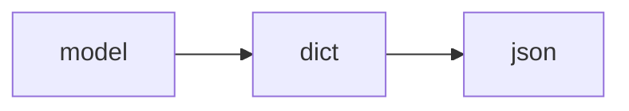
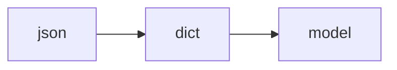

# DRF

基于Python打造，实现了RESTApi风格的重量级框架，在Django基础上，加了许多实现，定制了更加丰富的功能，有极大的可定制性。

官网：https://www.django-rest-framework.org/

中文文档：https://q1mi.github.io/Django-REST-framework-documentation/

- 特性
  - 可浏览API
  - 提供丰富认证
  - 支持数据序列化
    - dict转json，json转dict
  - 可以轻量嵌入，仅使用FBV模型
  - 强大的社区支持

## init your brain

### 安装使用

```shell
pip install djangorestframework
```
在项目settings.py的INSTALLED_APPS中注册：`'rest_framework'`

### 项目目录

主要是和Django的区别

#### 在app中

1. serializers.py

自行创建serializers.py文件，在其中创建用来序列化模型数据的类ModelnameSerializer(serializers.ModelSerializer)，在其中定义一个元类Meta用来制定model的名字，和返回的数据
```python
class GameSerializer(serializers.Modelserializer):
	class Meta:
		model = Game
		fields = ("id", "g_name", "g_price")
```

也可以继承自(serializers.Serializer)，则需要实现抽象方法create(), update()方法(必须重写)，基本格式为下，不过一般不常使用。

```python
class GameSerializer(serializers.Serializer):
	id = serializers.IntegerField(read_only=True)
	g_name = serializers.CharField(max_length=32)
	g_price = serializers.FloatField(default=11)
	
	# 重写方法，传入一个经过确认的数据，字典，在Serializer中有一个将数据格式化为字典的方法
	def create(self, validated_data)：
		return Game.objects.create(**validated_data)
	
	def update(self, instance, validated_data):
		instance.g_name = validated_data.get("g_name", instance.g_name)
		instance.g_price = validated_data.get("g_price") or instance.g_price
		instance.save()
		return instance
```

2. views.py使用类

定义一个NameViewSet(viewsets.ModelViewSet)的类，自动创建一个view的元组，包含一系列的views。

必须定义的属性：
```python
class BookViewSet(viewsets.ModelViewSet):
	queryset = Book.objects.all()
	serializer_class = BookSerializer
```

在多级父类`GenericAPIView`中，默认的queryset = None, serializer_class = None，但是在其类方法中会获取这两个参数，定义NameViewSet时不给这两个参数会报错。

3. app的urls.py

使用router和上面创建的NameViewSet()来注册路由，在项目根路由中可以用router来注册，也可以用appname来注册

urls.py注册路由：

```python
router = routers.DefaultRouter()
# 路由全称为'/app/books/'，BookViewSet为views.py中创建的路由类
router.register(r'books', views.BookViewSet)
```
#### 根路由

跟urls注册app中的路由：

```python
from app.urls import router
# 使用app的urls里定义的router来注册路由
url(r'app/', include(router.urls)),
# 使用appname来注册路由
url(r'ser/', include("LearnSerializer.urls"))
```

### 启动测试

- 他直接实现了数据的增删改查，在浏览器中返回的页面已经写好
- 可以直接在返回的页面中直接浏览
- 可以使用API的形式，json格式展示

## 序列化 serializers

用三种方法实现序列化，继承自serializers中的三个不同的类，写法不同。

1. serializsers.Serializer
2. serializers.ModelSerializer
3. serializers.HyperLinkedModelSerializer

一般开发中最长使用serializers.ModelSerializer，书写最方便

特性：

serializers.Serializer：
- 特点
  - 手动书写字段
  - 必须实现抽象方法：create和update
- 序列化器使用
  - model转化为json
  - json转化为model

model转化为json，依照模型对象为模板，构建序列化对象，如果是单数可直接传入，如果是复数，需要添加many=True

```python
class GamesView(View):

    def get(self, request):
        games = Game.objects.all()
        # 返回的是多个对象，需要添加many=True
        serializer = GameSerializer(games, many=True, context={'request': request})
        return JsonResponse(serializer.data, safe=False)
```



json转化为model，使用dict数据取构建序列化对象`xxxSerializer(data=dict)`

首先验证is_valid，然后在调用save方法，验证不通过时，调用errors()属性

```python
class GamesView(View):
    def post(self, request):
        g_name = request.POST.get("g_name")
        g_price = request.POST.get("g_price")
        source_data = {
            "g_name": g_name,
            "g_price": g_price
        }
        serializer = GameSerializer(data=source_data)
        # 验证数据
        if serializer.is_valid():
            serializer.save()
            return JsonResponse(serializer.data)
        return JsonResponse(serializer.errors)
```



serializers.ModelSerializer：

- 继承自serializers.Serializer
- 最省事，最常用

serializers.HyperLinkedModelSerializer：

- 最智能
- 是ModelSerializer的子类，多出了url的属性
  - 可以动态生成链接
  - 需要配置获取单个对象的方式，需要主键做参数并起别名
    - namespace, name
- 配置繁琐

## RESTframework中的双R

1. Request

- Django中的request只能接受GET，POST参数，PUT，PATCH的参数未做处理，在body中传入，中间穿插转义和制表符，需要自己进行处理
- DRF中对Request进行了重构，使用request.data来获取参数
  - data可以接受POST，PUT，PATCH参数

2. Response
- 继承自Django中的SimpleTemplateResponse
- 可以根据客户端的不同来返回不同的内容


## views转换Wrapping两种方式

1. @api_view装饰器（FBV方式）

在FBV模型中使用，在路由函数前添加
- 需要在后面追加允许请求的方法列表
  - 默认的http_method_names = None，只支持GET请求
- 将Django中的request转换成了restframework中的request
- 原来的HttpResponse可以正常兼容
- 可以使用Response来根据客户端返回不同的内容
- 类似于as_view()的方法，获取请求方法的名字，判断是不是在给的方法列表里面，如果在则返回给handler，实现支持某个请求

2. 继承自APIView（CBV方式）

- 兼容 现有的代码，不需要做大的改动，会将传入的数据作为响应返回，如果是字符串也直接返回字符串
- APIView继承自View

- APIView实现了获取请求方法的名字，然后返回给handler，和view中的as_vie类似


