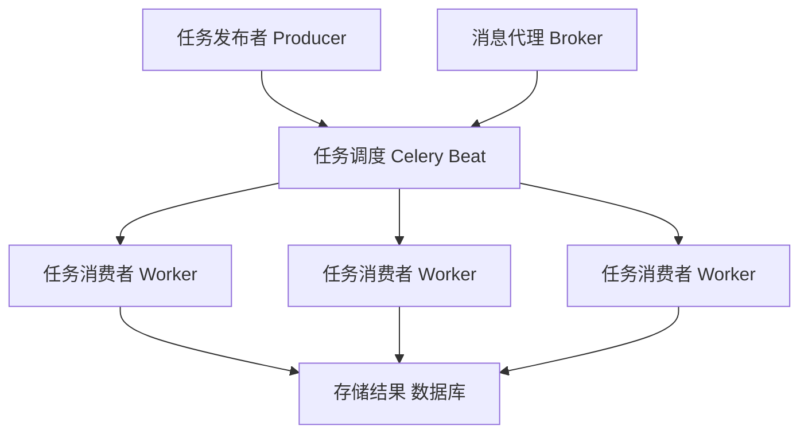

# celery

celery是一个简单的、可定制的、可靠的用来处理大量信息的分布式系统，支持异步任务、定时任务。celery是一个分布式队列的管理工具，可以用celery的接口快速管理一个分布式的任务队列。它本身不是任务，是管理工具，封装了任务管理的常见操作。

首先你需要安装celery，最新版本为4.3，如果使用redis作为broker，推荐使用4.1版本，因为4.3版本可能与django-redis-cache的版本有兼容问题，解决这个问题所需要的模块如下

```shell
pip install celery==4.1.0
pip install django-redis-cache==2.10.6
pip install django-celery-results==1.1.2
pip install redis==3.2.0
```


## celery的组件

## 1. celery使用生产者消费者设计模式

- Celery Beat：任务调度器。Beat进程会读取配置文件内容，周期性的将配置中到期需要执行的任务发送给任务队列
- Celery Worker：执行任务的消费者，通常会在后台服务器运行多个消费者，提高运行效率
- Broker：消息队列，队列本身，也成为消息中间件，接受任务生产者发送过来的任务消息，存进队列分发给任务消费方（通常是消息队列或者数据库）
- Producer：任务生产者，调用Celery API，函数或者装饰器，产生任务交给任务队列的都是任务生产者
- Result Backend：任务处理完成后保存状态信息和结果，以供查询

Celery框架图：



## 2. 产生任务的方式

1. 发布者发布任务（WEB应用）
2. 任务调度发布任务（定时任务）

## 3. celery依赖三个库

- billiard：基于Python2.7的multisuprocessing改进的库，主要用来提高性能和稳定性
- librabbitmp：c语言实现的Python客户端
- kombu：Celery自带的用来收发消息的库，提供了符合Python语言习惯的，使用AMQP协议的高级接口

# 消息代理Broker

使用RabbitMQ和Redis

使用RabbitMQ来作为代理：

```shell
sudo apt-get install rabbitmq-server
```

或者在Docker里面运行：

```shell
docker run -d -p 5462:5462 rabbitmq
```

使用Redis作为代理：

```shell
# 在Docker里面运行
docker run -d -p 6379:6379 redis
```

使用redis作为代理的具体配置。首先需要一个模块`celery[redis]`

```shell
pip install -U "celery[redis]"
```

然后设置消息队列存储的地址：

```python
app.conf.broker_url = 'redis://localhost:6379/0'
# 格式如下
# redis://:password@hostname:port/db_number
```

# 基本用法

我们可以直接创建一个tasks.py来编写消息队列

```python
from celery import Celery

app = Celery('tasks', broker='pyamqp://guest@localhost//')

@app.task
def add(x, y):
    return x + y
```

这是一个基本的celery消息队列的写法，celery的基本使用流程如下：

- 创建Celery的app
- 指定消息代理Broker
- 创建任务
- 添加任务到任务队列
- 配置执行策略

# 与Django

在Django中使用Celery，可以将配置集中写入到settings.py里面。

注意：celery4.0支持Django1.8以上的版本，如果是以下的版本请使用celery3.1。

## app

首先是创建一个Celery的app，在Django项目目录下创建`/proj/proj/celery.py`的文件

```python
from __future__ import absolute_import, unicode_literals
import os
from celery import Celery

# set the default Django settings module for the 'celery' program.
os.environ.setdefault('DJANGO_SETTINGS_MODULE', 'proj.settings')
# it`s not necessary to have many instances of the library, one is enough
app = Celery('proj')

# Using a string here means the worker doesn't have to serialize
# the configuration object to child processes.
# - namespace='CELERY' means all celery-related configuration keys
#   should have a `CELERY_` prefix.
app.config_from_object('django.conf:settings', namespace='CELERY')

# Load task modules from all registered Django app configs.
app.autodiscover_tasks()


@app.task(bind=True)
def debug_task(self):
    print('Request: {0!r}'.format(self.request))
```

## 注册

然后将这个app注册到`/proj/proj/__init__.py`文件中，可以确保在Django启动时，celery app会被加载：

```python
from __future__ import absolute_import, unicode_literals

# This will make sure the app is always imported when
# Django starts so that shared_task will use this app.
from .celery import app as celery_app

__all__ = ('celery_app',)
```

## 创建

在每个应用的目录下，创建文件`/app/tasks.py`，然后使用`@shared_task`装饰器来创建任务

```python
from celery import shared_task


@shared_task
def xsum(numbers):
    return sum(numbers)
```

## 消息队列

### results

任务的运行信息会被存储到默认的数据库sqlite里面，将其改为默认的数据库，使用了一个模块`django-celery-results`

`pip install django-celery-results`安装之后在settings.py里面注册app

```python
INSTALLED_APPS = (
	...,
    'django_celery_results'
)
```

迁移这个app，使其在生成数据库映射

```shell
python manage.py migrate django_celery_results
```

然后在settings.py里面设置restult的依赖为django中设置的数据库

```python
CELERY_RESULT_BACKEND = 'django-db'
# 如果是基于缓存的
CELERY_CACHE_BACKEND = 'django-cache'
```

### Broker

在settings.py里面配置Broker消息队列的接收器，这里使用redis。

```python
CELERY_BROKER_URL = 'redis://localhost:6379/3'

#: Only add pickle to this list if your broker is secured
#: from unwanted access (see userguide/security.html)
CELERY_ACCEPT_CONTENT = ['json']
# 存储到数据库中
CELERY_RESULT_BACKEND = 'django-db'
CELERY_TASK_SERIALIZER = 'json'
```

## 定时任务

首先是在tasks.py中定义任务，然后在settings.py中配置运行策略

### schedule

```python
app.conf.beat_schedule = {
    'add-every-30-seconds': {
        'task': 'tasks.add',

        'schedule': 30.0,
        'args': (16, 16)
    },
}
app.conf.timezone = 'UTC'
```

有几个参数：

- task：需要执行的task任务名字(函数名)
- schedule：运行频率
- args：运行函数时传入的参数，可以是列表或元组
- kwargs：键值对类型的参数

### crontab

也可以使用crontab来定时执行任务，可以具体到每天每周每月等

```python
from celery.schedules import crontab

app.conf.beat_schedule = {
    # Executes every Monday morning at 7:30 a.m.
    'add-every-monday-morning': {
        'task': 'tasks.add',
        'schedule': crontab(hour=7, minute=30, day_of_week=1),
        'args': (16, 16),
    },
}
```

例如：

| Example                            | Meaning              |
| ---------------------------------- | -------------------- |
| crontab()                          | 每分钟执行一次       |
| crontab(minute=0, hour=0)          | 没天凌晨执行一次     |
| crontab(minute=0, hour='*/3')      | 没三个小时执行一次   |
| crontab(day_of_week='sunday')      | 每周日执行一次       |
| crontab(0, 0,day_of_month='2')     | 每月第二天执行一次   |
| crontab(0, 0, month_of_year='*/3') | 每季度第一天执行一次 |


